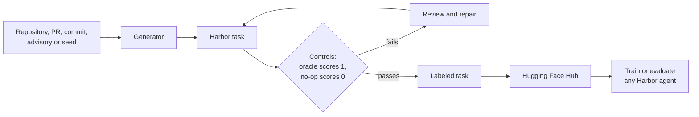

<h1 align="center">Repo2RLEnv</h1>

<p align="center">
  <b>Turn any repository into verifiable RL environments for coding agents.</b>
</p>

<p align="center">
  <a href="https://pypi.org/project/repo2rlenv/"></a>
  <a href="https://pypi.org/project/repo2rlenv/"></a>
  <a href="https://github.com/huggingface/Repo2RLEnv/actions/workflows/ci.yml"></a>
  <a href="https://huggingface.github.io/Repo2RLEnv/"></a>
  <a href="https://huggingface.co/collections/FineEnvs/repo2rlenv-verifiable-rl-environments-6aa82300d7494c050f50508d"></a>
  <a href="https://harborframework.com/"></a>
  <a href="https://github.com/huggingface/Repo2RLEnv/blob/main/THIRD_PARTY_NOTICES.md"></a>
</p>

<p align="center">
  <a href="https://huggingface.github.io/Repo2RLEnv/">Documentation</a> ·
  <a href="#quickstart">Quickstart</a> ·
  <a href="#tasksmith-an-agent-that-builds-environments">Tasksmith</a> ·
  <a href="#what-you-can-build">Pipelines</a> ·
  <a href="#datasets">Datasets</a> ·
  <a href="#whats-new">What's new</a>
</p>

<p align="center">
  
</p>

Coding agents get better by doing: attempting a real task, and being told by a program,
not a person, whether they succeeded. Reinforcement learning needs thousands of those
tasks, each with a working environment, an instruction that doesn't give the answer away,
and a verifier you can trust. Building them by hand takes hours apiece.

**Repo2RLEnv builds them from material that already exists:** merged pull requests,
commit history, security advisories, a library's own functions, terminal recordings and
problem families. Each one becomes a standard
[Harbor](https://github.com/harbor-framework/harbor) task you can train on, evaluate with
any agent, and share on the Hugging Face Hub.

<p align="center">
  <b>23 generators</b> · <b>21 published datasets</b> · <b>1,930 tasks on the Hub</b> · runs with any Harbor agent
</p>

## What's new

| When | What |
|---|---|
| **Sep 29, 2026** | 📚 **A new documentation site**, with guides for every pipeline, a full CLI reference, and live explainer films that follow your light or dark theme. [Read the docs →](https://huggingface.github.io/Repo2RLEnv/) |
| **Sep 29, 2026** · v0.9.3 | 🧮 **FrontierSmith** turns closed-ended programming problems into optimization tasks with continuous, deterministic rewards. There's no known optimum, so a better solution earns more. [Release notes →](https://huggingface.github.io/Repo2RLEnv/release_notes/HISTORY/) |
| **Sep 25, 2026** · v0.9.2 | 🧱 **CodeMidas** rebuilds removed features from their behavioral contract, with execution-grounded tests and independent rollout review. |
| **Sep 15, 2026** · v0.9.0 | 🤖 **Tasksmith** and **15 research recipes** (SWE-smith, R2E-Gym, SWE-gen, SETA, SCALER and more) on one shared execution and review layer. |

Older releases are in the [version history](https://huggingface.github.io/Repo2RLEnv/release_notes/HISTORY/).

## Quickstart

Generate your first environments in about five minutes. This first pipeline needs no
Docker and no LLM key, just Python 3.12+ and the [GitHub CLI](https://cli.github.com).

```bash
pip install 'repo2rlenv[harbor]'
gh auth login

# Turn three recent merged PRs from pallets/click into Harbor tasks
repo2rlenv generate --repo pallets/click --pipeline pr_diff \
  --pipeline-opt limit=3 --out ./tasks

# Check them, then prove them: the reference solution should score 1.0
repo2rlenv validate ./tasks --oracle
harbor run -p ./tasks -a oracle --env docker
```

Then point a real agent at them:

```bash
harbor run -p ./tasks -a claude-code -m anthropic/claude-sonnet-4-6 \
  --ae ANTHROPIC_API_KEY=$ANTHROPIC_API_KEY --env docker
```

The [quickstart guide](https://huggingface.github.io/Repo2RLEnv/quickstart/) walks through
every step and what each file in a task is for.

## Tasksmith: an agent that builds environments

Mining pipelines keep only the pull requests that pass their filters.
**[Tasksmith](https://huggingface.github.io/Repo2RLEnv/pipelines/tasksmith/)** adapts to
each one instead. Point it at a merged pull request and an agent:

1. investigates the change and the repository around it,
2. bootstraps the repository's environment on a remote worker,
3. designs the instruction and a private verifier,
4. constructs the Harbor task, with the merged code as the reference solution,
5. reviews and repairs its own work until the controls pass.

Tasksmith orchestrates Pi or OpenCode agents with LangGraph, runs on Daytona or Modal
(with Modal L4 GPUs for GPU tasks), and records the evidence and cost of every stage. Its
reference cohort, [HF_ML_Tasksmith](https://huggingface.co/datasets/FineEnvs/HF_ML_Tasksmith),
holds 50 verified tasks from Accelerate, Diffusers, PEFT, Transformers and TRL.
[Run one PR →](https://huggingface.github.io/Repo2RLEnv/pipelines/tasksmith/#run-one-pr)

## What you can build

Every generator produces a Harbor task. They differ in what they start from and how the
agent's work is scored. **[Browse all 23 →](https://huggingface.github.io/Repo2RLEnv/pipelines/)**

| Kind of task | Generators | How it's scored |
|---|---|---|
| **Repository repair:** fix real code in a real repository | [Tasksmith](https://huggingface.github.io/Repo2RLEnv/pipelines/tasksmith/), [`pr_runtime`](https://huggingface.github.io/Repo2RLEnv/pipelines/pr_runtime/), [`commit_runtime`](https://huggingface.github.io/Repo2RLEnv/pipelines/commit_runtime/), [`cve_patches`](https://huggingface.github.io/Repo2RLEnv/pipelines/cve_patches/), `swe_smith`, `swe_next`, `r2e_gym` | The repository's own tests: failing ones must pass, passing ones must stay green |
| **Implementation and reconstruction:** write or restore functionality | [`code_instruct`](https://huggingface.github.io/Repo2RLEnv/pipelines/code_instruct/), [`equivalence_tests`](https://huggingface.github.io/Repo2RLEnv/pipelines/equivalence_tests/), `r2e`, `swe_flow`, `swe_gen`, `codemidas` | Hidden or differential tests |
| **Patch similarity:** reproduce a real change | [`pr_diff`](https://huggingface.github.io/Repo2RLEnv/pipelines/pr_diff/) | Similarity to the merged diff, with an optional LLM judge. No test suite needed |
| **Terminal tasks:** reach a state in a shell | `seta_seed2synth`, `seta_evol`, `dataarc`, `tmax`, `endless_terminals`, `terminalworld`, `cli_gym` | State checks in the container |
| **Reasoning and optimization:** no repository at all | `scaler`, `frontiersmith` | Exact answers (−1/+1), or a continuous score in [0, 1] |

The six native pipelines run on your machine. Tasksmith and the research recipes run
their target code on Modal or Daytona workers, inside a budget you set.

### Watch how they work

Each native pipeline has a one-minute explainer film in the docs.

<table>
  <tr>
    <td align="center" width="33%"><a href="https://huggingface.github.io/Repo2RLEnv/pipelines/pr_runtime/"></a><br><code>pr_runtime</code>: the two runs</td>
    <td align="center" width="33%"><a href="https://huggingface.github.io/Repo2RLEnv/pipelines/commit_runtime/"></a><br><code>commit_runtime</code>: the history walk</td>
    <td align="center" width="33%"><a href="https://huggingface.github.io/Repo2RLEnv/pipelines/cve_patches/"></a><br><code>cve_patches</code>: the advisory</td>
  </tr>
  <tr>
    <td align="center"><a href="https://huggingface.github.io/Repo2RLEnv/pipelines/code_instruct/"></a><br><code>code_instruct</code>: the gauntlet</td>
    <td align="center"><a href="https://huggingface.github.io/Repo2RLEnv/pipelines/equivalence_tests/"></a><br><code>equivalence_tests</code>: the mirror</td>
    <td align="center"><a href="https://huggingface.github.io/Repo2RLEnv/pipelines/pr_diff/"></a><br><code>pr_diff</code>: the split</td>
  </tr>
</table>

## How it works



A task is a directory. The agent sees the instruction and the starting environment; the
verifier and reference solution stay private until grading.

```text
org__service-412/
├── instruction.md     what the agent is asked to do
├── task.toml          resources, provenance and evaluation label
├── environment/       the starting container
├── tests/             the private verifier, which writes the reward
└── solution/          the reference solution (the oracle)
```

A generated task is a starting point, not a guarantee. Controls, the
[review and repair loop](https://huggingface.github.io/Repo2RLEnv/pipelines/quality_loop/)
and [evaluation labels](https://huggingface.github.io/Repo2RLEnv/pipelines/task_evaluation_labels/)
record how far each one has been checked. [How it works →](https://huggingface.github.io/Repo2RLEnv/concepts/how-it-works/)

## Datasets

Start from ours: **21 datasets and 1,930 tasks** in the
[Repo2RLEnv collection](https://huggingface.co/collections/FineEnvs/repo2rlenv-verifiable-rl-environments-6aa82300d7494c050f50508d),
each with its generation evidence and per-task evaluation labels. Browse them in the
[Harbor Visualizer](https://huggingface.co/spaces/HuggingFaceH4/harbor-visualiser), or pull one
and run it:

```bash
repo2rlenv pull FineEnvs/repo2rlenv-pr-runtime ./pr-runtime
harbor run -p ./pr-runtime -a oracle --env docker
```

Publishing your own is one command: `repo2rlenv push ./tasks <your-org>/<dataset>`. The
[release inventory](https://huggingface.github.io/Repo2RLEnv/pipelines/releases/) and
[yield and cost](https://huggingface.github.io/Repo2RLEnv/pipelines/economics/) pages report
what each dataset contains and what it cost to generate.

## Install

```bash
pip install repo2rlenv                               # native pipelines and the CLI
pip install 'repo2rlenv[harbor]'                     # + Harbor, to run and review tasks
pip install 'repo2rlenv[tasksmith,daytona,harbor]'   # + Tasksmith on Daytona (or modal)
```

`mutation` adds what `swe_smith` needs. Native runtime pipelines use local Docker;
Tasksmith, the research recipes and the review loop need a Modal or Daytona account and
run their controller on Linux, macOS or WSL. See
[installation](https://huggingface.github.io/Repo2RLEnv/installation/) for every extra and
credential.

## Documentation

- **[Get started](https://huggingface.github.io/Repo2RLEnv/introduction/)**: introduction, quickstart, installation, choosing a pipeline
- **[Concepts](https://huggingface.github.io/Repo2RLEnv/concepts/how-it-works/)**: how it works, anatomy of a task, rewards, quality and verification
- **[Pipelines](https://huggingface.github.io/Repo2RLEnv/pipelines/)**: every generator, with stage diagrams and the exact prompts
- **[Guides](https://huggingface.github.io/Repo2RLEnv/guides/run-with-harbor/)**: running with Harbor, remote workers, publishing, troubleshooting
- **[CLI reference](https://huggingface.github.io/Repo2RLEnv/reference/cli/)** · **[Design RFCs](https://huggingface.github.io/Repo2RLEnv/rfcs/)** · **[Release notes](https://huggingface.github.io/Repo2RLEnv/release_notes/HISTORY/)**

The docs are also available as [`llms.txt`](https://huggingface.github.io/Repo2RLEnv/llms.txt)
for coding agents.

## Contributing

New pipelines, recipes, log parsers and docs are all welcome. Read
[CONTRIBUTING.md](https://github.com/huggingface/Repo2RLEnv/blob/main/CONTRIBUTING.md) and,
for a new generator, start with an [RFC](https://huggingface.github.io/Repo2RLEnv/rfcs/) and
the [guide to adding a pipeline](https://huggingface.github.io/Repo2RLEnv/contributing/ADDING_A_PIPELINE/).

## License and credits

Repo2RLEnv's own code is [Apache-2.0](https://github.com/huggingface/Repo2RLEnv/blob/main/LICENSE).
The research recipes are credited, independent adaptations of published methods; bundled
adaptations keep their MIT and Apache-2.0 licenses, so the distribution is
`Apache-2.0 AND MIT`. [Third-party notices](https://github.com/huggingface/Repo2RLEnv/blob/main/THIRD_PARTY_NOTICES.md)
link each recipe's source revision, retained material and attribution. Source
repositories and generated tasks keep their own terms; check each dataset's license and
provenance before redistributing it.
