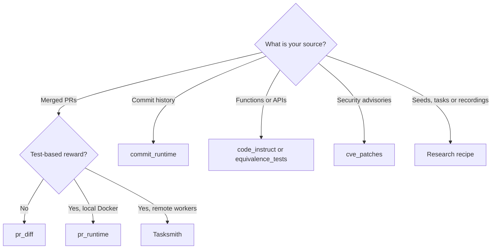

Repo2RLEnv has six native pipelines, Tasksmith, and 16 research recipes. Which one fits depends on what you start from, what kind of reward you need, and where you can run containers.

## Four questions

1. **What's your source material?** A merged PR, a repository's commit history, a repository's own functions and APIs, a security advisory, or seeds such as question/answer pairs, existing Harbor tasks, terminal recordings or problem families.
2. **Do you need a test-based reward?** Diff similarity scores an agent's patch against the real one without running any code. Test-based rewards run the repository's tests, so generation has to build an environment where they pass.
3. **Where can you run containers?** Native pipelines build and check environments with Docker on your machine. Tasksmith and research recipes run on remote Modal or Daytona workers.
4. **How much churn can you absorb?** `pr_diff`, `pr_runtime` and `commit_runtime` are stable. Everything else is experimental: its interface and output can change between releases.

## Compare the routes

| Route | Input | The agent's task | Reward | LLM at generation | Runs on | Status |
|---|---|---|---|---|---|---|
| [`pr_diff`](pipelines/pr_diff.md) | Merged PRs (GitHub, GitLab) | Reproduce the change a PR made | Diff similarity, 0–1, with an optional LLM judge at verify time | No | Your machine; no Docker to generate | Stable |
| [`pr_runtime`](pipelines/pr_runtime.md) | Merged PRs that add tests (GitHub, GitLab) | Make failing tests pass without breaking passing ones | Graded F2P × P2P, plus a strict `resolved` flag | Yes: bootstrap, cached per repository | Local Docker | Stable |
| [`commit_runtime`](pipelines/commit_runtime.md) | Commit history (GitHub, GitLab, local path) | The same, mined from commits, with the instruction rewritten as a symptom | Graded F2P × P2P | Yes: bootstrap, plus one call per task for the instruction | Local Docker | Stable |
| [`code_instruct`](pipelines/code_instruct.md) | A Python repository's source | Solve an LLM-authored problem grounded in the repository's APIs | Tests pass, 0/1 | Yes: problem, test and solution | Local Docker | Experimental |
| [`equivalence_tests`](pipelines/equivalence_tests.md) | Python functions in a repository | Reimplement a function so it matches a hidden reference | Tests pass, 0/1 | Yes: the equivalence tests | Local Docker | Experimental |
| [`cve_patches`](pipelines/cve_patches.md) | OSV advisories and their fix commits (GitHub, Python ecosystem) | Repair the vulnerability | Graded F2P × P2P | Yes: bootstrap, plus a proof-of-concept test when the fix ships none | Local Docker | Experimental |
| [Tasksmith](pipelines/tasksmith.md) | A merged PR that changes testable Python source | Implement the PR's behavior from a human-style request | Private behavioral tests, 0/1 | Yes: a Pi or OpenCode agent, plus review and repair | Modal or Daytona | Experimental |
| [Research recipes](pipelines/owned_recipes.md) | Repositories, PR or commit history, question/answer seeds, Harbor tasks, terminal recordings, problem families | Repair, reconstruction, terminal, reasoning and optimization tasks | Tests pass, 0/1; SCALER scores −1/+1; FrontierSmith scores 0–1 continuously | Most recipes; SCALER is fully programmatic | Modal or Daytona | Experimental |

Graded F2P × P2P is the fraction of fail-to-pass tests the agent fixes times the fraction of pass-to-pass tests it keeps green. [Rewards](concepts/rewards.mdx) defines every reward kind. The [bootstrap](reference/BOOTSTRAP.md) is a one-time LLM agent loop that builds a working container for a repository; `--max-spend-usd` caps it (default $5).

## If you want…

- For a first dataset in minutes, without Docker or an LLM key, use `pr_diff`. The [Quickstart](quickstart.mdx) walks through it.
- For SWE-bench-style tasks graded by the repository's own tests, use `pr_runtime`.
- For a repository with few PRs, or one where fixes are committed straight to the main branch, use `commit_runtime`.
- For tasks about using a library rather than its history, use `code_instruct`.
- For function-level reimplementation tasks, use `equivalence_tests` locally, or the [`r2e`](pipelines/r2e.md) recipe on remote workers.
- For security repair tasks, use `cve_patches`.
- For one carefully built task per PR, even when the PR's own tests don't cover the change, use Tasksmith. It can write private behavioral tests, and it reviews and repairs each task before export.
- For many repair tasks from one healthy repository, use [`swe_smith`](pipelines/repo_mutate.md), which introduces source defects for the agent to fix.
- For terminal and shell tasks, use [`seta_seed2synth`](pipelines/terminal_synth.md), [`tmax`](pipelines/tmax.md), [`endless_terminals`](pipelines/endless_terminals.md) or [`terminalworld`](pipelines/terminalworld.md). For broken development environments, use [`cli_gym`](pipelines/env_repair.md).
- For harder variants of Harbor tasks you already have, use [`seta_evol`](pipelines/task_evolve.md) or [`dataarc`](pipelines/dataarc.md).
- For reasoning tasks with no repository at all, use [`scaler`](pipelines/scaler.md).
- For open-ended optimization with a graded objective and no known optimum, use [`frontiersmith`](pipelines/frontiersmith.md).
- To reproduce a specific published method, use its recipe. [Research recipes](pipelines/owned_recipes.md) maps each method to its pipeline name.

## Run your choice

Each family starts differently:

| Family | Start with |
|---|---|
| Native pipeline | `repo2rlenv generate --repo org/service --pipeline <name> --out ./tasks`, adding `--llm provider/model` for every pipeline except `pr_diff` |
| Research recipe | `repo2rlenv generate --config <recipe>.yaml`, with an `execution:` block that names a running worker, a runtime wheel and a campaign directory. The repository's `examples/owned-*.yaml` files are starting points. See [Remote execution](guides/remote-execution.mdx). |
| Tasksmith | `repo2rlenv tasksmith run <panel>.json --campaign <dir> --output <dir> --runtime-wheel <wheel>`, following the [one-PR walkthrough](pipelines/tasksmith.md) |

`repo2rlenv pipelines list` shows every route with its status, and `repo2rlenv pipelines describe <pipeline> --recipe <recipe>` shows a recipe's input, scope and provenance.

## Known limits

- **Status is about the code, not the tasks.** A stable pipeline can still emit a weak task. Every exported task starts with the evaluation label `unverified`; its [controls](concepts/quality.mdx) and the [review and repair loop](pipelines/quality_loop.md) decide whether you should train on it.
- **`limit` caps candidates, not output.** Each pipeline discards candidates that fail its filters, and test-based routes also drop candidates whose tests don't flip from failing to passing. A repository whose test suite doesn't run cleanly in a container yields almost nothing on any test-based route. [Pipelines](pipelines/index.mdx) lists typical yield per pipeline.
- **Language and host coverage varies.** `pr_diff` works on any language. The bootstrap for `pr_runtime` and `commit_runtime` detects Python, Node, Go, Rust, Java and C/C++. `code_instruct`, `equivalence_tests`, `cve_patches` and Tasksmith target Python. `cve_patches` needs GitHub; `generate` rejects an unsupported source before doing any work.
- **Remote routes have no local fallback.** Research recipes, Tasksmith and the quality loop need a Modal or Daytona worker.
- **SEC-bench is deferred.** It appears in `pipelines list` as `planned` and isn't implemented.
