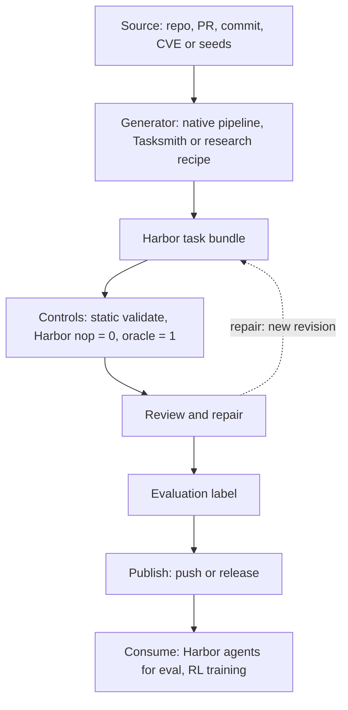

Repo2RLEnv turns a source (a repository, a merged PR, a commit, a security advisory or a set of task seeds) into [Harbor tasks](glossary.mdx#harbor-task). Each task is a self-contained directory with an instruction, a container environment, a private verifier and a reference solution. This page walks through the lifecycle end to end and shows where each step runs.



## Generation

Three kinds of generator write the same output format. Pick one by the input you have and how much you want to run remotely.

| Generator | Input | Entry point | Runs on | Status |
|---|---|---|---|---|
| [Native pipelines](glossary.mdx#native-pipeline) | A repository and its PRs, commits, CVE advisories or functions | `repo2rlenv generate --repo <repo> --pipeline <name>` | Your machine | `pr_diff`, `pr_runtime`, `commit_runtime` stable; `code_instruct`, `equivalence_tests`, `cve_patches` experimental |
| [Tasksmith](../pipelines/tasksmith.md) | Merged PRs | `repo2rlenv tasksmith run` | Controller plus remote worker | Experimental |
| [Research recipes](../pipelines/owned_recipes.md) | Repositories, PR history, question/answer seeds, Harbor seed tasks, terminal recordings or reasoning families | `repo2rlenv generate --config <file>`, with `pipeline.name` and `pipeline.recipe` set in the file | Controller plus remote worker | 16 recipes, all experimental |

Native pipelines that execute code (all except `pr_diff`) first [bootstrap](glossary.mdx#bootstrap) the repository: an LLM agent builds a Docker image in which the project installs and its test suite runs. The image is cached per repository and becomes the base of every task's `environment/Dockerfile`. `--max-spend-usd` caps that loop (default `5.0`).

A research recipe implements a published generation method inside a [pipeline family](glossary.mdx#pipeline-family). For example, the `swe_smith` recipe of the `repo_mutate` family introduces a defect into healthy source. Tasksmith explores a merged PR with a coding agent and designs the request and verifier itself. Both produce offline schema 1.3 bundles, and most of them grade in a separate verifier container. See [Anatomy of a task](tasks.mdx) for both layouts.

## Where code runs

There are two execution models, and the difference matters for cost, credentials and isolation.

### Native pipelines run locally

Everything happens on your machine. Model calls go to the provider you pass with `--llm`. Docker is needed only for bootstrap and for generation-time validation. For example, `pr_runtime` runs the test suite before and after the fix to find the tests the fix flips. `pr_diff` needs no Docker at all.

### Recipes, Tasksmith and the quality loop use a controller and a worker

The [controller](glossary.mdx#controller) is the `repo2rlenv` process on your machine. The [worker](glossary.mdx#worker) is a Modal or Daytona sandbox that runs the `repo2rlenv` wheel you built, plus Docker.

| Step | Controller (your machine) | Worker (Modal or Daytona) |
|---|---|---|
| Preflight, metadata and parsing | Yes | |
| Model calls, request logging, accounting | Yes | |
| Cloning targets, building images | | Yes |
| Running target tests, reference solutions, probes and solver trials | | Yes |
| Assembling and hashing the exported bundle | Yes | |

Target code and generated code never execute on the controller, and there is no local fallback: a recipe run needs a running worker. You name that worker in the `execution:` block of the `--config` file, along with the campaign directory, a run ID and the runtime wheel. GPU tasks in Tasksmith and the quality loop use native Modal with one or two L4 GPUs instead of a Docker worker.

A [campaign](glossary.mdx#campaign) is the directory that holds the budget ledger and worker receipts for a run. You set its spending limit once, explicitly. Every paid operation reserves its cost before dispatch. Completed model calls are settled from recorded usage. An operation with an unknown outcome keeps its reservation until you reconcile it with `campaign settle`, and it is never retried automatically. The ledger is an accounting limit, not a bill cap enforced by the provider.

```bash
repo2rlenv campaign init workspace/my-campaign --budget-usd 25
repo2rlenv workers start --campaign workspace/my-campaign --provider modal \
  --name my-worker --reserve-usd 3
repo2rlenv workers probe workspace/my-campaign/workers/my-worker.json \
  --out workspace/my-campaign/probes/first
repo2rlenv campaign status workspace/my-campaign
repo2rlenv workers stop workspace/my-campaign/workers/my-worker.json
```

Always stop workers you start. See [Remote execution](../guides/remote-execution.mdx) for setup and credentials.

## Verification

A task leaves the generator having passed that generator's own checks, such as a validated fail-to-pass contrast for `pr_runtime`. That makes it a generation result, not a verified task. Quality is established in three further layers:

1. **Static checks.** `repo2rlenv validate PATH --deep --oracle` reads each task's files and metadata without running anything. Use it on native output.
2. **Controls.** In Harbor, the [nop](glossary.mdx#nop) agent (does nothing) must score 0 and the [oracle](glossary.mdx#oracle) agent (runs the reference solution) must score 1.
3. **Review and repair.** `repo2rlenv quality run` reviews the instruction, verifier and leakage. It probes the verifier with a wrong solution and a valid alternative, runs a blind solver, and can repair defects as new revisions.

The outcome is written to the task's [evaluation label](glossary.mdx#evaluation-label), bound to its [bundle hash](glossary.mdx#bundle-hash). See [Quality and verification](quality.mdx).

## Publishing

| Command | Use it for | What it does |
|---|---|---|
| `repo2rlenv push DIR org/name` | Native output | Creates or updates a Hugging Face dataset repo, writes a Harbor `registry.json` pinned to the commit, and pushes each task's bootstrap image to a container registry or inlines its Dockerfile |
| `repo2rlenv release stage PLAN --out DIR`, then `release verify DIR` and `release publish DIR --receipt FILE` | Recipe and Tasksmith bundles | Publishes an explicit selection as an immutable release. Every task must match the bundle hash recorded in the release plan |
| `repo2rlenv pull org/name[@rev]` | Consuming | Downloads a dataset from the Hub, a Harbor registry or GitHub |

See [Publishing](../guides/publishing.mdx) for registry authentication, image modes and release plans, and the [CLI reference](../reference/cli.mdx#release) for every flag.

## Consumption

Harbor runs the tasks. Any Harbor agent can attempt them, locally in Docker or on a remote sandbox with `--env modal|daytona|e2b|runloop`:

```bash
uv tool install harbor
harbor run -p ./tasks -a oracle --env docker
harbor run -p ./tasks -a claude-code -m anthropic/claude-sonnet-4-6 \
  --ak max_budget_usd=2.00 \
  --ae ANTHROPIC_API_KEY=$ANTHROPIC_API_KEY \
  --ve ANTHROPIC_API_KEY=$ANTHROPIC_API_KEY \
  --env docker
```

`--ae` passes variables to the agent. `--ve` passes them to the verifier, which the `pr_diff` LLM judge needs. For evaluation, read each trial's reward and details. For RL training, use the per-trial scalar as the reward. [Rewards](rewards.mdx) explains what the number means for each family. [Run tasks with Harbor](../guides/run-with-harbor.mdx) covers agents, parallelism and remote environments.

<Cards>
  <Card title="Anatomy of a task" href="tasks.mdx" description="Every file in a Harbor task, and who can see it." />
  <Card title="Rewards" href="rewards.mdx" description="How each family is scored and where the score is written." />
  <Card title="Quality and verification" href="quality.mdx" description="From generated to verified: controls, review and labels." />
</Cards>
