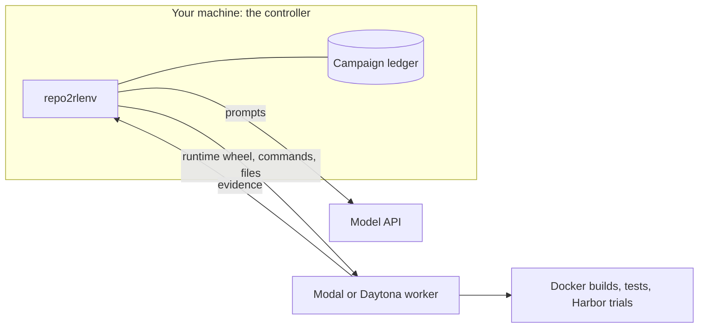

[Research recipes](../concepts/glossary.mdx#research-recipe), [Tasksmith](../concepts/glossary.mdx#tasksmith) and the quality loop never run target code on your machine. Your machine is the controller: it calls models, keeps the accounts and assembles task files, while every build, test and model-written program runs on a remote Modal or Daytona worker. This guide sets up what those three share: provider credentials, a [campaign](../concepts/glossary.mdx#campaign) budget, a runtime wheel and a worker.

Native pipelines don't need any of this: they run on your machine with local Docker.



## Why target code runs remotely

The repositories, PR changes and model-written tests these workflows handle are untrusted code. Running them in a disposable remote sandbox keeps them away from your credentials and files, and gives every build the same Linux and Docker environment. The controller downloads evidence as data and never executes it. There is no local Docker fallback: if no worker is available, the run stops before dispatching work.

| Workflow | Where its target code runs |
|---|---|
| Research recipe (`generate --recipe …`) | The worker named in the config's `execution.worker_receipt`, which you start with `workers start`. |
| Tasksmith (`tasksmith run`, `batch`, `bootstrap`) | Builder workers that Tasksmith creates on the provider in its options. |
| Quality loop (`quality run --repair` or `--run-rollout`) | A worker the loop creates and terminates, or one you pass with `--worker-receipt`. Remote validation accepts single-container, no-network tasks such as recipe and Tasksmith bundles, not native pipeline output. |
| CodeMidas audit (`codemidas audit`) | The worker you pass with `--worker-receipt`. |

Tasks that request GPUs (one or two L4s) are the exception for trials. `repo2rlenv quality run` runs their controls, probes and rollout on native Modal GPU sandboxes, with `--provider modal` and no worker receipt or runtime wheel. Tasksmith still investigates and builds a GPU task on a CPU worker, so it always needs `--runtime-wheel`; only its trials move to native Modal.

## Install from a checkout

The runtime wheel has to match your installed package exactly, so build it from the same checkout you run the controller from. Install the extras for your provider and workflow:

```bash
git clone https://github.com/huggingface/Repo2RLEnv
cd Repo2RLEnv
uv sync --extra modal --extra harbor
```

| Extra | Needed for |
|---|---|
| `modal` or `daytona` | The worker provider. |
| `harbor` | Parsing and running Harbor tasks (quality loop, releases, recipes that run Harbor trials). |
| `mutation` | The `swe_smith` recipe. |
| `tasksmith` | Tasksmith. Then run `uv run repo2rlenv tasksmith install-runtime` once. |

Run every command below with `uv run repo2rlenv …` from the checkout.

## Connect a provider

Put your provider and model credentials in `.env` at the checkout root. Under `uv run` the CLI loads it automatically, without overriding variables already set in your shell ([`.env` files](../reference/ENV.md#env-files)).

<Tabs items={['Modal', 'Daytona']}>
<Tab value="Modal">

```bash
uv run modal setup
```

This stores a token in `~/.modal.toml`. In CI, set `MODAL_TOKEN_ID` and `MODAL_TOKEN_SECRET` instead.

</Tab>
<Tab value="Daytona">

```bash title=".env"
DAYTONA_API_KEY=...
```

Set `DAYTONA_API_URL` or `DAYTONA_TARGET` only if your organization uses a non-default endpoint or region. Install with `uv sync --extra daytona` instead of `--extra modal`.

</Tab>
</Tabs>

Add the keys for the models your recipe or review uses (`OPENAI_API_KEY`, `ANTHROPIC_API_KEY`) and, for PR-based sources, GitHub access ([Authentication](../reference/AUTH.md)).

The two providers behave differently in ways that matter for long runs:

| | Modal | Daytona |
|---|---|---|
| How Docker runs | Inside a VM sandbox | The provider's image build and Docker-in-Docker |
| `--timeout-sec` | Maximum lifetime | Idle auto-stop; the controller also stops dispatching after the recorded execution window |
| Account limits | Your Modal plan | Your Daytona organization |

## Set a budget

Every paid operation (a model call, a worker, a trial) reserves an amount in the campaign ledger before it's dispatched, and is refused if the reservation would take accounted plus reserved spend past the limit. Create the campaign once, with an explicit limit:

```bash
uv run repo2rlenv campaign init workspace/my-campaign --budget-usd 25
```

This creates `workspace/my-campaign/budget.sqlite3`. Running `campaign init` again with the same amount is harmless. A different amount is refused (`Existing campaign limit differs; refusing an implicit budget reset`), so a limit can't be raised or reset by accident.

```bash
uv run repo2rlenv campaign status workspace/my-campaign
```

`status` shows the limit, the accounted spend, the amount still reserved and what remains. Completed model calls are settled from their recorded usage. Operations whose outcome is unknown keep their reservation until you reconcile them, so a lost response can't silently become free.

> [!NOTE]
> The campaign limit is an accounting limit that Repo2RLEnv enforces before each dispatch. It is not a spending cap at your provider. `generate --max-spend-usd` applies only to native pipelines; research recipes reject it.

## Build the runtime wheel

The worker runs the same Repo2RLEnv code as your controller, installed from a wheel you build:

```bash
uv build --wheel
```

This writes `dist/repo2rlenv-0.9.3-py3-none-any.whl`. Before uploading it, the controller compares every file of the installed `repo2rlenv` package with the wheel. If you changed code or pulled a new commit since the last build, the run stops with `Worker wheel is stale at repo2rlenv/…; run uv build` (or `Worker wheel is missing …`). Rebuild and try again.

The wheel's SHA-256 becomes part of the run's identity. A changed wheel therefore needs a new run id; `--resume` won't continue an old run with new code.

## Start and check a worker

```bash
uv run repo2rlenv workers start --campaign workspace/my-campaign --provider modal \
  --name my-worker --reserve-usd 3 --timeout-sec 3600
```

`start` reserves `--reserve-usd` under the operation `worker:modal:my-worker`, creates the worker and writes its receipt to `workspace/my-campaign/workers/my-worker.json`. The receipt is written before the provider is called, so a worker whose creation was interrupted can still be found. Worker names are single-use within a campaign; start another worker under a new name.

Probe the worker before the first real run:

```bash
uv run repo2rlenv workers probe workspace/my-campaign/workers/my-worker.json \
  --out workspace/my-campaign/probes/first
```

The probe starts the Docker daemon, checks that a binary file survives an upload and download round trip, builds a small image and runs it with no network access. Results and logs go to `--out/probe.json`.

The receipt's `state` tells you where the worker is:

| State | Meaning | What to do |
|---|---|---|
| `running` | Ready. The receipt has a `worker_id`. | Use it. |
| `terminated` | Stopped and confirmed. | Settle its reservation. |
| `creation_uncertain` | Creation was interrupted; the provider may or may not have a worker. | Find it by name at the provider, terminate it there, then settle. |
| `termination_uncertain` | Stopping was interrupted. | Run `workers stop` again. |
| `reservation_failed` | The campaign refused the reservation. No worker was created. | Check `campaign status`; start with a new name. |

## Run a recipe on the worker

A research recipe reads its remote context from the `execution:` block of its config file. This is `examples/owned-swe-smith.yaml`:

```yaml title="examples/owned-swe-smith.yaml"
source:
  kind: repository
  repo:
    url: https://github.com/more-itertools/more-itertools
    ref: 9ed3dbb0ae527230cd156d91d0af305478558fba
    access: public
pipeline:
  name: repo_mutate
  recipe: swe_smith
  options:
    source_paths: [more_itertools]
    test_paths: [tests]
    target: 1
    max_candidates: 10
llm:
  provider: openai
  model: gpt-5-mini
execution:
  campaign_dir: workspace/smith
  run_id: smith-first
  worker_receipt: workspace/smith/workers/smith-worker.json
  runtime_wheel: dist/repo2rlenv-0.9.3-py3-none-any.whl
  timeout_sec: 1800
output:
  destination: workspace/smith/tasks
  org: repo2rlenv
  dataset_name: smith-first
  visibility: private
```

| `execution` field | Default | Description |
|---|---|---|
| `worker_receipt` | required | Receipt of a running worker. |
| `runtime_wheel` | required | The wheel from `uv build --wheel`. |
| `campaign_dir` | required | Campaign directory whose ledger pays for the run. |
| `run_id` | required | Lowercase letters, digits and hyphens, starting with a letter (up to 61 characters). Receipts and the event journal go to `campaign_dir/runs/run_id/`. |
| `timeout_sec` | `1800` | Deadline for the remote job, 60–14400 seconds. |
| `resume` | `false` | Same as `generate --resume`. |

Unknown fields in the block are rejected. `output.destination` must be a local directory. Edit the example's paths to match your campaign and worker, then run it:

```bash
uv run repo2rlenv --no-ui generate --config examples/owned-swe-smith.yaml
```

Every recipe in `examples/owned-*.yaml` has the same `execution:` block. Its recipe page lists the options and extras it needs; start from [Choose a recipe](../pipelines/owned_recipes.md) or the [`swe_smith` guide](../pipelines/repo_mutate.md).

If a run is interrupted, continue it with `generate --resume --config …`. Resume observes a remote job that was already dispatched and reuses completed model responses. It never repeats a model request whose outcome is uncertain. Changing the configuration or the worker code requires a new `run_id`.

### Tasksmith and the quality loop

These take the same pieces as flags instead of an `execution:` block:

```bash
uv run repo2rlenv tasksmith run examples/tasksmith-pr.json \
  --options examples/tasksmith-options.json \
  --campaign workspace/my-campaign \
  --output workspace/my-campaign/tasksmith-run \
  --runtime-wheel dist/repo2rlenv-0.9.3-py3-none-any.whl

uv run repo2rlenv quality run ./tasks/example \
  --campaign workspace/my-campaign \
  --out workspace/my-campaign/reviews/example \
  --run-rollout --provider modal \
  --runtime-wheel dist/repo2rlenv-0.9.3-py3-none-any.whl
```

Tasksmith creates its own builder workers on the provider named in its options. The quality loop creates a worker and terminates it at the end, or reuses one you pass with `--worker-receipt`, in which case stopping it stays your job. Details: [Tasksmith](../pipelines/tasksmith.md), [Run Tasksmith on many PRs](../pipelines/tasksmith_parallel_campaigns.md) and [Review and repair](../pipelines/quality_loop.md).

## Stop the worker and settle its cost

Keep the worker until generation evidence has been downloaded, then stop it:

```bash
uv run repo2rlenv workers stop workspace/my-campaign/workers/my-worker.json
```

Stopping confirms cleanup, but it doesn't know what the worker cost. Its reservation stays held and `campaign status` warns:

```text
1 operations need reconciliation; their reservations remain held.
```

`campaign status --json` lists each open operation with a note on why it's open. Settle each one with its actual cost and the evidence for it: a usage or billing receipt from the provider, or a clearly labeled conservative estimate.

```bash
uv run repo2rlenv campaign settle workspace/my-campaign \
  --operation worker:modal:my-worker \
  --cost-usd 0.30 \
  --evidence workspace/my-campaign/worker-usage.json
```

The amount here only illustrates the command; it isn't a price. The ledger stores the evidence file's path and SHA-256. Settling the same operation again with the same values is a no-op; different values are refused.

The same applies to workers the quality loop creates: their reservations stay held until you settle them. Tasksmith settles its Modal builders automatically on confirmed termination, using a conservative estimate rather than an invoice.

## Clean up

- **Stop every worker you start.** Nothing stops a Modal worker before its lifetime ends or a Daytona worker before its idle timeout.
- **An uncertain creation** leaves a receipt without a `worker_id`, and `workers stop` refuses it with `Worker creation is uncertain; resolve its provider identity before cleanup`. Find the worker at the provider: Modal sandboxes are named after the worker in the app `repo2rlenv-owned-generation`; Daytona sandboxes carry the label `repo2rlenv-worker=<name>`. Terminate it there, then settle the operation with that evidence.
- **Keep the campaign directory.** Its ledger, receipts and run journals are the record of what was spent and what can be resumed.

## Limits

- Run the controller on Linux, macOS or WSL. It relies on POSIX file permissions and process cleanup. On Windows, the installed CLI, recipe discovery, native task emission and static validation are tested in CI; the remote workflows are not.
- The remote Harbor adapter supports Linux Dockerfile tasks that stay offline in every phase (`network_mode = "no-network"`, no `docker-compose.yaml`). Native pipeline output, multi-service, Windows and online tasks need another runtime; run native tasks with [Harbor](run-with-harbor.mdx) directly.
- A campaign limit bounds what Repo2RLEnv dispatches, not what your provider bills. Reconcile it against provider usage.
