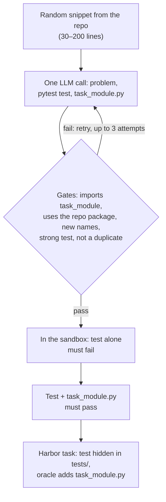

Each task asks the agent to write a new module, `task_module.py`, that builds on
the target library's API. An LLM invents the problem, a pytest test and a reference
solution from a random snippet of the repository in one call. The pipeline keeps
the task only if the test fails without the solution and passes with it inside the
repository's Docker image; the hidden test is the reward.

## At a glance

| | |
|---|---|
| Input | A Python repository on GitHub, GitLab or a local path |
| Task | Implement `task_module.py` so a hidden pytest test passes, using the repository's package |
| Reward | Binary: 1.0 if the hidden test file passes, else 0.0 |
| Needs an LLM | Yes: the one-time bootstrap (cached) and one call per synthesis attempt |
| Needs Docker | Yes, for bootstrap, validation and running tasks |
| Hosts | GitHub, GitLab and local paths |
| Languages | Python only. On GitHub, the repository's primary language is checked first (`--force-language` skips the check) |
| Status | Experimental |
| Reference dataset | [`FineEnvs/repo2rlenv-code-instruct`](https://huggingface.co/datasets/FineEnvs/repo2rlenv-code-instruct): 100 tasks, 20 each from click, flask, requests, attrs and starlette |

## Quickstart

```bash
repo2rlenv generate \
  --repo pallets/click \
  --pipeline code_instruct \
  --pipeline-opt limit=5 \
  --pipeline-opt seed=42 \
  --llm anthropic/claude-sonnet-4-6 \
  --out ./tasks/click-code-instruct
```

Here `limit` is the number of tasks to emit; the pipeline samples up to five
snippets per requested task before it gives up. `seed` makes snippet sampling
repeatable. The first run bootstraps the repository (capped by `--max-spend-usd`,
default 5.0, and cached). Each task lands in
`./tasks/click-code-instruct/pallets__click-cinst-<hash>/`. Run the oracle, which
should score 1.0:

```bash
harbor run -p ./tasks/click-code-instruct -a oracle --env docker
```

## How it works



1. **Bootstrap** the repository once and shallow-clone it at `--ref`. See
   [Bootstrap](../reference/BOOTSTRAP.md).
2. **Find the package.** Read `[project].name` from `pyproject.toml`, or look for
   `src/<repo>/__init__.py` or `<repo>/__init__.py`, and list the package's top-level
   symbols.
3. **Sample a seed.** Pick a random file matching `file_glob` and not
   `exclude_glob`, then a random window of `seed_min_loc` to `seed_max_loc` lines.
   Windows that are at least 80% blank lines, comments or imports are resampled.
4. **Synthesize.** One call asks for three sections, `[Problem Description]`,
   `[Test]` and `[Solution]`. The prompt requires the problem to build on the
   package's public API, the test to import from `task_module` with 3–6 assertions
   including a `pytest.raises`, and the solution to import and use the package.
5. **Gate the candidate.** Reject it if it matches a known benchmark phrase, if the
   test doesn't import `task_module`, if the solution doesn't import and use the
   package, if a top-level name in the solution already exists in the package, if
   the test is weak, or if it duplicates an earlier task. A rejected candidate is
   retried on the same seed up to `max_attempts_per_seed` times.
6. **Verify in the sandbox.** With only the test file in place, pytest must not
   pass. With the solution written to `task_module.py`, it must pass.
7. **Emit the task.** The instruction is the generated problem plus a delivery
   contract: write the implementation to `/workspace/task_module.py`, don't modify
   existing files, and expose the names the problem mentions.

## Options

Pass each option with `--pipeline-opt key=value`.

| Key | Default | What it does |
|---|---|---|
| `limit` | `50` | Number of tasks to emit. At most five times this many seeds are sampled |
| `seed_min_loc` / `seed_max_loc` | `30` / `200` | Snippet window size, in lines |
| `file_glob` | `**/*.py` | Files to sample seeds from |
| `exclude_glob` | tests, `test_*`, `*_test.py`, `docs/`, `examples/`, `__init__.py` | Files never used as seeds |
| `seed` | none | Random seed for snippet sampling |
| `max_attempts_per_seed` | `3` | LLM attempts per seed when a gate rejects the candidate |
| `llm_temperature` | `0.7` | Sampling temperature for synthesis |
| `max_llm_tokens` | `2048` | Output token limit for synthesis |
| `require_test_fails_without_oracle` | `true` | Reject tests that pass without `task_module.py` |
| `require_test_passes_with_oracle` | `true` | Reject tasks whose solution fails its own test |
| `validation_timeout_sec` | `180` | Timeout for each sandbox test run |
| `skip_validation` | `false` | Emit without running the sandbox checks. For debugging |
| `skip_decontamination` | `false` | Skip the benchmark-phrase check |

## Output

```files
pallets__click-cinst-<hash>
├── task.toml
├── instruction.md
├── environment
│   └── Dockerfile
├── solution
│   ├── patch.diff
│   └── solve.sh
└── tests
    ├── test.sh
    └── test_r2e_<hash>.py
```

- `task.toml`: Harbor 1.0 task. `reference` links to the seed lines; `[metadata.repo2env.code_instruct]` records the seed path and line range, the test file name, the bootstrap image and `llm_cost_usd`. The [evaluation label](task_evaluation_labels.md) starts as `unverified`.
- `instruction.md`: the generated problem statement and the delivery contract.
- `environment/Dockerfile`: `FROM` the bootstrap image, with the repository as bootstrapped.
- `solution/patch.diff`: creates `task_module.py` (the [oracle](../concepts/glossary.mdx#oracle)); `solve.sh` applies it.
- `tests/test_r2e_<hash>.py`: the generated test. Harbor delivers `tests/` at verify time for every agent.
- `tests/test.sh`: copies the test into `/workspace` and runs `python -m pytest` on it.

## Reward

`tests/test.sh` writes 1.0 to `/logs/verifier/reward.txt` when the test file passes
and 0.0 otherwise. There is no partial credit and no `reward-details.json`. A no-op
agent scores 0, because the test can't import `task_module`. See
[Rewards](../concepts/rewards.mdx#binary-test-execution).

## Yield and cost

The reference generation log records 136 sampled seeds for 100 exported tasks,
a 73.5% yield. Model retries happen within a seed, so they don't add to the count.

| Repository | Seeds | Exported | Yield |
|---|---:|---:|---:|
| pallets/click | 27 | 20 | 74.1% |
| pallets/flask | 28 | 20 | 71.4% |
| psf/requests | 24 | 20 | 83.3% |
| python-attrs/attrs | 23 | 20 | 87.0% |
| encode/starlette | 34 | 20 | 58.8% |
| **Total** | **136** | **100** | **73.5%** |

The most common rejections were solutions that failed their own tests and duplicate
tasks. Recorded synthesis cost was $3.78 for the 100 tasks, about $0.04 per task,
including retries but not bootstrap, compute or solver runs. In a five-task sample,
one task per repository, Claude Sonnet 4.6 in Claude Code scored 1.0 on four and 0
on one, for $0.27 in model usage. That's a small sample, not a solve rate. See
[native results](native_results.md#code-instruct).

What moves yield: the model's skill at writing a test and a solution that agree,
seed size (very small or very large windows give weaker tasks), and whether the
package can be detected. Cost scales with `limit × max_attempts_per_seed` calls.
Unlike the runtime pipelines, the repository's own test suite doesn't need to pass,
but the repository still has to bootstrap.

## Limits

- **A generated task isn't a verified environment.** Run the controls: the oracle
  should score 1.0 and a no-op agent (`-a nop`) 0. Record the outcome as an
  evaluation label; see [Quality](../concepts/quality.mdx).
- **The model invents the problem.** The generated test is the only specification,
  so it can encode choices the instruction doesn't state. Review instructions
  against their tests.
- **Anchoring depends on package detection.** If no package is found, the
  repository-anchoring and name-collision gates are skipped, and tasks can drift
  into generic exercises.
- **Decontamination is a short phrase list**, not a benchmark index.
- **Python and pytest only.**
- **`llm_cost_usd` is cumulative for the run**, not the cost of that task.
- **Tasks depend on a local image** until you publish them with `repo2rlenv push`.

## Related

- [RFC 0004: code_instruct](../rfcs/0004-code-instruct.md)
- [Reference dataset](https://huggingface.co/datasets/FineEnvs/repo2rlenv-code-instruct) and its [generation evidence](native_results.md#code-instruct)
- [`equivalence_tests`](equivalence_tests.md): tasks grounded in a real function instead of an invented one
- [Tasks](../concepts/tasks.mdx), [Rewards](../concepts/rewards.mdx) and [Run with Harbor](../guides/run-with-harbor.mdx)
- Adapted from OSS-Instruct in [Magicoder](https://github.com/ise-uiuc/magicoder) (Wei et al., 2024): seeds come from one repository instead of a corpus, and every task ships an executable test that the reference solution must pass. No code is copied.

## Implementation notes

Source: [`pipelines/code_instruct.py`](https://github.com/huggingface/Repo2RLEnv/blob/main/src/repo2rlenv/pipelines/code_instruct.py)
and [`pipelines/_oss_instruct.py`](https://github.com/huggingface/Repo2RLEnv/blob/main/src/repo2rlenv/pipelines/_oss_instruct.py).

The gates and the skip reasons they record:

| Gate | Rejects when | Skip reason |
|---|---|---|
| Parse | A section is missing or empty | `llm_parse_failed` |
| Decontamination | The problem or solution contains a known HumanEval, MBPP, APPS, GSM8K or DS-1000 phrase | `benchmark_overlap` |
| Test import | The test doesn't import from `task_module` | `test_does_not_use_task_module` |
| Repository anchoring | The solution has no import of the package, or never uses what it imports | `no_repo_import`, `repo_import_unused` |
| Name collision | A top-level class or function in the solution shares a name with a package symbol, which would let an agent re-export the real code | `symbol_collides_with_repo:<name>` |
| Test strength | No `test_*` function, fewer than three non-trivial asserts, any constant assert (`assert True`), or no `pytest.raises` when the problem mentions raising, errors, invalid input or rejection | `no_test_functions`, `too_few_asserts`, `trivial_assert_present`, `missing_pytest_raises` |
| Duplicate | The first 80 characters of the problem, or the set of public names in the solution, match an earlier task in the run | `duplicate_task` |
| Sandbox | The test passes without the solution, or fails with it | `test_passes_without_oracle`, `oracle_does_not_satisfy_test` |

- The gold patch creates only `task_module.py`. The test ships in `tests/` rather
  than the patch, because Harbor stages `solution/` only for its oracle agent, so
  other agents would otherwise run pytest against a missing file.
- The delivery contract exists because agents often wrote correct code to a
  naturally named file, and pytest then failed with
  `ModuleNotFoundError: No module named 'task_module'`.
- Sandbox checks reset the working tree with `git reset --hard` and `git clean`
  before each candidate, and decide pass or fail from pytest's summary line.
