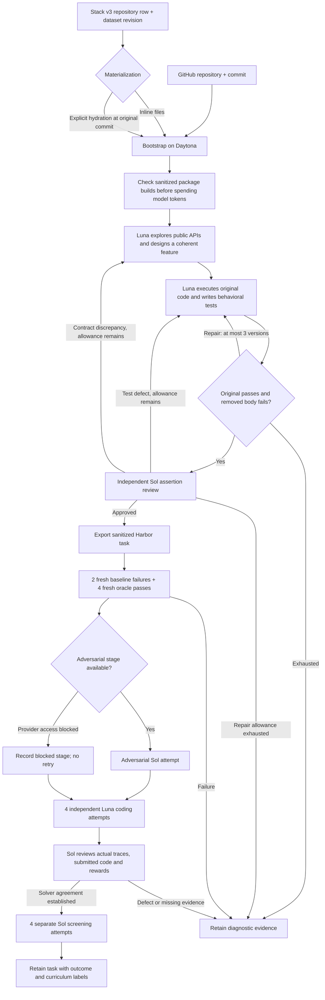

CodeMidas turns **working source code into a reconstruction task**. An agent
explores a feature, writes down its behavioral contract, and removes the
implementation. A second stage runs the original code to build private tests.
The original source becomes the Harbor oracle, and the training reward comes only
from executable tests.

This is an independent reproduction of the
[CodeMidas method](https://arxiv.org/abs/2609.22068), starting with offline
Python libraries on CPU. The paper didn't publish its exact prompts,
construction models or generator code, so the choices made here are recorded in
[RFC 0031](../rfcs/0031-codemidas-recipe.md).

## What happens



The **100-task campaign target counts generated tasks**, not 100 guaranteed
training acceptances. Keep the exported, execution-verified, method-reviewed and
curriculum-selected counts separate. Tasks where every attempt passes, or every
attempt fails, are still useful artifacts. They fall outside this model's
mixed-outcome curriculum, but that doesn't make them defective. The task contract
and verifier are frozen before any blind attempt.

Generated `task.toml` files use the shared evaluation schema with
`profile = "codemidas-v1"`, stage `controls`, and reason
`codemidas_controls_passed`. After the audit,
`AUDIT_DIRECTORY/retained/AUDIT_REVISION/TASK` holds a labeled copy bound to the
same executable bundle. A sound task records `codemidas_method_sound` and its
curriculum outcome; a defective one records `needs_repair`. The generic
`verified` label is kept for the separate shared quality-loop profile and its
semantic probes. Raw task and trial directories aren't changed.

If provider access blocks the adversarial stage, generation and the ordinary
solver checks can still go ahead. A task whose solver review passes then records
`blocked`, `provider_policy_blocked` and `codemidas_solver_review_passed`. Its
full method check stays incomplete, so it can't enter the paper's selected
curriculum. The campaign's `codemidas-adversarial-policy-block.json` stops new
adversarial dispatches; it doesn't quietly swap in a different model or prompt.
An explicit model refusal also stops the affected stage. Refusals are metered and
kept apart from malformed output, and they never trigger format-recovery retries.

## Prompts and evidence

| Stage | Model | What it receives | Required result |
|---|---|---|---|
| Design | GPT-6 Luna by default | Pinned source, anchor, source roots, read-only remote shell | Public instruction, requirement IDs, selected function/method bodies |
| Verifier | Same configured author | Frozen feature, working reference shell, execution feedback | Pytest tests, assertion-to-requirement map, observed examples |
| Assertion review | GPT-6 Sol | Instruction, tests, original source, observations, contrast, read-only reference shell | Material defects or an explicit approval |
| Adversarial attempt | GPT-6 Sol | Only the learner task and isolated terminal | Concrete evidence of accessible answers or reward bypasses |
| Four solver attempts | GPT-6 Luna | Only the learner task and isolated terminal | Independent patches and deterministic rewards |
| Rollout review | GPT-6 Sol | Immutable task, traces, submitted source and rewards | Evidence-backed agreement or false positives/negatives |
| Curriculum screen | GPT-6 Sol | Four fresh learner environments | `mixed`, `all_pass`, `all_fail`, or `incomplete` |

Read the [complete prompts and request assembly](prompts/codemidas.md),
including the solver and adversarial instructions.

### Models

To author with Sol, set both `pipeline.options.author_model: openai/gpt-6-sol`
and the matching `llm.model: gpt-6-sol`. Each task records its author and
reviewer models. Independent review uses a separate context even when both
stages use Sol.

### Repairs before a task is frozen

Before a task is frozen, assertion review can send a correction to its tests or
to its description. A description repair keeps the selected implementation
boundary and reconciles a discrepancy observed in the public API. All repairs
share one limit of three executed verifier versions. Invalid Python goes back to
the author as feedback before anything runs. An author can explicitly reject an
unsuitable candidate, giving the reason it observed; the pipeline keeps that
diagnosis and moves on. A reconstruction must describe behavior the original
code already has, not a proposed extension. Solver outcomes never lead to a
change in the task contract.

When broad claims, or interactions between options, are uncertain, review can
run a few targeted probes against the reference. Early audits found two problems
this way: an incorrect promise about empty output shapes, and a verifier that
tested options one at a time but missed how they behave together. The
construction prompts now check those boundaries explicitly. Tasks that were
already frozen keep their original results and defect labels.

Graph pilots showed another pattern. An optional filter was exercised only on
inputs where every result matched, and a repair replaced an earlier useful case.
The prompts now require contrasting fixtures for selection, and repairs keep the
checks that were justified. These changes improve construction; they don't
rewrite tasks that were already audited.

The controller writes every requirement into `instruction.md` as an acceptance
criterion, and the tests and independent review get that exact text. The private
requirement map links tests to public behavior, and it can't add rules of its
own. This fixes a pilot failure in which a filename restriction appeared only in
the hidden tests and looked, misleadingly, like model difficulty.

### Spend and retries

Every API call reserves spend before it runs. Exact requests, responses, cache
usage, tool outputs, model settings and costs are kept in the campaign folder,
which git ignores. This profile has no Anthropic route and no automatic provider
fallback. A completed API request with incomplete output gets one bounded
regeneration. Its usage is still charged, and none of its partial tool actions
run. Unknown transport outcomes keep their budget reservation. Curriculum
screening can replace a known provider-output failure once, keeping both
receipts. Valid successes and failures are never retried to change the
difficulty label.

## Run

Install the usual optional execution libraries, and set up a campaign with the
[shared worker and budget commands](owned_recipes.md#accounting-and-workers).
Generation uses the normal CLI and progress display:

```bash
repo2rlenv pipelines describe repo_reconstruct --recipe codemidas
repo2rlenv generate --config codemidas.yaml
```

```yaml
repo:
  url: owner/library
  ref: REPLACE_WITH_COMMIT_SHA
  access: public
pipeline:
  name: repo_reconstruct
  recipe: codemidas
  options:
    source_paths: [library]
    target: 2
    max_candidates: 6
    max_rounds: 3
    candidate_budget_usd: 2
llm:
  provider: openai
  model: gpt-6-luna
output:
  destination: workspace/codemidas/tasks
  org: HuggingEnvs
  dataset_name: CodeMidas
execution:
  worker_receipt: workspace/codemidas/workers/worker.json
  runtime_wheel: dist/repo2rlenv-0.9.3-py3-none-any.whl
  campaign_dir: workspace/codemidas
  run_id: library-pilot-01
  timeout_sec: 3600
```

After generation, run the audit explicitly. It reuses matching control receipts:

```bash
repo2rlenv codemidas audit workspace/codemidas/tasks/TASK \
  --controls workspace/codemidas/runs/RUN/tasks/CANDIDATE \
  --campaign workspace/codemidas \
  --worker-receipt workspace/codemidas/workers/worker.json \
  --runtime-wheel dist/repo2rlenv-0.9.3-py3-none-any.whl \
  --out workspace/codemidas/audits/TASK
```

Independent solver attempts run two at a time by default. Set
`--attempt-concurrency 1` to run them one after another, or up to `4` on a
larger worker. Each attempt has its own learner environment, receipt and spend
reservation. Running in parallel doesn't reduce the four audited solutions or
the screening sample that are required. The reviewer gets the changed-line
ranges for each submitted file and can read the full, immutable file when it
needs to. That keeps long source files navigable without replacing source
evidence with a model-written summary. A review cut off by its context limit
stays incomplete; it never counts as a task failure or a pass.

Use `--resume` for attempts that haven't changed. If observation was interrupted
after dispatch, the audit can retrieve the original completed remote job once it
has checked the worker, command and cleanup receipt. It never launches another
solve during recovery. If both the controller receipt and the remote supervisor
check prove that a trial never launched, its reservation can be released and one
separately identified replacement started. The abandoned receipt stays
available. A timeout after a model request has an unknown billing outcome, so it
keeps its maximum reservation. Unknown provider outcomes keep their reservation,
and changing prompts, source, runtime or verifier needs a new run identity. Keep
versioned runtime wheels.

If you're developing during a campaign, run the controller from the same
installed wheel as the worker. An editable controller is refused on purpose if
its code no longer matches the pinned runtime. Concurrent controllers share an
installation lock on each remote worker, so they can't create the same
environment twice.

## Stack v3 input

Supply `stack_manifest` in the recipe options. It's a JSON object with
`dataset` (`HuggingFaceCode/stack-v3-train`), `dataset_revision` (a commit SHA)
and `row` (the complete, bounded repository row). The configured repository and
commit must match the row. `stack_materialization: inline` uses the row's actual
files; `hydrated` explicitly restores the GitHub checkout at that same commit.
HEAD is never silently substituted.

```bash
repo2rlenv codemidas source workspace/stack-row.json --materialization inline
```

Rows carry inline `files[].content`. The full Stack v3 corpus is a **bucket
with a different schema**, and this adapter doesn't accept it. Missing build
resources, and files that were redacted or filtered, can stop an inline build.
Those are limits of the source, not task failures. The current distribution
profile requires explicit permissive file licenses, and it rejects unsafe paths
and oversized rows.

## Limits and economics

The first implementation removes existing Python function and method bodies
and keeps their interfaces. It supports related symbols across files, and the
learner can edit existing Python files under the configured roots. It doesn't yet
support arbitrary new implementation files, non-Python builds, GPU tasks or
external services.

Structural anchor selection is an engineering choice made here. Unlike the
paper's broader generation, it currently selects multiline public functions and
methods. `max_per_module` limits eligible, non-excluded anchors, not attempted
slots. Use `exclude_candidate_ids` when you continue a repository under a new run
identity. The default per-module cap is two, and an explicit campaign can raise
it to 100. The candidate pool can be smaller than `target`, and different anchors
can select the same missing implementation; duplicates like that don't count as
new tasks. Private helper modules are left out of directory-wide discovery. A
Python file you list explicitly can override that filter when it implements an
exported public API, which is common in Hugging Face libraries.

### Reproduction boundary

| Aspect | This implementation |
|---|---|
| Source-driven design | Working repository code supplies the behavior and original-source oracle. No PR, issue, docstring or existing test is required. |
| Execution and agreement | Six fresh control trials and four independently reviewed solver attempts follow the published method. |
| Generation choices | Public Python AST anchors, Sol/Luna, bounded repairs and the owned prompts are our choices; they are not upstream code or undisclosed paper settings. |
| Scope | Python CPU libraries. Multi-symbol and multi-file removal is supported; measured task scope must be reported separately from this capability. |
| Final screening | Four Sol attempts are our explicit sample size. All-pass/all-fail artifacts are retained, but do not satisfy the paper's mixed-outcome selection. |
| Adversarial coverage | Implemented; blocked in the initial campaign by provider access. A blocked check never establishes soundness. |
| Training and generalization | No RL training, benchmark improvement, or benchmark-contamination clearance is claimed. Public sources may appear in model pretraining. |

Compare these boundaries with [Sections 3.1–3.5 of the paper](https://arxiv.org/html/2609.22068v1#S3).
The emitted Dockerfiles keep the source profile's package constraints and base
image tag. Remote receipts identify the images used in this campaign, but a
rebuild isn't a fully locked, permanently archived dependency closure.

## Measured local campaign

The campaign on 2026-09-25 staged **100 Harbor tasks locally**. Every selected
task passed two fresh baseline-failure controls, four oracle-success controls,
and an independent review of four Luna solver attempts. Each one then got four
Sol screening attempts, whose rewards are reported separately below. Provider
access blocked the adversarial checks, and with approval the campaign continued
with those stages explicitly labelled as blocked. **Zero tasks are claimed as
fully method-validated or accepted into the paper's curriculum.** No dataset was
published and no RL training was run.

| Outcome | Count |
|---|---:|
| Current-collection construction attempts | 213 |
| Unique exports passing all six execution controls | 128 |
| Ordinary solver reviews passed | 101 |
| Reviews with demonstrated false positives or false negatives | 26 |
| Reviews unresolved without a demonstrated false positive/negative | 1 |
| Curated local tasks | 100 |

Construction yield was **60.1%**, and ordinary-review yield among exports was
**78.9%**. These denominators leave out discovery candidates that were never
attempted. The attempt count includes two candidates stopped at a safe control
boundary after the goal was reached. Rejected candidates, diagnosed exports and
nine older pilot folders are still available locally, outside the curated
collection.

| Source repository | Generated | Ordinary review passed | Curated |
|---|---:|---:|---:|
| [ShipDataProcess](https://github.com/GlobalFishingWatch/ShipDataProcess) | 2 | 2 | 2 |
| [pydash](https://github.com/dgilland/pydash) | 10 | 8 | 8 |
| [filesystem_spec](https://github.com/fsspec/filesystem_spec) | 3 | 1 | 1 |
| [python-sortedcontainers](https://github.com/grantjenks/python-sortedcontainers) | 4 | 2 | 2 |
| [huggingface_hub](https://github.com/huggingface/huggingface_hub) | 3 | 3 | 3 |
| [boltons](https://github.com/mahmoud/boltons) | 32 | 24 | 24 |
| [more-itertools](https://github.com/more-itertools/more-itertools) | 32 | 28 | 27 |
| [networkx](https://github.com/networkx/networkx) | 28 | 22 | 22 |
| [packaging](https://github.com/pypa/packaging) | 5 | 4 | 4 |
| [toolz](https://github.com/pytoolz/toolz) | 9 | 7 | 7 |

The curated set has 98 tasks sourced from GitHub and 2 from actual inline
Stack v3 files. It has **17 multi-symbol tasks and 0 multi-file tasks**. They're
all Python CPU library tasks, so don't confuse the multi-file and broader-domain
capability with what this campaign actually measured.

### Difficulty and quality

Sol's four-attempt screening produced **90 all-pass, 4 mixed and 6 all-fail
tasks** in the curated set. Sol solved 370/400 attempts, and at least one attempt
on 94/100 tasks. Luna solved 358/400 attempts, and at least one attempt on 92/100
tasks. Most tasks are easy for Sol. Passing ordinary review shows agreement on
the sampled attempts; it doesn't show frontier difficulty or that the verifier is
exhaustively correct. Only the mixed subset meets the screening-outcome filter,
and even there the blocked adversarial checks prevent full method acceptance.

Review caught missed boundary cases, contradictory requirements, and tests that
accepted implementations that broke the public contract. Construction controls
alone didn't catch these defects. Reference probes, contrasting fixtures and
keeping coverage during repairs improved later generation. Repository profiles
and candidate pools were chosen and adjusted during development, so this
campaign doesn't show unattended success on arbitrary repositories.

### Measured economics

The $300 cap covered the whole campaign: failed construction, older pilots,
review, screening and compute. The accounted cost is **$99.91**, plus **$1.47
reserved** for API calls whose billing outcome was still unknown after a
connectivity interruption. All workers are stopped. The accounted amount includes
**$11.71 of conservative Daytona compute estimates**, which aren't an invoice.
The remaining **$88.20** comes from recorded API usage.

| Stage | Accounted USD |
|---|---:|
| Task design | $2.58 |
| Verifier construction and repair | $4.14 |
| Independent assertion review | $28.32 |
| Ordinary Luna rollouts | $2.13 |
| Independent rollout review | $27.49 |
| Sol screening | $23.14 |
| Adversarial attempts before the access block | $0.39 |
| Daytona compute estimate | $11.71 |
| Other recorded pilot calls | $0.00 |

Across the whole campaign, that's **$0.78 per current export**, **$0.99 per
passing ordinary review**, and **$1.00 per curated task** (up to **$1.01** per
curated task if every unresolved reservation is charged). These are observed
averages for this mix of sources and models, not a price guarantee for other
repositories. There's no cost per fully accepted task, because no task completed
the blocked adversarial stage.

The local campaign directory, which git ignores, holds the 100-task archive, the
retained `task.toml` labels, a checksummed release manifest, source provenance,
per-task trials, usage receipts and a detailed report. The PR,
[#165](https://github.com/huggingface/Repo2RLEnv/pull/165), contains only the
implementation, tests, prompts and this measured summary.

## Release status and audit

The [release notes and pre-merge audit](../release_notes/codemidas.md) separate
the 0.9.2 package release from the dataset, which is staged locally and
unpublished. The [central results](releases.md#local-collections-awaiting-publication)
and [economics](economics.md#codemidas-generation-and-evaluation) include this
cohort without changing the existing published totals.

Inconclusive or infrastructure-limited reviews keep `blocked` labels. Only
demonstrated false positives, false negatives or confirmed exploits produce
`needs_repair`. Applying this rule corrected how one unresolved task outside the
selected 100 was first annotated, without changing any task instruction,
verifier or oracle.
