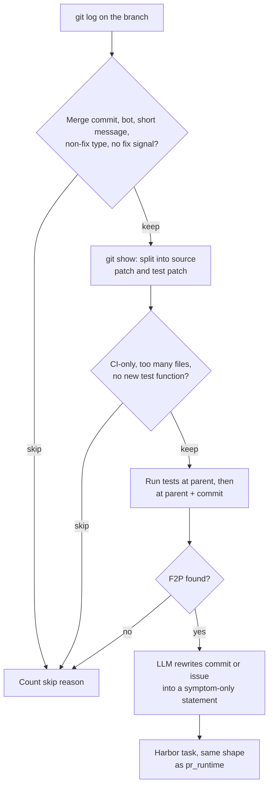

Each task is a bug-fix commit that changed both source and tests. The agent gets a
problem statement an LLM rewrote from the commit message (or its linked issue) to
describe only the symptom; the commit's own tests, hidden until verification,
decide the reward. Use it on repositories whose fixes land as ordinary commits,
including local checkouts with no pull-request history.

## At a glance

| | |
|---|---|
| Input | A GitHub or GitLab repository, or a local git checkout |
| Task | Fix the bug a commit fixed, starting from its parent commit |
| Reward | Graded `f2p_rate × p2p_rate`, plus strict `resolved` and `command_resolved` flags (the [`pr_runtime`](pr_runtime.md#reward) verifier) |
| Needs an LLM | Yes: the one-time bootstrap (cached) and one call per emitted task to write the problem statement |
| Needs Docker | Yes, for bootstrap, validation and running tasks |
| Hosts | GitHub, GitLab and local paths. Linked-issue text is fetched only from GitHub and GitLab |
| Languages | The same test runners as `pr_runtime`: pytest, `go test`, `cargo test`, Jest, Mocha and Vitest. The reference dataset has Python and Go tasks |
| Status | Stable |
| Reference dataset | [`FineEnvs/repo2rlenv-commit-runtime`](https://huggingface.co/datasets/FineEnvs/repo2rlenv-commit-runtime): 100 tasks from 22 repositories |

## Quickstart

```bash
repo2rlenv generate \
  --repo pallets/click \
  --pipeline commit_runtime \
  --pipeline-opt limit=100 \
  --llm anthropic/claude-sonnet-4-6 \
  --out ./tasks/click-commit-runtime
```

`limit` is the number of commits walked, newest first, so you get at most that many
tasks. The same `--llm` model bootstraps the repository (capped by
`--max-spend-usd`, default 5.0, and cached) and writes the problem statements. Each
task lands in `./tasks/click-commit-runtime/pallets__click-<sha12>/`. Run the
oracle, which should score 1.0:

```bash
harbor run -p ./tasks/click-commit-runtime -a oracle --env docker
```

## How it works



1. **Bootstrap** the repository once, as for `pr_runtime`. See
   [Bootstrap](../reference/BOOTSTRAP.md).
2. **Walk the history.** Clone `clone_depth` commits at `--ref` and list up to
   `limit` commits on `branch` with `git log`, bounded by `since` and `until`. The
   walk isn't first-parent, so it includes commits brought in by merges.
3. **Filter on metadata.** Skip merge commits (`skip_merge_commits`), authors in
   `exclude_authors`, and messages shorter than `min_message_words` or
   `min_problem_statement_words`. Skip conventional-commit types that aren't fixes
   (`chore`, `docs`, `feat`, `refactor`, `style`, `test`, `ci`, `build`, `perf`,
   `revert`). Require a fix signal: a `fix:` prefix, a linked issue (`Fixes #12`), or
   a word such as *fix*, *bug*, *regression*, *crash*, *broken*, *incorrect*, *wrong*
   or *fail* in the subject.
4. **Split the diff** from `git show` into a source patch and a test patch, with the
   same path rules as `pr_runtime`. Skip the commit if either is empty.
5. **Filter on structure.** Skip commits whose source changes are all under
   `.github/`, that touch more than `max_source_files_per_commit` source files, or
   whose test patch adds no test function. Skip commits with no parent.
6. **Validate twice** in the bootstrap container at the parent commit: tests with
   only the test patch, then with the whole commit. Keep the commit if at least
   `min_fail_to_pass` tests flip, and cap the P2P set at `max_pass_to_pass`.
7. **Write the instruction.** When the commit links an issue, fetch the issue. With
   `synthesize_with_llm` on, an LLM rewrites the commit message and issue into a
   short bug report: the symptom and expected behavior, with no fix, file names,
   test names, hashes or issue numbers. If the call fails, the pipeline falls back to
   the stripped commit or issue text.
8. **Emit the task**, with the commit's source changes as the oracle.

## Options

Pass each option with `--pipeline-opt key=value`.

| Key | Default | What it does |
|---|---|---|
| `limit` | `50` | Maximum commits to walk. You get at most this many tasks |
| `since` / `until` | none | ISO dates (`2026-01-31`) bounding the commit date |
| `branch` | `HEAD` | Branch or ref to walk |
| `clone_depth` | `200` | History depth to clone. Raise it when `limit` or the date range reaches further back |
| `skip_merge_commits` | `true` | Skip commits with more than one parent |
| `min_message_words` | `5` | Skip commits whose message has fewer words |
| `min_problem_statement_words` | `8` | A second word-count floor on the commit message, applied before synthesis. `0` disables it |
| `max_source_files_per_commit` | `10` | Skip commits that touch more source files |
| `exclude_authors` | `[]` | Author emails to skip, as JSON: `'exclude_authors=["bot@example.com"]'` |
| `require_new_test_funcs` | `true` | Require the test patch to add at least one test function |
| `skip_ci_only` | `true` | Skip commits whose source changes are all under `.github/` |
| `require_fail_to_pass` | `true` | Skip commits with fewer than `min_fail_to_pass` F2P tests |
| `min_fail_to_pass` | `1` | Minimum number of F2P tests |
| `max_pass_to_pass` | `50` | Cap on the P2P set. `0` keeps all of them |
| `validation_timeout_sec` | `600` | Timeout for each of the two validation test runs |
| `skip_validation` | `false` | Emit without running tests, with a pass/fail exit-code reward. For debugging |
| `synthesize_with_llm` | `true` | Rewrite the commit or issue into a symptom-only problem statement |
| `llm_temperature` | `0.3` | Sampling temperature for the rewrite |
| `max_llm_tokens` | `1024` | Output token limit for the rewrite |

## Output

```files
pallets__click-<sha12>
├── task.toml
├── instruction.md
├── environment
│   ├── Dockerfile
│   └── docker-compose.yaml
├── solution
│   ├── patch.diff
│   └── solve.sh
└── tests
    ├── test.sh
    ├── verifier.py
    ├── f2p.json
    └── p2p.json
```

The files match [`pr_runtime`'s output](pr_runtime.md#output): an environment
`FROM` the bootstrap image at the parent commit with history scrubbed and an
egress guard, the commit's source changes as `solution/patch.diff`, and the hidden
test patch plus graded verifier under `tests/`. `task.toml` carries
`[metadata.repo2env.commit_runtime]`: commit and parent SHAs, author date and email,
subject, F2P and P2P lists, `validation_status`, the bootstrap image digest,
`instruction_synthesized` and `llm_cost_usd`. For a local checkout, the
`reference` URL is omitted. The [evaluation label](task_evaluation_labels.md)
starts as `unverified`.

## Reward

Identical to [`pr_runtime`](pr_runtime.md#reward): `f2p_rate × p2p_rate` in
`reward.txt` for training, and `resolved` and `command_resolved` in
`reward-details.json` for evaluation. The test files are restored and the hidden
test patch re-applied before scoring, so editing tests doesn't help.

## Yield and cost

No generation denominator or cost ledger was recovered, so yield is unmeasured.
The main driver is how a repository lands its fixes. A commit yields a task only
when it carries both the fix and a test that exercises it. Squash-merged pull
requests and direct commits usually do. Merge commits themselves are skipped, and
branches merged with merge commits often split the fix and its test into separate
commits, so neither shows a failing-to-passing test. On those repositories, use
[`pr_runtime`](pr_runtime.md). Repository health matters as much as it does for
`pr_runtime`: the suite has to run in the bootstrap container.

Cost is one bootstrap per repository, two test runs per candidate, and one
problem-statement call per emitted task.

All 100 reference tasks carry generation-time `validation_status = "verified"`,
but a Harbor oracle run over all 100 wasn't recovered. An earlier 52-task cohort,
built before instruction synthesis, has separate evidence: 52 oracle passes, 47
clean-command passes and 47 with a regression guard. No reliable solve rate was
recovered. See [native results](native_results.md#commit-runtime).

## Limits

- **A generated task isn't a verified environment.** Run the controls: the oracle
  should score 1.0 and a no-op agent (`-a nop`) 0. Record the outcome as an
  evaluation label; see [Quality](../concepts/quality.mdx).
- **Commits are unreviewed.** Nobody signed off on a commit the way a PR is
  reviewed, so the filters and validation do all the work. Review instructions and
  verifiers before you rely on a task.
- **The problem statement is model-written.** The rewrite is told to describe only
  the symptom, but it can still leak the fix or come out vague.
- **History is shallow.** Only `clone_depth` commits are cloned, and the oldest
  commit in a shallow clone has no parent, so it's skipped.
- **Runtime limits carry over.** Python needs pytest output
  ([#167](https://github.com/huggingface/Repo2RLEnv/issues/167)), and the egress
  guard doesn't block the Go module proxy or crates.io
  ([#160](https://github.com/huggingface/Repo2RLEnv/issues/160)).
- **`llm_cost_usd` is cumulative for the run**, not the cost of that task.
- **Tasks depend on a local image** until you publish them with `repo2rlenv push`.

## Related

- [RFC 0003: commit_runtime](../rfcs/0003-commit-runtime.md)
- [Reference dataset](https://huggingface.co/datasets/FineEnvs/repo2rlenv-commit-runtime) and its [release history](native_results.md#commit-runtime)
- [`pr_runtime`](pr_runtime.md): the PR-based sibling, with the verifier details
- [`r2e_gym`](r2e_gym.md): the research recipe for commit history
- [Tasks](../concepts/tasks.mdx), [Rewards](../concepts/rewards.mdx) and [Run with Harbor](../guides/run-with-harbor.mdx)
- Inspired by the SWE-GEN curation in [R2E-Gym](https://github.com/R2E-Gym/R2E-Gym) (Jain et al., 2025). No code is copied.

## Implementation notes

Source: [`pipelines/commit_runtime.py`](https://github.com/huggingface/Repo2RLEnv/blob/main/src/repo2rlenv/pipelines/commit_runtime.py)
and [`git_local.py`](https://github.com/huggingface/Repo2RLEnv/blob/main/src/repo2rlenv/git_local.py).
Patch splitting, validation, the eval script and the verifier are reused from
`pr_runtime`.

- The walk runs `git log --max-count=<limit>` on `branch` in the shallow clone. The
  pipeline warns when the candidate count reaches `clone_depth`, since the clone may
  be truncating history.
- When the P2P set exceeds `max_pass_to_pass`, tests whose names mention a changed
  file are kept first, then the rest fill up to the cap.
- The synthesized statement must be at least 10 words, or the pipeline uses the
  fallback text. The fallback strips the conventional-commit prefix, closing
  keywords, commit hashes, PR and issue links, `(#123)` squash suffixes and
  `owner/repo#123` cross-references, then trims template sections.
- Task IDs are `<owner>__<repo>-<first 12 characters of the SHA>`. The `reference`
  URL points at `github.com/<owner>/<repo>/commit/<sha>`, or `/-/commit/` on GitLab.
