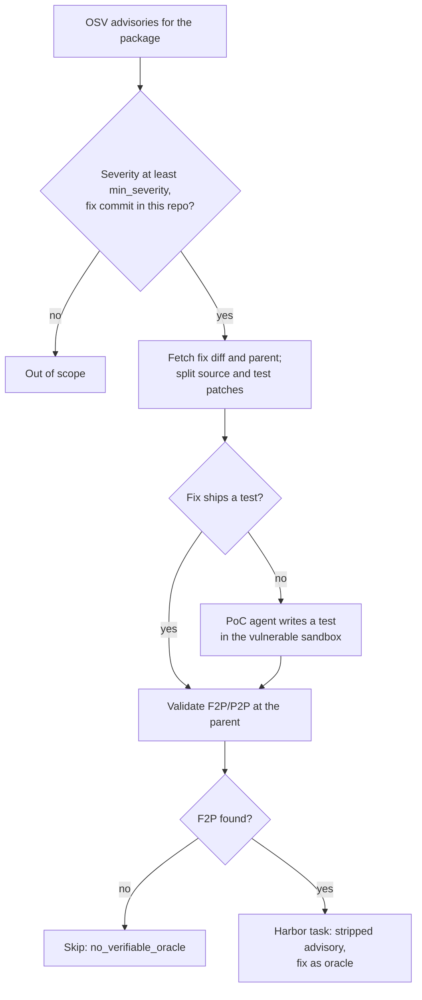

Each task is a published vulnerability in the target repository: the agent gets
the advisory with every pointer to the fix removed and patches the code at the
commit before the fix. The reward comes from a regression test that fails on the
vulnerable code and passes on the fixed code: the fix commit's own test when it
ships one, otherwise a proof-of-concept (PoC) test that an LLM agent writes in the
vulnerable sandbox. Advisories come from [OSV](https://osv.dev), which links each
one to its fixing commit.

## At a glance

| | |
|---|---|
| Input | A GitHub repository whose package has advisories in OSV that link fix commits in that repository |
| Task | Patch the vulnerability described by a stripped advisory, starting from the parent of the fix commit |
| Reward | Graded `f2p_rate × p2p_rate`, plus strict `resolved` and `command_resolved` flags (the [`pr_runtime`](pr_runtime.md#reward) verifier) |
| Needs an LLM | Yes: the one-time bootstrap (cached), and PoC test synthesis when a fix ships no test |
| Needs Docker | Yes, for bootstrap, validation, PoC synthesis and running tasks |
| Hosts | GitHub only |
| Languages | Any test runner `pr_runtime` supports when the fix commit ships a test. PoC synthesis is Python only |
| Status | Experimental |
| Reference dataset | [`FineEnvs/repo2rlenv-cve-patches`](https://huggingface.co/datasets/FineEnvs/repo2rlenv-cve-patches): 19 tasks from six repositories |

## Quickstart

```bash
repo2rlenv generate \
  --repo pallets/werkzeug \
  --pipeline cve_patches \
  --pipeline-opt limit=2 \
  --llm anthropic/claude-sonnet-4-6 \
  --out ./tasks/werkzeug-cve
```

The example uses `pallets/werkzeug` because OSV lists advisories with fix commits
for it; most repositories have only a handful. `limit` is the number of tasks to
emit. The first run bootstraps the repository (capped by `--max-spend-usd`,
default 5.0, and cached), and each advisory without a shipped test can spend up to
`poc_agent_max_spend_usd` (default 1.5) on PoC synthesis. Each task lands in
`./tasks/werkzeug-cve/pallets__werkzeug-cve-<CVE id>/`. Run the oracle, which
should score 1.0:

```bash
harbor run -p ./tasks/werkzeug-cve -a oracle --env docker
```

## How it works



1. **Bootstrap** the repository once. See [Bootstrap](../reference/BOOTSTRAP.md).
2. **Query OSV** (`/v1/query`) for the package: `osv_package`, or the repository
   name in lower case, in `osv_ecosystem`, or an ecosystem guessed from the owner
   (PyPI unless the owner is a known npm or crates.io organization).
3. **Scope the advisories.** Keep those at or above `min_severity` that reference a
   `github.com/<owner>/<repo>/commit/<sha>` URL for this repository. Links to forks
   are ignored; when an advisory lists several commits, the first is used.
4. **Fetch the fix** and its parent commit through the GitHub API, and split the
   diff into source and test patches. Skip empty source patches and fixes that
   touch more than `max_source_files_per_fix` source files.
5. **Build the oracle test.** If the fix ships a test, validate it as `pr_runtime`
   does: tests at the parent with only the test patch, then with the whole fix.
   Otherwise, if the repository is Python, `synthesize_poc_test` is on and `--llm`
   is set, synthesize a PoC test and validate it the same way on a clean checkout.
6. **Require an oracle.** With `require_fail_to_pass` on, advisories that end with
   fewer than `min_fail_to_pass` F2P tests are dropped as `no_verifiable_oracle`
   instead of becoming tasks nobody can score. The P2P set is capped at
   `max_pass_to_pass`.
7. **Write the instruction** from the advisory's summary, severity, CWE tags and
   details, with fix pointers removed, plus a request to work the fix out from the
   code rather than fetch the upstream patch.
8. **Emit the task**, with the fix's source changes as the oracle and the shipped or
   synthesized test hidden inside `tests/test.sh`.

### PoC synthesis

By default (`poc_agent`), an LLM gets a shell in the sandbox, reset to the
vulnerable parent commit, plus the advisory and the fix diff, which it may study
but not apply. It replies with one command per turn: it explores how existing
tests import the package, writes `test_cve_poc.py` in the test directory, runs
pytest, and finishes only after seeing the test fail for the vulnerability's
reason. It stops after 14 turns or when it has spent `poc_agent_max_spend_usd`.
With `poc_agent=false`, a one-shot prompt that includes the vulnerable source of up
to two changed files writes the test instead, retried up to `poc_max_attempts`
times. Either way, the test counts only if validation shows it failing before the
fix and passing after it.

## Options

Pass each option with `--pipeline-opt key=value`.

| Key | Default | What it does |
|---|---|---|
| `limit` | `50` | Number of tasks to emit |
| `osv_ecosystem` | guessed | OSV ecosystem, such as `PyPI`, `npm`, `crates.io`, `Go` or `Maven` |
| `osv_package` | repository name | Package name in that ecosystem |
| `min_severity` | `low` | Lowest severity to keep: `low`, `medium`, `moderate`, `high` or `critical` |
| `max_source_files_per_fix` | `50` | Skip fixes that touch more source files |
| `synthesize_poc_test` | `true` | Synthesize a PoC test when the fix ships none (Python only) |
| `poc_agent` | `true` | Use the agent with a shell in the sandbox; `false` uses the one-shot prompt |
| `poc_agent_max_spend_usd` | `1.5` | Model budget per advisory for the PoC agent |
| `poc_max_attempts` | `2` | Attempts for the one-shot prompt |
| `llm_temperature` | `0.3` | Sampling temperature for the one-shot prompt |
| `max_llm_tokens` | `4096` | Output token limit for the one-shot prompt |
| `require_fail_to_pass` | `true` | Drop advisories without at least `min_fail_to_pass` F2P tests. With `false`, they're emitted with a pass/fail exit-code reward |
| `min_fail_to_pass` | `1` | Minimum number of F2P tests |
| `max_pass_to_pass` | `50` | Cap on the P2P set. `0` keeps all of them |
| `validation_timeout_sec` | `600` | Timeout for each validation test run |
| `skip_validation` | `false` | Skip validation and PoC synthesis. For debugging; pair it with `require_fail_to_pass=false`, or every advisory is dropped |
| `require_new_test_funcs` | `false` | Accepted but not used by the current pipeline |

## Output

```files
pallets__werkzeug-cve-<CVE id>
├── task.toml
├── instruction.md
├── environment
│   ├── Dockerfile
│   └── docker-compose.yaml
├── solution
│   ├── patch.diff
│   └── solve.sh
└── tests
    ├── test.sh
    ├── verifier.py
    ├── f2p.json
    └── p2p.json
```

The files match [`pr_runtime`'s output](pr_runtime.md#output): an environment
`FROM` the bootstrap image at the parent commit with history scrubbed and an
egress guard, the fix's source changes as `solution/patch.diff`, and the hidden
test patch plus graded verifier under `tests/`. `task.toml` has
`difficulty = "hard"`, `category = "security"`, the fix commit URL as `reference`,
and `[metadata.repo2env.cve_patches]`: CVE and OSV ids, aliases, CWE ids, severity,
publication date, fix and parent commits, F2P and P2P lists, `validation_status`
(`verified` for a shipped test, `poc_synthesized` for a synthesized one),
`poc_synthesized`, the bootstrap image and `llm_cost_usd`. The
[evaluation label](task_evaluation_labels.md) starts as `unverified`.

## Reward

Identical to [`pr_runtime`](pr_runtime.md#reward): `f2p_rate × p2p_rate` in
`reward.txt`, and `resolved` and `command_resolved` in `reward-details.json`. The
test files are restored and the hidden test patch re-applied before scoring, so
editing or deleting the PoC test doesn't help.

## Yield and cost

The reference dataset lists 19 tasks from six repositories: waitress 8,
werkzeug 3, requests 3, mistune 2, flask 2 and sqlparse 1. Its cached manifest has
no per-task validation results or F2P/P2P counts, and no candidate count or cost
ledger was recovered, so yield is unmeasured. See
[native results](native_results.md#cve-patches).

What drives yield:

- **Advisory supply.** Most repositories have few advisories that link a fix
  commit, so building many tasks means mining many repositories.
- **Repository health.** The suite has to collect and run in the bootstrap
  container; suites that need network access yield nothing.
- **Oracle tests.** Few fixes ship a regression test. PoC synthesis supplies one
  for Python repositories, but vulnerabilities that depend on timing, network or
  environment rarely get a deterministic test and are dropped.

Cost is one bootstrap per repository, up to `poc_agent_max_spend_usd` per advisory
that needs a PoC test, and two test runs per validated test.

## Limits

- **A generated task isn't a verified environment.** Run the controls: the oracle
  should score 1.0 and a no-op agent (`-a nop`) 0. Record the outcome as an
  evaluation label; see [Quality](../concepts/quality.mdx). For the 19 published
  tasks, validation evidence is unavailable.
- **PoC tests are model-written.** Validation proves a test flips with the fix,
  not that it exercises the vulnerability rather than an incidental behavior
  change. Review each synthesized test.
- **Known fixes are easy to find.** The instruction drops advisory ids, links and
  fixed versions, and the egress guard blocks PyPI and GitHub, but the fix is
  public and the agent's own model may know it. The guard also doesn't block the
  Go module proxy or crates.io ([#160](https://github.com/huggingface/Repo2RLEnv/issues/160)).
  For evaluation, run without network access.
- **GitHub and OSV only.** Advisories need a fix-commit link in this repository.
  Records without a `database_specific.severity` label (for example, those with
  only a CVSS vector) are skipped, even at `min_severity=low`.
- **The ecosystem guess defaults to PyPI.** Set `osv_ecosystem` and `osv_package`
  for other packages.
- **Runtime limits carry over from `pr_runtime`**, including the pytest-only Python
  parser ([#167](https://github.com/huggingface/Repo2RLEnv/issues/167)).
- **`llm_cost_usd` is cumulative for the run**, not the cost of that task.

## Related

- [RFC 0006: cve_patches](../rfcs/0006-cve-patches.md)
- [Reference dataset](https://huggingface.co/datasets/FineEnvs/repo2rlenv-cve-patches) and its [inventory](native_results.md#cve-patches)
- [`pr_runtime`](pr_runtime.md): the validation harness and verifier this pipeline reuses
- [SEC-bench recipe proposal](../rfcs/0025-sec-bench-recipe.md), which is deferred
- [Tasks](../concepts/tasks.mdx), [Rewards](../concepts/rewards.mdx) and [Run with Harbor](../guides/run-with-harbor.mdx)
- Inspired by [PatchSeeker](https://github.com/hungkien05/PatchSeeker) and CVE-Bench (Zhu et al., 2025). OSV's structured fix-commit references replace an LLM-based CVE-to-commit mapper. No code is copied.

## Implementation notes

Source: [`pipelines/cve_patches.py`](https://github.com/huggingface/Repo2RLEnv/blob/main/src/repo2rlenv/pipelines/cve_patches.py),
[`pipelines/_poc_agent.py`](https://github.com/huggingface/Repo2RLEnv/blob/main/src/repo2rlenv/pipelines/_poc_agent.py)
and [`osv.py`](https://github.com/huggingface/Repo2RLEnv/blob/main/src/repo2rlenv/osv.py).

The advisory strip runs in three passes:

| Pass | Removes |
|---|---|
| Sections | Headings such as Workarounds, Remediation, Mitigation, References, Fix, Patches, Solutions, Credits, Resources, Links and See also, with their bodies |
| Lines | Lines that say to apply, see, backport or cherry-pick something, that say the issue was fixed or patched in a version, or that say to upgrade |
| Tokens | URLs, CVE and GHSA ids, PR, pull, commit and issue references, `#NN` references, and 7–40 character hex strings |

- The ecosystem guess maps owners such as `pallets`, `pypa`, `psf`, `django` and
  `encode` to PyPI, `nodejs`, `expressjs` and `facebook` to npm, and `rust-lang` and
  `tokio-rs` to crates.io. Every other owner defaults to PyPI.
- Severity ranks are `LOW` 1, `MEDIUM` and `MODERATE` 2, `HIGH` 3 and `CRITICAL` 4.
- The PoC agent's test path is converted to a repository-relative new-file diff,
  which becomes the task's test patch.
- Task IDs are `<owner>__<repo>-cve-<CVE id>`, falling back to the OSV id when the
  advisory has no CVE alias.
