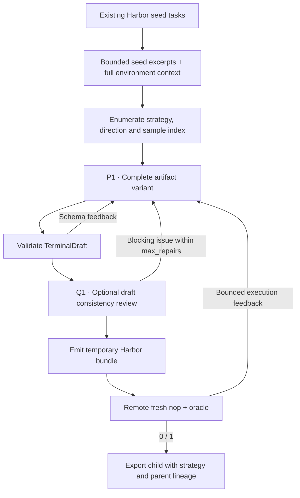

This recipe, inspired by DataArc, augments complete Harbor tasks in four ways:
few-shot, self-instruct, in-depth evolution and in-breadth evolution. Recipe
version 2 keeps those stages and input options, but the prompt wording is
Repo2RLEnv's own.

The collection has **100 Harbor tasks**, 20 kept from earlier runs and 80 new
from the September expansion, published as
[FineEnvs/repo2rlenv-dataarc](https://huggingface.co/datasets/FineEnvs/repo2rlenv-dataarc).
Each of the 80 new exports has a baseline reward of 0 and a reference reward of
1, matched to its hash. The expansion cost **$26.57**, about **$0.33 per new
export**, counting unsuccessful model attempts and estimated worker and build
costs. The
[published manifest](https://huggingface.co/datasets/FineEnvs/repo2rlenv-dataarc/resolve/main/manifest.json)
keeps those controls separate from independent quality acceptance, which hasn't
been established.

These results are for version 1. Version 2 has contract tests but hasn't been
run in a paid generation campaign yet, so the figures above don't measure the
replacement prompts.

## Pipeline, step by step

`P1`, `P2`, … mark real model calls. Unlabelled stages are code or remote execution.

**Read a seed.** Selected excerpts of the instruction, reference and tests give the task context. Environment files are supplied in full, within the supported text-size limit. The native filter that drops canary lines is kept, and documented in the provenance file.

**Enumerate transformations.** `few_shot` makes a close variant, `self_instruct` makes a related task, and `evol_instruct` picks `in_depth` or `in_breadth`. Samples are independent variants of the selected parent, not a chained curriculum.

**Generate complete artifacts.** A deterministic design function wraps the seed. The only authoring stage then creates a complete `TerminalDraft`. Retries use the same strategy and seed, plus real execution feedback.

## Every prompt and its data

The first attempt makes one artifact-author call. There's no separate design
LLM call. With `review_drafts: true`, a
[Q1 consistency review](prompt_reference.md#optional-review-before-execution)
follows the artifact author. That adds a model call on each complete draft before
execution, and its blocking findings go back into the same bounded
artifact-author loop.

| Call | System prompt composition | User / input material | Output | Retry or branch |
|---|---|---|---|---|
| P1 · Artifact / repair | artifact_prompt.md with strategy text from strategies.json + common materialization + owned adaptation | Selected seed excerpts are substituted into the system template; user JSON contains environment_context and feedback. | TerminalDraft | Initial call plus max_repairs; default three attempts. |

The [complete dataarc prompt reference](https://huggingface.github.io/Repo2RLEnv/pipelines/prompts/dataarc/) has every retained template, appended instruction, substitution, example and output schema. The [shared prompt guide](prompt_reference.md) shows how to inspect the fully resolved request from a real run.

## Follow one task

Say a scheduling seed becomes a related scheduling problem with a new constraint. The generated environment, solution and tests must agree on that constraint and keep the seed's actual tools.

## What repeats, what is checked

Retries rebuild the same variant from the original seed context plus the evidence from the previous failure. For strategies that aren't evolutions, the null evolution direction is left out of the TOML metadata. Full independent validation is deferred, and strategy labels aren't quality scores.

An exported bundle is a generation result. Independent leakage review, shortcut probes and blind solver traces come later, in the quality campaign.

## Implementation map

- [`dataarc/recipe.py`](https://github.com/huggingface/Repo2RLEnv/blob/main/src/repo2rlenv/pipelines/recipes/dataarc/recipe.py)
- [`dataarc/strategies.json`](https://github.com/huggingface/Repo2RLEnv/blob/main/src/repo2rlenv/pipelines/recipes/dataarc/strategies.json)
- [`terminal/runner.py`](https://github.com/huggingface/Repo2RLEnv/blob/main/src/repo2rlenv/pipelines/recipes/terminal/runner.py)
- [`terminal/draft.py`](https://github.com/huggingface/Repo2RLEnv/blob/main/src/repo2rlenv/pipelines/recipes/terminal/draft.py)
- [`terminal/grade.py`](https://github.com/huggingface/Repo2RLEnv/blob/main/src/repo2rlenv/pipelines/recipes/terminal/grade.py)

## Run and supported profile

Run `repo2rlenv generate --config examples/owned-dataarc.yaml`. The input
directory holds seed task subdirectories, each with `task.toml`, `instruction.md`
and `solution/solve.sh`. The first profile accepts text assets in a single CPU
Linux container. The native examples cover portfolio optimization, cancelling
asynchronous tasks and constraint scheduling. You can supply your own Harbor
seeds.

`strategies`, `evol_directions` and `samples_per_strategy` control the
enumeration. Each variant is authored directly from its seed, with no separate
design model. The seed's domain and tools must survive any repairs driven by
execution feedback. Parent hashes and strategy names stay in the generated
lineage.

Shared options control `target`, `max_candidates`, `max_repairs`, token limits
and test timeouts. The target grew from 20 tasks to **100 generated tasks**. A
failing baseline and a passing reference are generation checks; detailed quality
validation comes after the full generation campaign. See the
[remote execution and CLI guide](owned_recipes.md).

Credit: [DataArc-SynData-Toolkit](https://github.com/DataArcTech/DataArc-SynData-Toolkit),
terminal branch `2a1d65ec8dcfaea2458d67e1fb18078cce6420b9`. That revision has no
recorded license grant. Version 2 replaces the prompts version 1 had kept, and
drops the license that came from a different branch. The method is still
credited, and existing version 1 artifacts keep their historical provenance. See
[RFC 0022](../rfcs/0022-dataarc-terminal-recipe.md) and
[`provenance.md`](https://github.com/huggingface/Repo2RLEnv/blob/main/src/repo2rlenv/pipelines/recipes/dataarc/provenance.md)
for the source and licensing boundary.

## Cost evidence

See the [measured yield and cost](economics.md) and
[dataarc accounting](experiment_accounting.md#dataarc) for the pilot/expansion
scope, model identities, stage costs, compute resources and validation limits.
