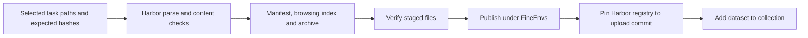

To publish a recipe's earlier and newly generated tasks as one dataset, list
them in an explicit selection. By default, task files and existing labels are
left as they are. An explicit normalization option, described below, adds
missing evaluation metadata to the release copies.
[RFC 0030](../rfcs/0030-campaign-expansion-and-release.md) has the contracts.

Release summaries use the uniform `metadata.repo2env.evaluation.status` when it's
present, check its revision binding, and keep the legacy `quality_status` as
`generation_status`. An old `exported` generation label must never hide a later
`verified` or `needs_repair` assessment.

Set `normalize_evaluation_labels: true` in the release plan to add the common
evaluation block to historical tasks that don't have one. Only the release copies
change. They get `status = "unverified"`, their unchanged executable bundle
identity, and the original configuration's hash and path. Existing evaluation
blocks and legacy generation labels are left alone. This adds no claim of review,
controls, rollout or acceptance. The changed configuration bytes and archive are
recorded as a new release, and old staging directories and published commits
stay available.



A release plan is JSON. Paths point to the local selected exports. Evidence and
costs must describe actual receipts, and any missing evidence has to be stated.
An optional `task_id` sets the published directory name for delivery layouts such
as `entries/<id>/<hash>/task/`. It must match the name in `[task]`, and it doesn't
change any bundle contents or hashes. Ordinary exports use their resolved
directory name by default, including when the selected path is `.`. Keep the
staging destination outside every selected task directory; nested output is
rejected before any directory is created.

```json
{
  "repo_id": "FineEnvs/repo2rlenv-swe-smith",
  "recipe": "swe_smith",
  "title": "Repo2RLEnv SWE-smith",
  "description": "Coding tasks produced by owned procedural mutation.",
  "methodology": "Mutate real repository functions, verify test contrast, then write an issue.",
  "code_revision": "COMMIT_SHA",
  "normalize_evaluation_labels": true,
  "tasks": [{
    "path": "workspace/campaign/generated/swe-smith/TASK_ID",
    "bundle_hash": "sha256:EXPECTED_HASH",
    "evidence": {"baseline_reference": "not assessed in this example"},
    "evidence_documents": {
      "validation.json": {
        "scope": "Illustrative summary only; no execution performed",
        "baseline_reference": "not assessed"
      }
    },
    "diagnostics": []
  }],
  "economics": {},
  "citations": [],
  "limitations": ["Generation exports are not independently accepted tasks."]
}
```

`evidence_documents` optionally embeds JSON objects that you supply explicitly
in the plan. Staging writes them to `evidence/<task_id>/<filename>` and records
each relative path and SHA-256 in the task's manifest entry. Names must be
distinct JSON basenames, even on case-insensitive filesystems. Release integrity
and upload-completeness checks cover the documents, but they stay outside the
executable task and `tasks.tar.gz`, so the original task bytes don't change.

Write public summaries deliberately. State their scope, bind them to the task
identity, and keep recorded execution distinct from review. Staging doesn't
follow local paths in evidence annotations, and it doesn't redact document
contents for you, so remove secrets and private traces before adding documents.
Historical paths in unchanged task annotations stay as provenance; portable
documents carry the readable public evidence. Extra source-license notices can
use the same mechanism without replacing any bundled upstream notices.

```bash
repo2rlenv release stage release-plan.json --out workspace/releases/swe-smith
repo2rlenv release verify workspace/releases/swe-smith
repo2rlenv release publish workspace/releases/swe-smith \
  --receipt workspace/releases/swe-smith-publication.json \
  --collection FineEnvs/COLLECTION_SLUG
```

`stage` and `verify` only read, hash, copy and archive locally. They don't run
tasks or build images. `publish` needs configured Hub credentials. It uploads
only the selected artifacts and keeps model and worker receipts local. If an
earlier publication receipt is incomplete, inspect and reconcile it before you
try again. A completed receipt is returned without uploading twice.

For a new large dataset, add `--batch-size 500` to `release publish`. This needs
an empty destination repository. It writes bounded commits, each guarded by its
parent, with a receipt for every batch. The card and release identity are written
last, and registry and collection entries are added only once every staged file
is present. A partially uploaded repository isn't a completed release. Uncertain
batches stop for reconciliation; restarting with a new receipt would throw that
evidence away.

Each dataset contains:

| Path | Purpose |
|---|---|
| `tasks/<task_id>/` | Original Harbor instruction, environment, verifier and reference |
| `tasks.tar.gz` | Same tasks with executable file modes preserved |
| `data/tasks.jsonl` | Auxiliary task instruction and evidence index; not the executable task |
| `manifest.json` | Provenance, quality labels, diagnostics, economics and citations |
| `evidence/<task_id>/*.json` | Optional explicit validation summaries or supplementary source notices |
| `bundle-files.json` | Original task file hashes and modes |
| `release-files.json` | Staged release identity |
| `registry.json` | Harbor task paths pinned to the artifact upload commit |
| `README.md`, `LICENSES.md` | Method, limitations, usage and source licensing |

The dataset card links to **Harbor Visualiser**, the full `tasks/` tree, and
one concrete task's configuration, instruction, verifier and oracle. The generic
tabular Hub viewer is turned off with `viewer: false`, because it can't display
the executable environments in these folders. This follows the browsing pattern
of the earlier PR-runtime and commit-runtime datasets.

The current bundles use Harbor's `schema_version = "1.3"`, including separate
verifier environments and declared agent artifacts. Older datasets use the
legacy top-level `version = "1.0"` spelling. Both are Harbor configurations, and
changing the field spelling alone isn't a compatibility or execution test. See
the
[Harbor task format](https://www.harborframework.com/docs/tasks) and
[Hub viewer setting](https://huggingface.co/docs/hub/datasets-viewer-configure).

Before adding registry or collection entries, publication checks that **every
staged file** exists at the uploaded revision, including build contexts, verifier
helpers and oracle files. Finding `task.toml` alone doesn't show the upload is
complete. Parsing and publication completeness are separate from running the
task's baseline, oracle and blind solver controls remotely.

The [published dataset index](releases.md) links every selected artifact
revision and manifest. The current publication check compared 214,097 file
identities and parsed 1,330 tasks with Harbor. Those are format and integrity
checks. Per-task quality labels and diagnosed issues stay in each dataset's
manifest.

A corrected task replaces its predecessor in the selected collection; it doesn't
add to the task count. Keep the original bundle and repair evidence outside the
release selection. An unsolved and reference pair, a consistency review and a
blind solver rollout are different kinds of evidence, and they must stay labeled
separately.

If a large artifact upload timed out before it created a commit, use
`release publish ... --recover-empty` with its original receipt. The command
first checks that the remote repository holds only its initial `.gitattributes`.
It then uploads bounded batches with parent-commit guards and records every
confirmed commit. If any task artifacts already exist, or a recovery batch itself
has an uncertain outcome, it stops for reconciliation rather than overwriting or
blindly replaying. Dataset card license links use absolute HTTPS URLs, which the
Hub's metadata validator requires.
