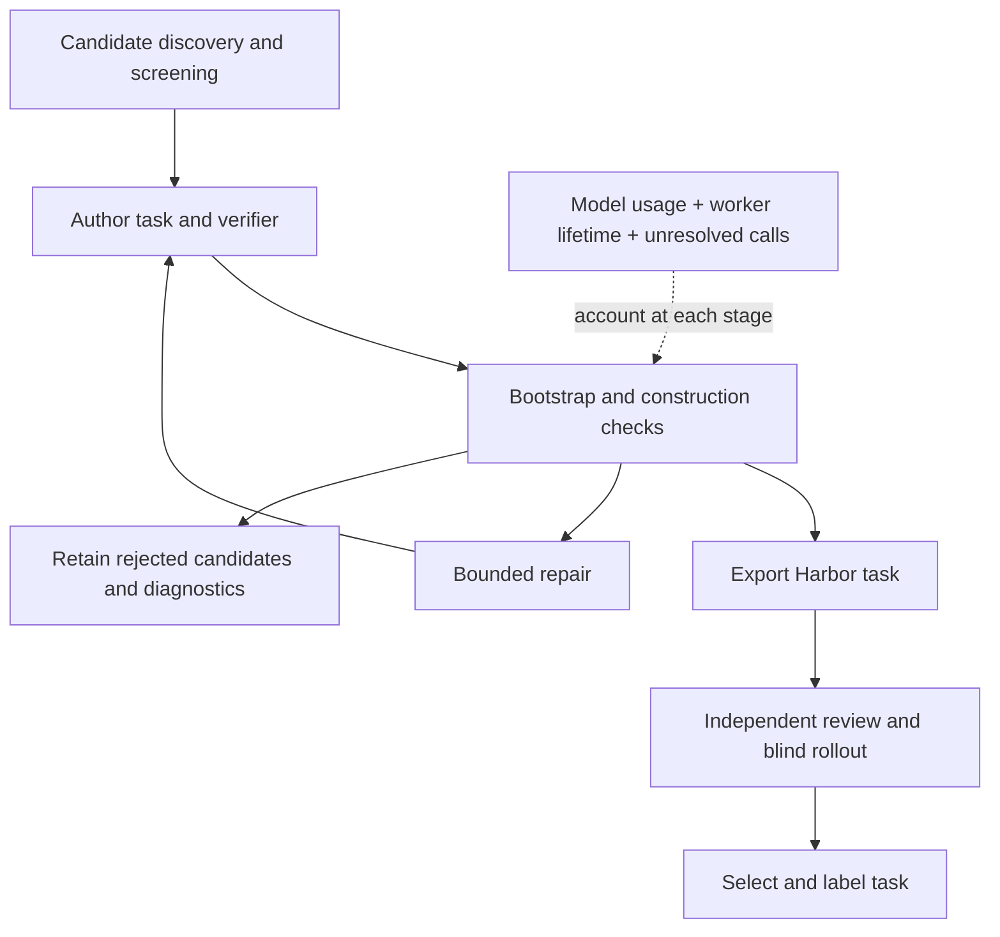

Evidence audited **2026-09-30**. Recipe/Tasksmith samples were measured September 14, CodeMidas September 25, and FrontierSmith September 29, 2026. These are historical experiments on different inputs and checks, not a controlled price or quality ranking.

Read the [stage costs, models, tokens and compute](experiment_accounting.md) for each recipe, or the [published inventory](releases.md) for dataset versions and quality labels.



## Measurement definitions

| Term | Definition |
|---|---|
| Candidate yield | Exports divided by distinct recorded candidates in the same sample; retries do not become new candidates. The recipe can start counting before design screening. |
| Attempt yield | Used explicitly for CodeMidas/FrontierSmith: exports or selections divided by recorded attempts; historical revisions and repeated seeds are identified. |
| Export / selected / accepted | A written Harbor bundle / a curated subset / a task that passed its named quality profile. These are different denominators. |
| Accounted cost | Recorded API-usage estimates plus attributable compute estimates, including unsuccessful attempts and repairs within the stated scope. |
| Held cost | Unresolved or reserved charges, reported separately from accounted spend; not evidence of a paid invoice. |
| Per-task cost | The stated sample cost divided by its new outputs. Retained tasks and later validation must not silently enter the denominator. |
| n/a | Evidence unavailable or not safely attributable. It never means free. |

## Recorded experiment spend

**$1,586.71 accounted, plus $31.72 unresolved/reserved**, across the disjoint scopes below. The combined accounting exposure is $1,618.43. This is a recovered experiment subtotal, not an invoice or a complete lifetime project bill. Older native-pipeline costs and interactive assistant usage are outside it.

| Measurement scope | Accounted | Held separately | What it paid for |
|---|---:|---:|---|
| Initial research pilots + Tasksmith development/evaluation | $972.45 | $21.07 | 291 recipe exports + 50 final Tasksmith tasks; includes failures, shared work and $22.43 prior spend |
| Research-recipe expansion | $445.94 | $8.50 | 989 new exports across 14 recipes; earlier retained tasks excluded |
| CodeMidas campaign | $99.91 | $1.47 | 100 curated tasks; includes historical pilots, generation and evaluation |
| FrontierSmith campaign | $68.42 | $0.67 | 100 selected tasks; includes pilot, expansion and sample evaluation |

Do not add the Tasksmith expansion, original recipe pilots, or per-stage tables again: they are subsets of these rows. Parent-to-child budget transfers were excluded. The [accounting detail](experiment_accounting.md#how-the-total-is-reconciled) explains scope, attribution and evidence.

## Research recipes and Tasksmith generation

These 14 generation samples added **989 tasks** to 291 retained recipe tasks. The final published recipe inventory is 1,280 tasks. Costs include failed generation and bounded repairs, but independent quality-pilot costs belong to the earlier program and are reported separately.

| Recipe | Candidate denominator | New / final tasks | Export yield |
|---|---:|---:|---:|
| [swe-smith](repo_mutate.md) | n/a | 76 / 100 | n/a |
| [r2e](r2e.md) | n/a | 80 / 100 | n/a |
| [swe-gen](pr_to_env.md) | n/a | 80 / 100 | n/a |
| [swe-next](swe_next.md) | n/a | 80 / 100 | n/a |
| [r2e-gym](r2e_gym.md) | n/a | 80 / 100 | n/a |
| [scaler](scaler.md) | n/a | 80 / 100 | n/a |
| [endless-terminals](endless_terminals.md) | 99 | 80 / 100 | 80.8% |
| [cli-gym](env_repair.md) | n/a | 5 / 25 | n/a |
| [swe-flow](repo_reconstruct.md) | n/a | 76 / 100 | n/a |
| [seta-seed2synth](terminal_synth.md) | 112 | 77 / 100 | 68.8% |
| [seta-evol](task_evolve.md) | 92 | 80 / 100 | 87.0% |
| [tmax](tmax.md) | 104 | 35 / 55 | 33.7% |
| [terminalworld](terminalworld.md) | 1293 | 80 / 100 | 6.2% |
| [dataarc](dataarc.md) | 83 | 80 / 100 | 96.4% |

The first six repository recipes and CLI-Gym/SWE-flow lack a reliable deduplicated attempt denominator for these cost samples. Hitting a 100-task target is not 100% yield. TerminalWorld counted 1,293 recordings before suitability screening; 1,145 were screened out, leaving 148 candidates and 80 exports (54.1% after screening). SETA Evol includes one unfinished candidate; TMax includes eight.

| Recipe | API total | Compute total | Held | API / new task | Combined / new task |
|---|---:|---:|---:|---:|---:|
| [swe-smith](experiment_accounting.md#swe-smith) | $2.41 | n/a | $0.00 | $0.032 | n/a |
| [r2e](experiment_accounting.md#r2e) | $17.73 | n/a | $1.50 | $0.222 | n/a |
| [swe-gen](experiment_accounting.md#swe-gen) | $1.63 | n/a | $0.00 | $0.020 | n/a |
| [swe-next](experiment_accounting.md#swe-next) | $7.51 | n/a | $0.00 | $0.094 | n/a |
| [r2e-gym](experiment_accounting.md#r2e-gym) | $3.52 | n/a | $0.75 | $0.044 | n/a |
| [scaler](experiment_accounting.md#scaler) | $0.00 | n/a | $0.00 | $0.000 | n/a |
| [endless-terminals](experiment_accounting.md#endless-terminals) | $29.47 | $12.05 | $0.00 | $0.368 | $0.519 |
| [cli-gym](experiment_accounting.md#cli-gym) | $3.54 | $2.17 | $0.00 | $0.709 | $1.142 |
| [swe-flow](experiment_accounting.md#swe-flow) | $4.05 | $18.86 | $0.00 | $0.053 | $0.301 |
| [seta-seed2synth](experiment_accounting.md#seta-seed2synth) | $41.74 | $12.90 | $0.00 | $0.542 | $0.710 |
| [seta-evol](experiment_accounting.md#seta-evol) | $30.75 | $13.97 | $1.25 | $0.384 | $0.559 |
| [tmax](experiment_accounting.md#tmax) | $58.83 | $14.68 | $5.00 | $1.681 | $2.100 |
| [terminalworld](experiment_accounting.md#terminalworld) | $54.34 | $46.13 | $0.00 | $0.679 | $1.256 |
| [dataarc](experiment_accounting.md#dataarc) | $14.53 | $12.04 | $0.00 | $0.182 | $0.332 |

The six repository recipes share **$43.09 compute**, without a defensible per-recipe allocation. Their combined 476 new exports cost **$75.90**, or **$0.159/task**. SCALER has zero generation API spend, not zero runtime cost.

Most expansion calls used `claude-sonnet-4-6`; TMax also tried `gpt-5.4-mini`. The earlier pilots used Sonnet and Opus in different proportions. Repository expansion started with six Modal workers, then used 26 Daytona workers; terminal/reconstruction expansion used Daytona. All were CPU workers. See the [per-recipe detail](experiment_accounting.md#per-recipe-generation-detail) for stages, exact model identifiers, calls and tokens.

## Tasksmith and optional evaluation

The final cohort contains **50 verified tasks and 19 full Sonnet solves**. It came from assisted development; neither the archived PR inventory nor the 50-task target establishes unattended conversion yield.

| Cost scope | Accounted | Denominator | Cost per task |
|---|---:|---|---:|
| Direct operations attributed to the final 50 | $649.56 | 50 accepted tasks | $12.991 |
| Expansion, including retained-task repair/revalidation | $392.01 | 26 additional accepted tasks | $15.077 |

These are overlapping views, not additive bills. Direct attribution excludes shared/unattributed costs and rejected PRs; expansion cost includes unsuccessful attempts and work on previously retained tasks. Do not call either a complete marginal production price.

| Expansion component | Total | Per added accepted task |
|---|---:|---:|
| Authoring model | $63.91 | $2.458 |
| Review and repair models | $86.06 | $3.310 |
| Blind solver model | $21.20 | $0.815 |
| Compute, including validation | $220.83 | $8.494 |

A further $4.98 is held in that expansion scope. Authoring and blind solving used Sonnet 4.6; the larger program also used Opus 4.6 and GPT-6 Astra for review/repair. The final task requirements comprise 39 CPU tasks and 11 L4 GPU tasks. Cloud controllers, learner resources and model API inference are separate costs. See [Tasksmith accounting and interventions](experiment_accounting.md#tasksmith-development-and-quality-work).

## CodeMidas generation and evaluation

Measured **2026-09-25** using GPT-6 Luna/Sol and Daytona. This whole-campaign sample includes historical pilots, failed construction, independent review, rollouts and compute. It is **not comparable to generation-only prices** above; interactive assistant usage is excluded.

| Measure | Result |
|---|---:|
| Construction yield | 128/213 (60.1%) |
| Ordinary review yield | 101/128 (78.9%) |
| Recorded API usage | $88.20 |
| Conservative compute estimate | $11.71 |
| Combined accounted | $99.91 |
| Unknown API billing reserved | $1.47 |
| Accounted per export | $0.78 |
| Accounted per reviewed task | $0.99 |
| Accounted per curated task | $1.00 |

Compute is an estimate, not an invoice. The construction denominator includes two candidates stopped after the goal was met. The 100 curated tasks remain adversarial-blocked; there is no cost per fully accepted task. See [stage costs and limitations](codemidas.md#measured-economics).

## FrontierSmith optimization synthesis

Measured **2026-09-29** with OpenAI `gpt-6-sol` and Daytona CPU workers. 153 candidate attempts across 152 distinct seeds produced 101 initial exports; 100 were selected after construction and collection review. Initial export yield was **66.0%**; final selection was **65.4%**.

| Cost component | Whole collection | Per selected task |
|---|---:|---:|
| Recorded API usage | $64.66 | $0.647 |
| Estimated compute | $3.76 | $0.038 |
| Accounted combined | $68.42 | $0.684 |
| Unknown API charges reserved separately | $0.67 | $0.007 |

| Measurement scope | Attempts | Initial exports | Selected | Combined cost |
|---|---:|---:|---:|---:|
| Development pilot | 15 | 11 | 10 | $5.61 |
| Expansion and collection review | 138 | 90 | 90 | $62.81 |

| Model-call stage | Recorded API cost |
|---|---:|
| Baseline and sampled programs | $25.52 |
| Blind agent rollouts | $2.86 |
| Finished-task contract review | $1.58 |
| Collection diversity review | $0.51 |
| Task formulation and review | $5.70 |
| Test infrastructure and bounded repair | $24.10 |
| Other development calls | $0.56 |
| Post-construction generator repair | $0.15 |
| Original seed descriptions | $0.54 |
| Sample algorithm diversity review | $3.14 |

Costs include original seed authoring, failed candidates, bounded repair, construction trials, collection reviews and sample rollouts. The ten-task development pilot used evolving checks; the expansion used the recorded fixed recipe. This is a measured assisted campaign, not a guarantee of future yield. 21/100 selected bundles have blind rollout evidence; full quality acceptance remains pending.

Interactive assistant usage is excluded. Model costs use recorded usage and the configured rate table. Compute uses worker lifecycle duration and the [Daytona resource rates](https://www.daytona.io/pricing), with no free-tier deduction; neither amount is an invoice reconciliation. All workers were terminated. Lost API responses retain their conservative reservations rather than being counted as free or silently retried. See the [collection audit](frontiersmith.md#measured-100-task-collection) and [machine-readable results](../data/frontiersmith-campaign.json).

## Native pipeline measurements

These May–July 2026 runs have less complete accounting. **Recorded synthesis cost excludes bootstrap, compute and solver evaluation**; it is not comparable to the total generation costs above. n/a means unavailable. See [historical results](native_results.md) for the evidence and sample boundaries.

| Pipeline | Retained tasks | Measured generation yield | Recorded synthesis / task | Scope |
|---|---:|---:|---:|---|
| [pr_diff](pr_diff.md) | 181 | n/a | n/a | No complete generation-cost ledger recovered. Unavailable does not mean zero. |
| [pr_runtime](pr_runtime.md) | 100 | n/a | n/a | No complete generation-cost ledger recovered. Unavailable does not mean zero. |
| [commit_runtime](commit_runtime.md) | 100 | n/a | n/a | No complete generation-cost ledger recovered. Unavailable does not mean zero. |
| [code_instruct](code_instruct.md) | 100 | 100/136 (73.5%) | $0.038 | Run-cumulative synthesis counters: sum one final maximum per repo, not every task. Includes retries through the last export; excludes bootstrap, compute, rollouts and earlier development. |
| [equivalence_tests](equivalence_tests.md) | 100 | n/a | ≥ $0.025 | Lower bound from seven productive runs only. Excludes zero-output runs, later failed attempts, bootstrap, compute and rollouts; not an all-in task price. |
| [cve_patches](cve_patches.md) | 19 | n/a | n/a | No complete generation-cost ledger recovered. Unavailable does not mean zero. |

Code-instruct's complete generation log records 136 candidates, correcting the earlier 132-candidate claim. Equivalence-test logs contain at least 200 candidates, including zero-output runs, but several runs lack a final summary; its overall yield is unavailable. Its $0.025/task figure is only a lower bound from productive-run counters.

## Measurement source

Tables are generated from [pipeline measurements](../data/pipelines.json), [reconciled experiment evidence](../data/experiment-economics.json), and the [FrontierSmith collection report](../data/frontiersmith-campaign.json). The [accounting guide](experiment_accounting.md#evidence-and-refresh) describes the source fingerprints and refresh procedure. Raw generated tasks, receipts and campaign scripts remain outside Git.

```bash
python3 docs/_tools/generate_metrics.py
python3 docs/_tools/generate_metrics.py --check
```
