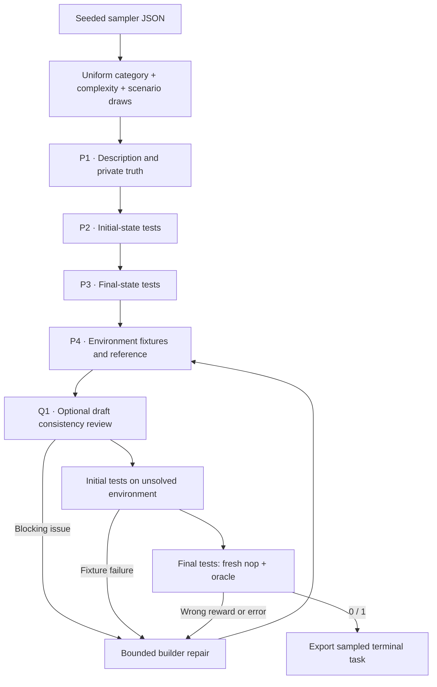

Endless Terminals generates terminal tasks from a sampled category, complexity
and scenario. Its native category list covers files, text, databases, configuration,
software tools and other terminal workflows.

## Pipeline, step by step



`P1`, `P2`, … mark real model calls. Unlabelled stages are code or remote execution.

**Sample without a repository.** Category, complexity and scenario are each drawn uniformly and independently from the native lists, kept as they were. The seed holds the request built from those choices.

**Generate the task and tests.** A call for the description and truth is followed by separate calls for the initial-state tests and the completion tests. The final-test author sees the initial tests.

**Construct a runnable environment.** The fourth call writes the starting text fixtures and a reference solution. The result runs through the same remote preflight and bounded builder repair that TMax uses.

## Every prompt and its data

The first successful attempt makes four calls, and the environment builder is
the stage that repeats during repair. With `review_drafts: true`, the shared
runner adds a
[Q1 consistency review](prompt_reference.md#optional-review-before-execution)
after P4 and before the initial-state check, and each repaired draft is reviewed
again. The default is false, and run configurations record whether it ran.

| Call | System prompt composition | User / input material | Output | Retry or branch |
|---|---|---|---|---|
| P1 · Template | template_prompt.md + shared adaptation | Sampled category, complexity, scenario and constructed request. | TaskTemplate: description, truth | One call per design. |
| P2 · Initial tests | initial_prompt.md + shared adaptation | Description and truth. | TestProgram: code | Five to ten top-level pytest tests. |
| P3 · Final tests | final_prompt.md + shared adaptation | Description, truth and initial_tests. | TestProgram: code | One separate call. |
| P4 · Build / repair | environment_prompt.md + templates.builder_prompt additions + common materialization | TemplateDesign and actual failures. | TerminalDraft | Initial call plus max_repairs. |

The [complete endless_terminals prompt reference](https://huggingface.github.io/Repo2RLEnv/pipelines/prompts/endless_terminals/) has every retained template, appended instruction, substitution, example and output schema. The [shared prompt guide](prompt_reference.md) shows how to inspect the fully resolved request from a real run.

## Follow one task

Say the SQLite category and a backup scenario become a database export task, with supplied records and a precise archive format. The initial checks assert that the inputs exist, and the final checks inspect the requested archive.

## What repeats, what is checked

This recipe shares execution machinery with TMax, but not TMax's taxonomy or weighted language sampling. It has no training, no adaptive sampler and no blind-agent acceptance step.

An exported bundle is a generation result. Independent leakage review, shortcut probes and blind solver traces come later, in the quality campaign.

## Implementation map

- [`endless_terminals/sampler.py`](https://github.com/huggingface/Repo2RLEnv/blob/main/src/repo2rlenv/pipelines/recipes/endless_terminals/sampler.py)
- [`endless_terminals/recipe.py`](https://github.com/huggingface/Repo2RLEnv/blob/main/src/repo2rlenv/pipelines/recipes/endless_terminals/recipe.py)
- [`terminal/templates.py`](https://github.com/huggingface/Repo2RLEnv/blob/main/src/repo2rlenv/pipelines/recipes/terminal/templates.py)
- [`terminal/preflight.py`](https://github.com/huggingface/Repo2RLEnv/blob/main/src/repo2rlenv/pipelines/recipes/terminal/preflight.py)
- [`terminal/runner.py`](https://github.com/huggingface/Repo2RLEnv/blob/main/src/repo2rlenv/pipelines/recipes/terminal/runner.py)

## Run and supported profile

Run `repo2rlenv generate --config examples/owned-endless-terminals.yaml`.
The input is a sampler JSON file:

```json
{"count":40,"seed":24,"categories":["text processing and manipulation","backup and archiving","SQLite database operations via CLI"]}
```

Omit `categories` to sample from the full native list. All three axes are
sampled uniformly, as in the original method. TMax is a separate recipe with its
own domain and skill taxonomy and language weights; the two share the metered
authoring and remote execution stages.

The first profile uses text fixtures in an offline CPU Docker container. The
solver runs as `user`, and dependencies are installed at build time. Initial
tests run on a fresh environment before the final baseline and reference pair.
The builder can repair inconsistent fixtures or a failing reference within
`max_repairs`. Every attempted input and execution outcome stays in the run.

The [measured generation sample](economics.md) completed **100 tasks**, published
as
[FineEnvs/repo2rlenv-endless-terminals](https://huggingface.co/datasets/FineEnvs/repo2rlenv-endless-terminals).
All 80 newly generated tasks have baseline-0 and reference-1 controls matched to
their hashes. Independent semantic quality evaluation and blind rollouts are
separate. Upstream's sampled solutions and training run are outside this
milestone. Options and cloud setup follow the [shared interface](owned_recipes.md).
The configuration records the author model actually used; it doesn't claim the
original Qwen settings.

Credit: [Endless Terminals](https://github.com/kanishkg/endless-terminals)
(Apache-2.0), commit `99f4c74b75faacf21e53d3dc01df170902e924cb`.
See [RFC 0020](../rfcs/0020-endless-terminals-recipe.md) and the packaged
`recipes/endless_terminals/provenance.md` for the source map and adaptations.

## Cost evidence

See the [measured yield and cost](economics.md) and
[endless-terminals accounting](experiment_accounting.md#endless-terminals) for the pilot/expansion
scope, model identities, stage costs, compute resources and validation limits.
