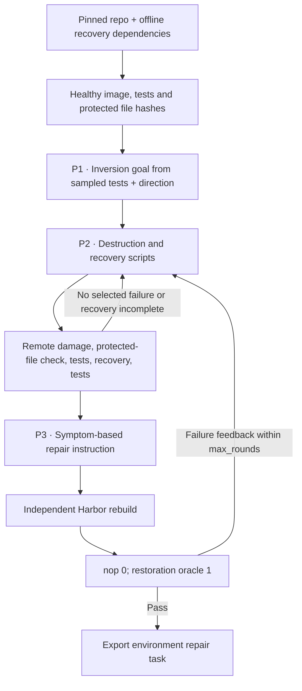

CLI-Gym builds repair tasks by deliberately breaking a healthy development
environment, then checking that a recovery brings its existing tests back.

## Pipeline, step by step

`P1`, `P2`, … mark real model calls. Unlabelled stages are code or remote execution.

**Establish a healthy system.** The recipe records the real passing test IDs, the installed packages and file paths, and hashes that protect the source and tests. The author sees at most fifty test IDs per candidate.

**Invert and restore.** The goal describes an environment failure. The scripts must change persistent filesystem state without touching the protected repository code or tests. A valid inversion breaks at least one selected test, and the recovery restores the healthy suite.

**Describe symptoms.** The instruction author gets the actual baseline results and a recovery goal. It isn't free to invent assertion failures. A fresh Harbor rebuild then checks the packaged destruction and restoration path.

## Every prompt and its data

There's one goal call, then up to `max_rounds` inversion calls. The instruction is written only after a disruption and recovery attempt succeeds.

| Call | System prompt composition | User / input material | Output | Retry or branch |
|---|---|---|---|---|
| P1 · Goal | inversion_prompt.md with candidate_uts_list, directions and existing_tasks substitutions | Candidate, installed packages and file paths. | InversionGoal: title, category, selected_tests, description, expected_result, recovery_strategy | Existing titles discourage repeats within a run. |
| P2 · Inversion / repair | Inline system prompt in CLIGymPipeline.author_export | Goal, observed healthy environment and feedback. | Inversion: destruction_shell, recovery_shell, explanation | Up to max_rounds, default three. |
| P3 · Instruction | instruction_prompt.md with task_description and symptoms_UTs + adaptation | Actual baseline and goal.recovery_strategy. | RepairInstruction: instruction | Called after a valid contrast; repeated if a later Harbor failure returns to the loop. |

The [complete cli_gym prompt reference](https://huggingface.github.io/Repo2RLEnv/pipelines/prompts/cli_gym/) has every retained template, appended instruction, substitution, example and output schema. The [shared prompt guide](prompt_reference.md) shows how to inspect the fully resolved request from a real run.

## Follow one task

Say a Python path configuration stops the healthy CLI package from importing. The learner sees the failure and an offline wheel cache, and must restore the environment. The source implementation itself has to stay unchanged.

## What repeats, what is checked

P1 is fixed for each candidate. P2 gets feedback from failed destruction or recovery, and later from Harbor. The final task runs as root because it's an environment repair problem, so its isolation and shortcut risks still need the later quality review. Empty tests and incomplete recovery never count as a successful generation.

An exported bundle is a generation result. Independent leakage review, shortcut probes and blind solver traces come later, in the quality campaign.

## Implementation map

- [`cli_gym/models.py`](https://github.com/huggingface/Repo2RLEnv/blob/main/src/repo2rlenv/pipelines/recipes/cli_gym/models.py)
- [`cli_gym/pipeline.py`](https://github.com/huggingface/Repo2RLEnv/blob/main/src/repo2rlenv/pipelines/recipes/cli_gym/pipeline.py)
- [`cli_gym/worker.py`](https://github.com/huggingface/Repo2RLEnv/blob/main/src/repo2rlenv/pipelines/recipes/cli_gym/worker.py)
- [`cli_gym/export.py`](https://github.com/huggingface/Repo2RLEnv/blob/main/src/repo2rlenv/pipelines/recipes/cli_gym/export.py)
- [`cli_gym/grade.py`](https://github.com/huggingface/Repo2RLEnv/blob/main/src/repo2rlenv/pipelines/recipes/cli_gym/grade.py)

## Run and supported profile

Run `repo2rlenv generate --config examples/owned-cli-gym.yaml`. This first
profile supports public GitHub Python repositories with a `tests/` directory.
The config supplies source paths, test and build dependencies, offline recovery
assets and, optionally, disruption directions. The target repository is cloned
during the remote bootstrap. The CLI-Gym research repository is never a runtime
dependency.

The inversion author samples up to fifty real passing test IDs and proposes a
distinct environment failure. It then revises its scripts using actual execution
feedback. Source and test files are protected. Changes must persist in files; a
temporary shell export can't represent a separate environment state.

The baseline must lose at least one selected test, and the recovery must bring
back all the required healthy tests. Empty, malformed and incomplete results
can't earn success. A broken Python import or collection step counts as a valid
environment failure, and it's reported as exactly that. The final Harbor bundle
gets another fresh baseline and reference pair before export.

The solver repairs the container as root, offline, without changing repository
source or tests. The example puts dependency wheels in `/opt/wheelhouse`. The
exported image preinstalls `tmux` so Harbor's Terminus-2 agent can start without
downloading terminal tooling. Baseline and reference success don't exercise that
agent setup path, so include a blind solver run in the quality pilot. The
build-time destruction script stays outside the learner's filesystem, and its
inverse stays a private reference. A full adversarial review of the root runtime
is left to the later quality campaign.

Options include `target`, `max_candidates`, `max_rounds`, `seed`, `directions`
and the common Python build and test profile. The target stays at
**20 tasks** or more, by request. The published release
keeps all **25 generated tasks**. See the [release inventory](releases.md) and
the [shared Modal/Daytona and progress interface](owned_recipes.md).

Credit: [CLI-Gym](https://github.com/LiberCoders/CLI-Gym) (MIT), commit
`48bb920b728a25a55a5b442303e901919654599e`. See
[RFC 0021](../rfcs/0021-cli-gym-recipe.md) and the packaged
`recipes/cli_gym/provenance.md` for the source mapping and profile restrictions.

## Cost evidence

See the [measured yield and cost](economics.md) and
[cli-gym accounting](experiment_accounting.md#cli-gym) for the pilot/expansion
scope, model identities, stage costs, compute resources and validation limits.
