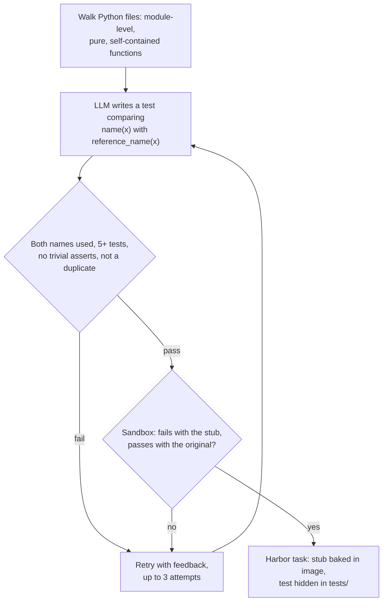

Each task stubs out a real function from the repository. The agent gets its
signature and docstring and must implement it so it behaves exactly like
`reference_<name>`, the original kept alongside it. An LLM writes the equivalence
test; the pipeline keeps it only if it fails against the stub and passes against
the original. Because the ground truth is working code rather than a model's
invention, these tasks vary less than [`code_instruct`](code_instruct.md)'s.

## At a glance

| | |
|---|---|
| Input | A Python repository on GitHub, GitLab or a local path |
| Task | Implement a stubbed function in `task_module.py` so its outputs match `reference_<name>` |
| Reward | Binary: 1.0 if the hidden equivalence test passes, else 0.0 |
| Needs an LLM | Yes: the one-time bootstrap (cached) and one call per test attempt |
| Needs Docker | Yes, for bootstrap, validation and running tasks |
| Hosts | GitHub, GitLab and local paths |
| Languages | Python only (module-level functions). On GitHub, the primary language is checked first (`--force-language` skips the check) |
| Status | Experimental |
| Reference dataset | [`FineEnvs/repo2rlenv-equivalence-tests`](https://huggingface.co/datasets/FineEnvs/repo2rlenv-equivalence-tests): 100 tasks from seven utility libraries |

## Quickstart

```bash
repo2rlenv generate \
  --repo pytoolz/toolz \
  --pipeline equivalence_tests \
  --pipeline-opt limit=5 \
  --pipeline-opt seed=42 \
  --llm anthropic/claude-sonnet-4-6 \
  --out ./tasks/toolz-equivalence
```

The example uses `pytoolz/toolz` because the pipeline only accepts
self-contained, side-effect-free functions: utility libraries have many, while
framework code such as `pallets/click` has few. `limit` is the number of tasks to
emit; `seed` makes the candidate order repeatable. The first run bootstraps the
repository (capped by `--max-spend-usd`, default 5.0, and cached). Each task lands
in `./tasks/toolz-equivalence/pytoolz__toolz-eqv-<hash>/`. Run the oracle, which
should score 1.0:

```bash
harbor run -p ./tasks/toolz-equivalence -a oracle --env docker
```

## How it works



1. **Bootstrap** the repository once and shallow-clone it at `--ref`. See
   [Bootstrap](../reference/BOOTSTRAP.md).
2. **Extract candidates.** Walk files matching `file_glob` and not `exclude_glob`,
   and keep module-level functions that take at least one argument, have a body of
   `min_loc` to `max_loc` lines, return a value, show no side effects (file,
   network, process, logging, printing, clock, randomness, framework context), and
   reference only their own arguments and locals, builtins and a small set of
   standard-library modules. Async functions and names that start with `_` or
   `test_` (or are `main`, `setup`, `run`, `init`, `cli`, `wrapper`) are skipped.
   Candidates are shuffled.
3. **Write the test.** The LLM gets the function's source and writes 5–10
   `test_*` functions, each asserting `name(x) == reference_name(x)` on one input.
4. **Gate the test.** Reject it if it doesn't import and use both names, has fewer
   than five test functions, has a test function that doesn't call both, contains a
   constant assert, or duplicates an earlier test suite.
5. **Verify in the sandbox.** Build `task_module.py` twice, with type annotations
   stripped so the module imports on its own. With `name` stubbed to raise
   `NotImplementedError`, the test must not pass. With `name` set to the original
   implementation, it must pass.
6. **Retry with feedback.** When a gate or sandbox check fails, the next attempt
   includes the reason and the last 1,200 characters of the failure log, up to
   `max_attempts_per_function` attempts.
7. **Emit the task.** The stub module is baked into the image; the instruction
   shows the signature and docstring only.

## Options

Pass each option with `--pipeline-opt key=value`.

| Key | Default | What it does |
|---|---|---|
| `limit` | `50` | Number of tasks to emit |
| `min_loc` / `max_loc` | `5` / `60` | Function body size, in lines |
| `file_glob` | `**/*.py` | Files to extract functions from |
| `exclude_glob` | tests, `test_*`, `*_test.py`, `conftest.py`, `docs/`, `examples/`, `__init__.py`, `setup.py` | Files never used |
| `seed` | none | Random seed for the candidate order |
| `max_attempts_per_function` | `3` | Test-writing attempts per function, each with feedback from the last failure |
| `llm_temperature` | `0.5` | Sampling temperature. Lower than `code_instruct`'s, for stable tests |
| `max_llm_tokens` | `1500` | Output token limit per attempt |
| `require_test_fails_with_stub` | `true` | Reject tests that pass against the stub |
| `require_test_passes_with_oracle` | `true` | Reject tests that fail against the original |
| `validation_timeout_sec` | `90` | Timeout for each sandbox test run |
| `skip_validation` | `false` | Emit without running the sandbox checks. For debugging |

## Output

```files
pytoolz__toolz-eqv-<hash>
├── task.toml
├── instruction.md
├── environment
│   └── Dockerfile
├── solution
│   ├── patch.diff
│   └── solve.sh
└── tests
    ├── test.sh
    └── test_r2e_<hash>.py
```

- `task.toml`: Harbor 1.0 task. `reference` links to the function's lines; `[metadata.repo2env.equivalence_tests]` records the function name, source path and lines, body size, argument names, test file name, bootstrap image and `llm_cost_usd`. The [evaluation label](task_evaluation_labels.md) starts as `unverified`.
- `instruction.md`: the function's signature and docstring, where to implement it, and how grading works.
- `environment/Dockerfile`: `FROM` the bootstrap image, writing `/workspace/task_module.py` with `reference_<name>` and a stub `<name>`.
- `solution/patch.diff`: replaces the stub with the original implementation (the [oracle](../concepts/glossary.mdx#oracle)); `solve.sh` applies it.
- `tests/test_r2e_<hash>.py`: the equivalence test, delivered by Harbor at verify time.
- `tests/test.sh`: copies the test into `/workspace` and runs `python -m pytest` on it.

The output directory also gets a `.debug_skips/<function>/` folder for each
rejected candidate, with its last test and sandbox logs. These aren't tasks.

## Reward

`tests/test.sh` writes 1.0 to `/logs/verifier/reward.txt` when every equivalence
assertion holds and 0.0 otherwise. There is no partial credit and no
`reward-details.json`. A no-op agent scores 0, because the stub raises. See
[Rewards](../concepts/rewards.mdx#binary-test-execution).

## Yield and cost

Completed generation summaries account for at least 200 candidate functions for
the 100 reference tasks, including runs on mpmath, setuptools and black that
produced none. Other runs lack a final summary, so the overall yield is unknown.
Productive runs recorded at least $2.51 in synthesis cost (at least $0.025 per
task), a partial floor that excludes the empty runs, bootstrap and compute.

Solver samples on the reference dataset used different tasks per model, so they
aren't a leaderboard:

| Model and agent | Tasks | Outcome |
|---|---:|---|
| Claude Sonnet 4.6, Claude Code | 5 | 4 scored 1 after setup retries; 1 failed while installing the agent |
| GPT-5.3-Codex, Codex | 5 | 5 scored 1 |
| Qwen3.6-35B-A3B, OpenHands SDK | 5 | 5 scored 1 |

See [native results](native_results.md#equivalence-tests). What moves yield:
repository shape first, since the purity and self-containment filters leave few
candidates in framework code; then the model's choice of inputs the original
handles cleanly, which the feedback loop improves. Cost scales with candidates ×
`max_attempts_per_function` calls.

## Limits

- **A generated task isn't a verified environment.** Run the controls: the oracle
  should score 1.0 and a no-op agent (`-a nop`) 0. Record the outcome as an
  evaluation label; see [Quality](../concepts/quality.mdx).
- **The reference is visible by design.** `reference_<name>` sits in the agent's
  `task_module.py`, and the instruction says reading it is the intended way to
  solve the task. The test checks only that outputs match, so a solution that calls
  or copies the reference also scores 1.0. Treat these as function-reconstruction
  exercises.
- **Equality is the only check.** Functions whose results don't compare with `==`,
  or that raise on most inputs, rarely make it through; the test covers only the
  inputs the model chose.
- **Module-level functions only.** Methods, async functions and anything that
  touches files, network, time or global state are excluded.
- **Python and pytest only.**
- **`llm_cost_usd` is cumulative for the run**, not the cost of that task.
- **Tasks depend on a local image** until you publish them with `repo2rlenv push`.

## Related

- [RFC 0005: equivalence_tests](../rfcs/0005-equivalence-tests.md)
- [Reference dataset](https://huggingface.co/datasets/FineEnvs/repo2rlenv-equivalence-tests) and its [generation evidence](native_results.md#equivalence-tests)
- [`r2e`](r2e.md): the research recipe with coverage-guided test repair and a private verifier
- [`code_instruct`](code_instruct.md): tasks invented from a snippet instead of extracted
- [Tasks](../concepts/tasks.mdx), [Rewards](../concepts/rewards.mdx) and [Run with Harbor](../guides/run-with-harbor.mdx)
- Adapted from [R2E](https://github.com/r2e-project/r2e) (Jain et al., 2024): the function filters and the `reference_<name>` test pattern. No code is copied.

## Implementation notes

Source: [`pipelines/equivalence_tests.py`](https://github.com/huggingface/Repo2RLEnv/blob/main/src/repo2rlenv/pipelines/equivalence_tests.py),
[`pipelines/_function_extractor.py`](https://github.com/huggingface/Repo2RLEnv/blob/main/src/repo2rlenv/pipelines/_function_extractor.py)
and [`pipelines/_eval_script.py`](https://github.com/huggingface/Repo2RLEnv/blob/main/src/repo2rlenv/pipelines/_eval_script.py).

The module the agent starts from looks like this:

```python
def reference_<name>(...):
    ...  # the original implementation, annotations stripped

def <name>(<args>):
    raise NotImplementedError("implement <name>")
```

- The rename to `reference_<name>` rewrites the AST, including recursive calls, so
  a recursive reference calls itself rather than the stub.
- Type annotations are stripped from both functions because annotations such as
  `def f(x: Argument) -> FC` name repository types that don't exist in the
  standalone module, which would fail at import.
- Before any sandbox run, both modules are compiled and their top-level names
  resolved against builtins (`stub_module_not_importable`,
  `oracle_module_not_importable`).
- Skip reasons include `llm_parse_failed`, `test_missing_both_names`,
  `too_few_test_functions:<n><5`, `test_fn_missing_both_names:<test>`,
  `trivial_assert_present`, `duplicate_task`, `test_passes_with_stub` and
  `oracle_does_not_satisfy_test`.
- The duplicate check hashes the function name with the whitespace-normalized,
  lower-cased test body.
- The gold patch fills in `<name>` in the baked module rather than adding files, so
  the reference is present for every agent, not only Harbor's oracle agent.
