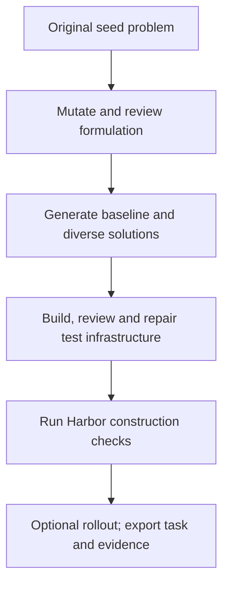
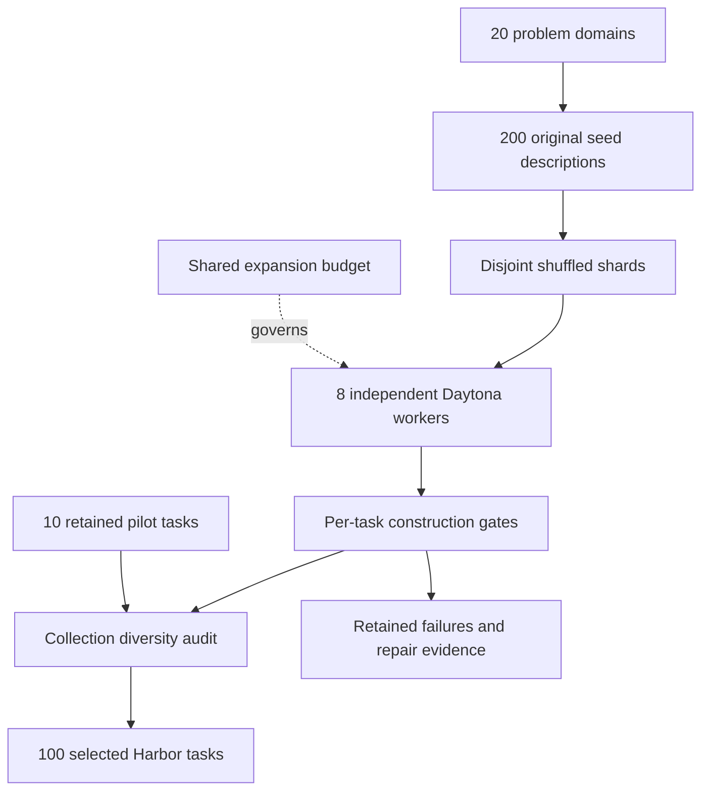

`optimization_synth / frontiersmith` turns a closed-ended programming problem
into an optimization challenge. The agent submits a reusable Python program, and
deterministic private tests score its feasibility and solution quality on a
continuous `[0,1]` scale. A better solution can earn more reward even though
nobody knows the optimum.

**Status:** experimental. A 100-task local collection was completed on
2026-09-29. This is Repo2RLEnv's own adaptation of the paper, not the unreleased
upstream generation code. [RFC 0032](../rfcs/0032-frontiersmith-recipe.md) lists
the exact differences.



## What each prompt does

Every call uses the configured OpenAI model, each in its own context. That
doesn't make it a cross-model ensemble. The first feasibility call is written
from the instruction, and repairs can see earlier infrastructure through
diagnostic feedback. Every exact request and response is kept in the campaign,
and the [complete prompt reference](prompts/frontiersmith.md) is generated from
source.

| Stage | Model receives | Required output and gate |
|---|---|---|
| Mutation | Seed problem and provenance | Public instruction, objective, feasibility, score and simple baseline |
| Formulation review | Design | Approve or list concrete ambiguities and triviality concerns |
| Baseline | Public instruction and simple strategy | Deterministic feasible program |
| Sampled solutions | Public instruction and strategy brief | Three independently authored programs by default |
| Idea divergence | Sample programs | One algorithmic-distinction judgment per pair |
| Test generation | Design and sampled strategies | Seeded generator with 8–16 edge, adversarial and larger cases |
| Scoring | Design and generated tests | Feasibility checker and exact public score calculation |
| Feasibility | Public instruction; previous infrastructure and diagnostic feedback on retries | Separate `is_feasible` checker; valid zero-reward solutions remain valid |
| Infrastructure review | Instruction, tests, scorer, validity checker and programs | Approve or route concrete defects to bounded repair |
| Optional rollout | Learner-visible Harbor task only | Independent agent attempt, transcript and observed reward |

Harbor execution itself uses no LLM judge. The no-op must score zero, and a
sampled reference must beat the baseline and reproduce its per-case scores. The
baseline and at least two sampled programs must be feasible on every generated
case. A separate boolean validity verdict tells a legal zero score apart from an
invalid submission. Sample score vectors must differ: by default, a mean absolute
difference of at least 0.001 for at least 30% of sampled pairs. That's a
sensitivity threshold on deterministic scores. It isn't a minimum task reward or
a claim about training benefit. A reference scoring below one is normal.
Artifacts that were generated but rejected stay in the campaign for diagnosis.

## Run

Install the package with the cloud and Harbor extras. Set `OPENAI_API_KEY` and
`DAYTONA_API_KEY` in your environment or `.env`. No upstream research package is
installed. Rebuild the wheel after you change source, so the remote runtime
matches.

```bash
uv sync --extra daytona --extra harbor
uv build --wheel
repo2rlenv campaign init workspace/frontiersmith --budget-usd 30
repo2rlenv workers start --campaign workspace/frontiersmith \
  --provider daytona --name frontiersmith-pilot --reserve-usd 2 \
  --timeout-sec 14400
repo2rlenv pipelines describe optimization_synth --recipe frontiersmith
repo2rlenv generate --config examples/owned-frontiersmith.yaml
```

Use `--resume` with unchanged settings and the same runtime wheel. A request
whose outcome is unresolved can't be blindly dispatched again. A live connection
error skips the affected candidate but keeps its reservation and diagnosis, and
later seeds carry on. The CLI shows named stage events, and `--json` prints the
same events as JSON Lines. The ledger counts reservations as well as settled
spend. When you're done, terminate the worker and reconcile its cost from
provider evidence:

```bash
repo2rlenv workers stop workspace/frontiersmith/workers/frontiersmith-pilot.json
repo2rlenv campaign status workspace/frontiersmith
```

## Task and evidence layout

```text
tasks/frontiersmith-<seed>/
  task.toml                  # Harbor configuration, lineage and evaluation label
  instruction.md             # Complete public contract
  environment/Dockerfile     # CPU-only, offline Python runtime
  solution/solve.sh           # Installs the best sampled reference
  solution/solution.py
  tests/test.sh
  tests/grade.py              # Owned process isolation and reward writer
  tests/generator.py          # Private reproducible test instances
  tests/scorer.py             # Feasibility and graded objective
  tests/feasibility.py        # Independently authored validity verdict
  tests/contract.json
```

Each generator is also smoke-tested at the configured seed and the next two
values. That catches construction failures that depend on the seed. It doesn't
show that solvers generalize to those extra inputs. Seed-family metadata goes
into each task so you can measure the collection's diversity. When
structured-output repairs run out, the candidate is rejected and its receipts are
kept, and later seeds continue.

The campaign also keeps, separately, the model receipts, review findings, trial
results, per-case score vectors and a `quality.json` for each emitted task. The
generic evaluation label stays `unverified` until the broader review, probe and
rollout evidence the repository requires exists. Don't mistake construction
verification for full quality acceptance.

The shared `quality` review and repair loop currently checks the oracle and valid
alternatives against one fixed `success_reward`. Changing that number doesn't
turn it into an optimization profile, because distinct feasible programs can
legitimately earn different rewards. Don't apply that binary-style acceptance
contract to this recipe, and don't flatten scores to get a `verified` label. This
recipe uses its own construction checks. Optimization-aware acceptance isn't
integrated into the shared quality loop yet.

The Dockerfile currently uses the `python:3.12-slim` tag and installs build-time
system packages without a repository snapshot. Task hashes bind the Dockerfile
and verifier bytes, not a permanently pinned base-image digest. The recorded runs
show what executed during this campaign; a future image rebuild needs its own
checks. Execution evidence comes from Harbor 0.22.0 and the repository's offline
Docker adapter inside Daytona. This collection didn't validate any other
execution backend.

## Scope, economics and credit

This recipe supports Python standard-library algorithms, not GPU or service
tasks. The existing FrontierSmith release uses C++ and a privileged judge
sidecar; this adapter doesn't copy or need it. The seed descriptions and prompts
are original.

Candidate filtering and repair can dominate cost. Report spend per attempted
seed and per exported task, including rejected candidates, and keep cloud billing
separate from token estimates. Report the observed acceptance fraction alongside
the cost. The development pilot and the broader collection are measured
separately.

Method credit: [FrontierSmith paper](https://arxiv.org/abs/2605.14445),
[upstream repository](https://github.com/FrontierCS/FrontierSmith), and
[provenance](https://github.com/huggingface/Repo2RLEnv/blob/main/src/repo2rlenv/pipelines/recipes/frontiersmith/provenance.md).

## Measured 100-task collection

**100 local Harbor tasks across 20 problem families:** 10 kept from the pilot
and 90 new exports. All use OpenAI `gpt-6-sol` and Daytona execution. The
collection was measured on 2026-09-29 with assistance; it isn't a fully
unattended yield benchmark.

| Evidence | Result |
|---|---:|
| Candidate attempts / distinct seeds | 153 / 152 |
| Initial exports / final selected tasks | 101 / 100 |
| Final selection yield | 65.4% |
| Harbor parsing, content integrity and construction checks | 100 / 100 |
| Finished-task static contract reviews without unresolved concrete findings | 100 / 100 |
| Tasks with a blind rollout attempt | 24 / 100 |
| Tasks with completed, fully feasible blind rollouts | 21 / 24 attempted |
| Post-construction generator repairs | 2 tasks |
| Full quality acceptance | 0; all remain `unverified`, stage `construction` |

Construction means a no-op that scores zero, a fully feasible baseline, at
least two fully feasible sampled programs, a reference that beats that baseline,
score vectors that can be told apart, and reference scores that repeat. It
doesn't require a proven optimum. Generator smoke checks cover seeds 42, 43 and
44, and solution grading uses seed 42. For the tasks kept from the pilot, the
extra generator smoke check was a separate remote audit. It doesn't show that
solutions generalize across those seeds.

Blind rollouts covered at least one task in every family. There were 26 attempts
on 24 final bundles, including two retries with larger output budgets after
truncated model responses. All 21 completed rollouts were feasible on every
graded case. Three tasks stopped during agent commands, before grading:
`bipartite-matching`, `sequence-reordering-parallel-swap-rounds` and
`communication-priced-frame-slots`. Their timeouts are recorded, and the tasks
weren't weakened to let the agent succeed. The other 76 tasks have construction
evidence but no blind rollout. Scores on different objectives don't add up to a
shared performance benchmark.

The collection review checked all 20 families, plus summaries of the mathematics
across families. It found no unresolved near-duplicate formulations, and the
exact instruction and executable-bundle hashes are all unique. That's
model-assisted curation, not proof of semantic uniqueness or broad adversarial
safety. Two generators were repaired after concrete findings, and one needed a
second repair after a targeted branch probe. The original and intermediate
bundles are still available, with their diagnoses.

| Problem family | Tasks |
|---|---:|
| Combinatorial design | 4 |
| Communication | 4 |
| Compiler optimization | 4 |
| Data representation | 3 |
| Energy systems | 4 |
| Geometric layout | 9 |
| Image grid processing | 5 |
| Logic constraints | 4 |
| Network design | 6 |
| Numerical approximation | 5 |
| Query planning | 3 |
| Resource allocation | 8 |
| Scheduling | 6 |
| Search structures | 5 |
| Sequence reordering | 4 |
| Software testing | 7 |
| State space planning | 5 |
| Storage systems | 6 |
| Strings compression | 4 |
| Transport routing | 4 |

| Generation rejection or interruption | Candidate attempts |
|---|---:|
| `formulation_rejected` | 1 |
| `infrastructure_repair_exhausted` | 4 |
| `insufficient_successful_programs` | 6 |
| `low_execution_diversity_or_improvement` | 13 |
| `low_semantic_divergence` | 24 |
| `provider_response_unavailable` | 4 |

These generation outcomes come before collection curation. The pilot also
dropped one initial export, and repaired versions of two expansion tasks replace
their parents without adding to the selected count.

The accounted cost is **USD 68.42**, or **USD 0.684 per selected task**,
including seed authoring, rejected candidates, reviews, repairs and sample
rollouts. Another **USD 0.67 remains reserved for four lost API responses**,
whose actual charges are unknown. Accounted cost plus those reservations comes to
USD 69.09, within the USD 100 cap. All 13 campaign workers have been terminated.
API costs use recorded usage and configured rates. Compute is an estimate from
resource duration, not an invoice. Interactive assistant usage is excluded. See
[economics](economics.md#frontiersmith-optimization-synthesis) for the stage
breakdown.

The [machine-readable collection manifest](../data/frontiersmith-campaign.json)
records task identities, families, baseline and reference scores, rollout
attempts, repair lineage, costs and the generation revision. Pilot bundles are
unchanged, and their family tags are assigned only in the collection manifest.
The original expansion runtime wheel, from before the post-campaign code fixes,
is preserved locally.

Local artifacts are under `workspace/frontiersmith-scale/`:

- `collection/tasks/`: the 100 selected standalone Harbor directories.
- `frontiersmith-100.tar.gz` and `frontiersmith-100.sha256`: portable task archive and checksum.
- `manifest.json`: collection evidence summary. `runs/`, `audit/`, `repairs/` and
  `recoveries/` keep the detailed local receipts and operator decisions.

Generated tasks and raw campaign receipts stay out of Git. They haven't been
published to the Hub, and they aren't counted in published-dataset totals.

## Measured local pilot

**10 selected Harbor tasks from 15 candidate attempts across 14 original seeds.**
Eleven tasks were exported at first. One graph-coloring candidate was kept with a
`needs_repair` label after explicit feasibility checks. The other ten passed the
final construction profile: a feasible baseline, at least two fully feasible
sampled programs, a no-op scoring zero, improvement on the baseline, score
diversity and repeated reference scores. All ten parse with Harbor and pass
artifact-integrity checks.

| Task | Cases | Baseline | Best sampled reference |
|---|---:|---:|---:|
| bipartite-matching | 13 | 0.894 | 0.916 |
| cache-replacement | 12 | 0.328 | 0.577 |
| edit-distance | 14 | 0.105 | 0.823 |
| load-balancing | 12 | 0.583 | 0.797 |
| matrix-chain | 14 | 0.500 | 0.920 |
| rectangle-packing | 15 | 0.853 | 0.912 |
| set-coverage | 13 | 0.512 | 0.628 |
| spanning-tree | 12 | 0.185 | 0.542 |
| string-compression | 12 | 0.000 | 0.369 |
| topological-order | 12 | 0.000 | 0.638 |

Rewards use different objectives and normalizers, so compare strategies within a
task, not scores across rows. References are feasible sampled solutions, not
proofs of optimality.

A fresh run of the final pipeline generated the set-coverage task, repaired its
test set within the configured allowance, and completed a blind GPT-6 Sol
rollout. The rollout was feasible on all 13 cases and scored **0.628**, matching
the sampled reference. An earlier spanning-tree rollout scored 0.545, but it used
an earlier bundle, so it doesn't validate rollouts for the final collection.

All ten are still **`unverified`, stage `construction`**. Broad adversarial
testing, independent quality acceptance and Hub publication haven't been done.
The excluded graph-coloring candidate shows why reward and feasibility have to be
separate: only one sampled strategy was fully valid, and review also found a
seed-dependent boundary error in the generator.

Recorded OpenAI usage cost **\$5.27**, plus **\$0.34 of estimated Daytona
compute**: **\$5.61 total, about \$0.56 per selected task**. That includes
rejected attempts, development retries, two rollouts and repeated construction
checks. It excludes interactive assistant usage. These are usage and resource
estimates, not invoices. All three workers were terminated, and no reservations
are unresolved.

This was an assisted development campaign whose checks evolved along the way,
not a controlled benchmark of unattended yield. Initial export yield was 11/15
(73.3%), and final selection was 10/15 (66.7%). The
[machine-readable results and bundle identities](../data/frontiersmith-pilot.json)
record the exact sample. Generated tasks and raw receipts stay in the campaign
directory, which git ignores. The selected archive is
`workspace/frontiersmith/frontiersmith-pilot.tar.gz`.

## Expanding the problem range

The expansion uses 200 original closed-ended seeds, written with OpenAI, in
`examples/frontiersmith-diverse-seeds.json`, ten per domain. The domains are
network design, transport, scheduling, allocation, geometry, strings/compression,
storage, query planning, compilers, logic, numerical approximation, combinatorial
design, sequence reordering, energy systems, communication, search structures,
image/grid processing, data representation, software testing and state-space
planning.

Seeds carry their family and provenance. The mutation stage keeps each seed's
core domain instead of turning unrelated problems into the same generic selection
task. All the resulting environments are still Python standard-library coding
challenges with deterministic objectives. Domain variety doesn't mean GPU,
repository-editing or service-based environments.

Independent workers get disjoint, shuffled seed shards and share one expansion
budget ledger. The expansion cap is the \$100 combined allowance minus the
pilot's \$5.606553, which leaves the settled pilot ledger alone. Accepted pilot
tasks are kept unchanged. The expansion produced 90 more construction-checked
tasks and completed a diversity audit across the whole collection. Generated
campaign files are git-ignored.



The recorded expansion shuffled the 200 seeds with `random.Random(20260929)`
and split them as `seeds[i::8]` for `i = 0..7`. Shard targets were
`[12, 12, 11, 11, 11, 11, 11, 11]`, 90 new tasks in total. Each configuration has
its own `source.path`, `execution.run_id` and `execution.worker_receipt`, and they
share `execution.campaign_dir` and the output directory. Seed IDs are disjoint.
Each run is limited to 25 candidates, with two concurrent solution calls and one
blind rollout per shard. The final manifest records this partition and the
seed-file hash.

Parallelism happens at the campaign level: each worker runs the same public
`generate` command on its own seed shard and worker receipt. Within a candidate,
independent solution calls can overlap, but reference trials run one after
another on that worker so timings stay comparable. Collection curation is
separate from the single-shard recipe command. Every selected task keeps its
original executable bundle hash and construction evidence, and the collection
audit must never quietly rewrite a tested task.

## Collection review

A collection needs more checks than one successful construction run:

1. Parse every selected task with Harbor and check its content identity against
   the recorded trial receipts. Check the no-op zero, baseline feasibility, at
   least two feasible samples, improvement and repeated reference scores from
   per-case evidence, not only an aggregate success flag.
2. Review the finished instruction, generator, scorer and feasibility validator
   in a fresh context, without the sampled programs. Require a concrete
   counterexample for any reported defect, and tell limitations apart from real
   contract failures.
3. Compare formulations within each problem family and across mathematical
   summaries. Sharing an algorithm or a topic doesn't make two tasks duplicates;
   renamed decisions, constraints and objectives do. Exact file hashes alone
   can't detect semantic duplication.
4. Keep a flagged original along with its diagnosis. A repair creates a new
   bundle, records its parent identity, and reruns the construction profile.
   Don't copy old execution evidence onto changed tests or instructions.

For example, an energy-storage task passed its original construction checks, but
one generated input had surplus and demand at the same time, which its public
domain rules out. The extra review found that mismatch. A bounded generator
repair fixed the input, kept the instruction and scoring formula, and passed
fresh no-op, baseline, sample and repeated-reference trials. The original is
still available with a `needs_repair` label. A network generator also had to
reserve its complete connected backbone before adding optional edges; repeated
seeds and a targeted dense-branch check exposed an incomplete first repair. Cases
like these are why agreement among sampled programs is useful evidence but not
proof that the tests are valid.

These collection checks are an assisted curation step outside the single-shard
`generate` command. They use the same model accounting and remote execution
building blocks, and their requests, findings and repair receipts stay in the
campaign. They don't automatically upgrade tasks to the broader `verified` label.

## What the environments ask agents to do

The variety comes from the decisions, constraints and objectives, not from
renaming the story. Representative generated tasks include:

| Domain | Program output | What the verifier measures |
|---|---|---|
| Energy systems | Per-store charging and discharge schedules | Served demand value, subject to inventory and minimum charging-run constraints |
| Compiler optimization | Ordered expression-tree tiles, including fused operations | Operation cost, transition penalties and peak live values |
| Communication | Packet fragments assigned to priced frame slots | Transmission cost including headers, capacities and exact delivery |
| Numerical approximation | Nonnegative integer quadrature weights | Worst monomial integration error under a fixed weight budget |
| Software testing | Dependency paths from tests to edited modules | Shared setup cost plus path traversals, with bounded detours |
| Data representation | Tile palette assignments and pixel encodings | Exact reconstruction and encoded bit count including palette overhead |

These are compact algorithm-design environments. They don't exercise
navigating a large repository, installing dependencies, GPU execution or service
deployment. A model can write a feasible program and still leave plenty of room
to optimize. Report feasibility and reward together, rather than treating every
positive score as a solved problem.

## Operational lessons

- **Closed-ended seeds can stay too easy after mutation.** Different sampled
  programs sometimes land on the same algorithm or identical scores. Treat that
  as a failed diversity gate, and don't manufacture score differences by
  changing the public objective. Seed family names alone don't show that tasks
  vary.
- **Independent feasibility matters.** A zero can mean a valid but poor
  objective value. Keep validity separate, and require the baseline and several
  samples to be feasible on every graded case.
- **Review generators against the public domain.** A reference that runs
  successfully doesn't show that the generated inputs meet every promised
  constraint. Check boundary cases, and the exact control-flow branch a finding
  points to.
- **Repair evidence belongs to the new bytes.** Keep the original, issue a new
  bundle identity and rerun the construction profile. A repair that works on a
  few seeds can still miss a dense or adversarial branch.
- **Agent failures are a separate outcome.** Keep command timeouts and output
  truncations on record. An incomplete rollout neither disproves the verifier nor
  shows how hard the task is. Don't change the task to make a chosen agent pass.
- **Lost responses aren't free.** Stop the affected run and keep its API
  reservation. In this collection, four uncertain authoring operations were kept,
  and their candidates were skipped through an explicit recovery record before
  the unchanged shards resumed. That needed an operator. A fix made after the
  campaign now skips candidates on live connection errors automatically and keeps
  their reservations. Receipts that were already unresolved still need
  reconciling before they're dispatched again.
- **Fixed shards create a long tail.** Disjoint targets make resuming and
  accounting simple, but workers that finish early don't pick up work from
  slower shards. This campaign used fixed shards. A shared queue with durable
  seed claims and a global stop condition could cut elapsed time in future, as
  long as it doesn't lower the acceptance gates.
- **Cost and yield need their scope.** Include rejected seeds, seed authoring,
  reviews, repairs, sample rollouts and worker idle time. Report an assisted
  development collection separately from an unattended production benchmark.
