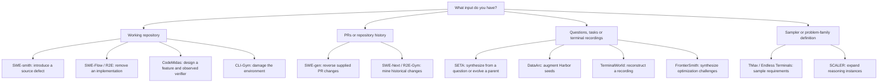
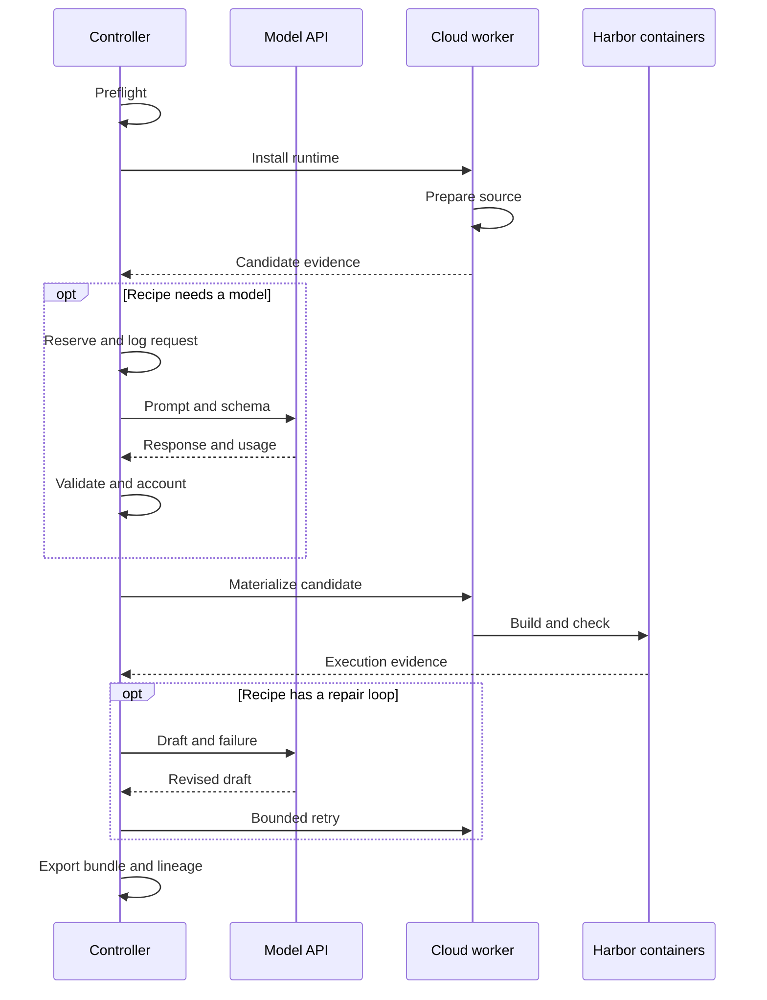
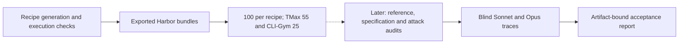

A research recipe is Repo2RLEnv's own implementation of a published
task-generation method. It doesn't install or clone the upstream research code at
runtime. Each recipe has its own source pin, notices, algorithm, options and RFC.
Harbor and ordinary libraries are still dependencies. Target repositories are
input data, and they may be cloned on the remote worker.

Pick a recipe by the input you have. Each walkthrough explains the algorithm,
numbers every model call, shows where retries loop back, and links to the
complete prompts. The [prompt guide](prompt_reference.md) explains how those
templates become the actual requests recorded in a campaign.

## Choose a generation route



| Walkthrough | `pipeline.name / recipe` | Input | Reference source |
|---|---|---|---|
| [SWE-smith](repo_mutate.md) | `repo_mutate / swe_smith` | Healthy Python repo | Original source before mutation |
| [SWE-gen](pr_to_env.md) | `pr_to_env / swe_gen` | Explicit merged PR URLs | PR-head implementation |
| [SWE-Flow](repo_reconstruct.md) | `repo_reconstruct / swe_flow` | Healthy Python repo | Original scheduled functions |
| [CodeMidas](codemidas.md) | `repo_reconstruct / codemidas` | Working repository or pinned Stack v3 row | Original selected implementation |
| [R2E](r2e.md) | `equivalence_tests / r2e` | Documented repo functions | Original function in private verifier |
| [SWE-Next](swe_next.md) | `pr_runtime / swe_next` | Repository PR history | Post-change source at merge revision |
| [R2E-Gym](r2e_gym.md) | `commit_runtime / r2e_gym` | First-parent history | Post-change source |
| [CLI-Gym](env_repair.md) | `env_repair / cli_gym` | Healthy development environment | Generated, execution-checked recovery |
| [SETA Seed2Synth](terminal_synth.md) | `terminal_synth / seta_seed2synth` | Question/answer records | Generated shell reference |
| [SETA Evol](task_evolve.md) | `task_evolve / seta_evol` | Owned Harbor parents | Generated child reference |
| [DataArc](dataarc.md) | `terminal_synth / dataarc` | Harbor seed tasks | Generated strategy-specific reference |
| [TMax](tmax.md) | `terminal_synth / tmax` | Legacy taxonomy sampler | Generated reference guided by truth/tests |
| [Endless Terminals](endless_terminals.md) | `terminal_synth / endless_terminals` | Category/complexity/scenario sampler | Generated reference guided by truth/tests |
| [TerminalWorld](terminalworld.md) | `terminal_reconstruct / terminalworld` | Metadata and text transcript | Extracted, refined and replayed solution |
| [FrontierSmith](frontiersmith.md) | `optimization_synth / frontiersmith` | Closed-ended seed problems | Best sampled solution; not a proven optimum |
| [SCALER](scaler.md) | `reasoning_synth / scaler` | Released family JSON | Answer from supplied reference program |

`pipeline.name` names the generation family, and `recipe` picks the
research-inspired implementation within it. Leave out the recipe and you get the
existing native behavior. All 16 recipes are experimental. SEC-bench is deferred
and not implemented.

```bash
repo2rlenv pipelines list
repo2rlenv pipelines describe repo_mutate --recipe swe_smith --json
```

The catalog marks each method as **planned** or as an executable
**experimental** implementation. A recipe that runs isn't a claim that its output
is good enough to train on. [RFC 0011](../rfcs/0011-owned-recipes.md) covers the
shared architecture and ownership policy.

## Where each stage runs



The diagram shows where each kind of work happens. It isn't one stage order
that every recipe follows. The history recipes establish the before-and-after
contrast before they write the instruction, TerminalWorld replays before it
writes tests, and SCALER has no model stage at all. SWE-smith's fresh Harbor
checks are a separate campaign step. Each method's own diagram gives its exact
order.

Preflight checks the source, recipe, budget and runtime hash. The model gets
stage-specific system and user messages plus an output schema. Execution evidence
includes test identities, rewards, logs and artifacts. The cloud
[worker](../concepts/glossary.mdx#worker) is a Modal or Daytona sandbox running
the owned wheel and Docker.

The [controller](../concepts/glossary.mdx#controller) on your machine handles
metadata, parsing, model calls, accounting and file assembly. Image builds, and
any run of target or generated code, happen remotely. Repository profiles reuse
`ensure_bootstrap` with an explicit Dockerfile and its cache, but without the
bootstrap LLM agent. Terminal builders generate their own task-specific setup and
fixtures as part of the recipe. Dependencies are installed before the learner
runs, and the learner runs offline.

## What a task contains

```text
<task-name>/
  instruction.md             # Learner request
  task.toml                  # Harbor runtime, resources and artifacts
  environment/
    Dockerfile               # Starting state and build-time dependencies
    ...                      # Repository snapshot or fixtures
  solution/
    solve.sh                 # Private reference entrypoint
    ...                      # Original source, recovery script or answer
  tests/
    test.sh                  # Trusted verifier entrypoint
    ...                      # Tests, expected identities and reward code
    Dockerfile               # When using a separate verifier environment
```

Harbor doesn't copy the whole bundle into the learner's container. It uses the
environment, solution and tests, each in its own phase. Model receipts and
generation traces stay outside the bundle.

| Verification shape | Recipes | Current reward |
|---|---|---|
| Collect allowed source into a separate verifier | SWE-smith, SWE-gen, SWE-Flow, R2E, SWE-Next, R2E-Gym | Required tests pass with expected nonempty identities; binary 0/1 |
| Inspect terminal state with generated pytest tests | SETA, DataArc, TMax, Endless Terminals, TerminalWorld | All required tests pass; binary 0/1. Recorded weights don't make the current grader fractional. |
| Check environment restoration | CLI-Gym | Healthy tests restored and protected source preserved; binary 0/1 |
| Collect answer file into a separate verifier | SCALER | Native answer equivalence; −1/+1 |

Generation checks only show that a task and its reference run. Independent
review of instruction quality, and adversarial review, come later.

## Accounting and workers

Set the budget once, explicitly. Reinitializing with a different amount is
rejected. A model or provider call whose outcome is unknown keeps its
reservation. Completed calls are charged from recorded usage estimates and never
counted twice.

Point `execution.campaign_dir` in the generation config at the campaign
directory. `generate --max-spend-usd` only applies to native generation: recipes
reject it before dispatch and use the shared campaign ledger instead.
`--pipeline-opt` overrides individual options, even when the pipeline name comes
from `--config`.

For recipes, `generate --json` prints progress as JSON Lines. Inspection commands
such as `tasksmith show --json` and `quality show --json` print a single JSON
result. CLI failures print `{"error": "ExceptionType", "message": "description"}`
and exit 2. Logs go to stderr, and `--verbose` adds a traceback there without
changing the machine-readable output.

```bash
repo2rlenv campaign init workspace/my-campaign --budget-usd 25
repo2rlenv workers start --campaign workspace/my-campaign --provider modal \
  --name my-worker --reserve-usd 3 --timeout-sec 3600
repo2rlenv workers probe workspace/my-campaign/workers/my-worker.json \
  --out workspace/my-campaign/probes/first
repo2rlenv campaign status workspace/my-campaign --json
repo2rlenv workers stop workspace/my-campaign/workers/my-worker.json
```

Stopping a worker confirms cleanup, but it doesn't make up a bill. Reconcile
the reservation with a usage or billing receipt, or with a conservative estimate
that's clearly labelled as one:

```bash
repo2rlenv campaign settle workspace/my-campaign --operation worker:modal:my-worker \
  --cost-usd 0.30 --evidence workspace/my-campaign/worker-usage.json
```

The amount above only illustrates the command; it isn't a price quote. Campaign
accounting should include failed requests, image builds and runtime. Model
receipts record the request, response, schema, usage and cost basis. Keep these
private review artifacts out of any task directory the learner can see.

Modal workers run Docker inside a VM. Daytona workers use Daytona's image builds
and Docker-in-Docker, and account limits can differ. Modal's timeout is a maximum
lifetime. Daytona's configured auto-stop is an **idle** timeout, so the
controller also stops dispatching work once the recorded execution window ends.
Always terminate workers explicitly when you're done. There's no local Docker
fallback.

## Output and acceptance

The release target is **100 generated tasks for each of twelve methods**, plus
two smaller approved collections: 55 tasks for TMax and 25 for CLI-Gym. The
first milestones were 20 tasks each. Tasksmith has its own verified cohort of 50
tasks. The [release inventory](releases.md) lists the finished datasets and the
remaining counts. Detailed attack and blind-rollout audits come after
generation, and they don't hold up work on the next recipe. That ordering doesn't
change what a quality-accepted label means when one is given later.



Generation reports how many candidates it attempted and how many it exported.
Acceptance is stricter. Every mandatory quality criterion must pass, with
evidence for the current [bundle hash](../concepts/glossary.mdx#bundle-hash). A
missing check, a failed check or evidence for an older revision isn't a pass. A
solver failing on a task doesn't, by itself, make the task invalid. These audits
are still being collected, so the tasks the recipes generate are labelled
**exported**.

Harbor 0.22.0 parses the schema 1.3 tasks the recipes emit. Some worker kernels
don't support Harbor's nftables-based dynamic firewall. The owned
`repo2rlenv.execution.harbor_offline:OfflineDockerEnvironment` adapter handles
Linux Dockerfile tasks that stay offline in every phase, using Docker's
`network_mode: none`. It rejects allowlists, network transitions and extra
services defined by the task. Other task shapes need another verified runtime
route.

The published research cohort has 14 recipes: [SWE-smith](repo_mutate.md),
[SETA Seed2Synth](terminal_synth.md), [SETA Evol](task_evolve.md),
[SWE-gen](pr_to_env.md), [SWE-Flow](repo_reconstruct.md), [R2E](r2e.md),
[TMax](tmax.md), [Endless Terminals](endless_terminals.md),
[TerminalWorld](terminalworld.md), [CLI-Gym](env_repair.md),
[DataArc](dataarc.md), [SWE-Next](swe_next.md), [R2E-Gym](r2e_gym.md), and
[SCALER](scaler.md), which adds algorithmic reasoning instances from released
families. [CodeMidas](codemidas.md) adds source-driven reconstruction in a
separate local campaign using Sol/Luna and Daytona. SEC-bench is still deferred
and isn't an implemented recipe.

## Contract references

- [Harbor tasks](https://www.harborframework.com/docs/tasks), validated against the installed 0.22.0 task models and trial implementation.
- [Modal VM sandboxes](https://modal.com/docs/guide/vm-sandboxes).
- [Daytona sandbox management](https://www.daytona.io/docs/en/sandbox-management/).
- [LiteLLM structured outputs](https://docs.litellm.ai/docs/completion/json_mode) and [Anthropic mapping](https://docs.litellm.ai/docs/providers/anthropic).
