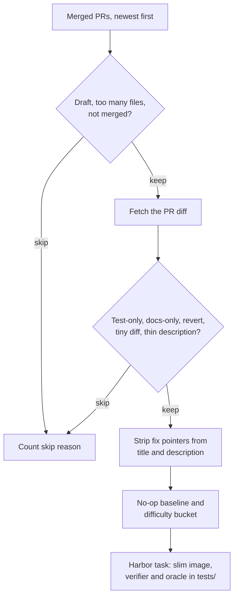

Each task is a merged pull request, rewound to its base commit: the agent gets the
PR's title and description and edits the repository to resolve it. A verifier
compares the agent's diff with the merged diff and, when you pass it a key, asks an
LLM judge whether the patch addresses the issue. Generation needs no Docker and no
LLM, so `pr_diff` is the cheapest way to get many tasks out of a repository.

## At a glance

| | |
|---|---|
| Input | A GitHub or GitLab repository with merged PRs |
| Task | Resolve the issue described in a merged PR, starting from its base commit |
| Reward | Weighted diff similarity in [0, 1] against the merged diff, plus an optional LLM judge |
| Needs an LLM | No at generation. The judge is optional, at verify time |
| Needs Docker | No at generation. Running a task builds a small `python:3.12-slim` image |
| Hosts | GitHub (needs `gh` on `PATH`) and GitLab |
| Languages | Any, since scoring is text-based. The reference dataset spans Python, JavaScript/TypeScript, Go and Rust |
| Status | Stable |
| Reference dataset | [`FineEnvs/repo2rlenv-pr-diff`](https://huggingface.co/datasets/FineEnvs/repo2rlenv-pr-diff): 181 tasks from 26 repositories |

## Quickstart

```bash
repo2rlenv generate \
  --repo pallets/click \
  --pipeline pr_diff \
  --pipeline-opt limit=5 \
  --out ./tasks/click-pr-diff
```

`limit` caps how many merged PRs are listed, so you get at most five tasks, one
directory each (`./tasks/click-pr-diff/pallets__click-<pr>/`). The command exits
with status 1 if every PR is filtered out. Check the tasks, then run the oracle,
which applies the merged diff:

```bash
repo2rlenv validate ./tasks/click-pr-diff --oracle
harbor run -p ./tasks/click-pr-diff -a oracle --env docker
```

To score a real agent, pass the judge key to the verifier with `--ve`; `--ae` only
reaches the agent:

```bash
harbor run -p ./tasks/click-pr-diff \
  -a claude-code -m anthropic/claude-sonnet-4-6 \
  --ak max_budget_usd=2.00 \
  --ae ANTHROPIC_API_KEY=$ANTHROPIC_API_KEY \
  --ve ANTHROPIC_API_KEY=$ANTHROPIC_API_KEY \
  --env docker
```

## How it works



1. **List merged PRs.** `gh pr list --state merged` on GitHub, or the merge-request
   API on GitLab, newest first. The listing over-fetches three times `limit` so that
   draft and `since`/`until` filtering still leaves up to `limit` PRs.
2. **Filter on metadata.** Skip drafts (`skip_drafts`), PRs with no changed files or
   more than `max_files_per_pr`, and PRs without a merge timestamp.
3. **Fetch the diff** with `gh pr diff` (or the GitLab equivalent). Empty diffs and
   fetch failures are skipped.
4. **Filter on content.** Skip diffs that only touch tests or only touch docs,
   titles that start with `Revert `, diffs with fewer than `min_loc_changed` changed
   lines, and PRs whose description is empty after stripping and whose title has
   fewer than five words.
5. **Write the instruction** from the PR title and description, with closing
   keywords, issue and PR links, GitHub URLs, commit trailers and squash suffixes
   removed (see [Implementation notes](#implementation-notes)).
6. **Calibrate.** Compute the reward an empty patch would get (the no-op baseline)
   and a difficulty bucket from the diff size.
7. **Emit the task.** The environment is `python:3.12-slim` with git and the
   repository checked out at the base commit, with git history past that commit
   removed. The oracle and verifier go in `tests/`, which Harbor uploads only at
   verify time, so the agent's image never contains the answer.

## Options

Pass each option with `--pipeline-opt key=value`.

| Key | Default | What it does |
|---|---|---|
| `limit` | `50` | Maximum merged PRs to list. You get at most this many tasks |
| `since` / `until` | none | ISO dates (`2026-01-31`) bounding the merge date |
| `max_files_per_pr` | `5` | Skip PRs that change more files than this |
| `min_loc_changed` | `3` | Skip PRs whose diff changes fewer `+`/`-` lines than this |
| `skip_drafts` | `true` | Skip draft PRs |
| `emit_harbor_env` | `true` | Write `environment/`, `tests/test.sh` and the verifier files. `false` writes text-only tasks (`task.toml`, `instruction.md`, `solution/`) for trainers that score diffs themselves |
| `diff_format` | `unified` | Recorded in task metadata. The oracle is always the unified diff from the host |
| `state` | `merged` | Accepts `merged` or `all`; listing currently always uses merged PRs |
| `context_window_loc` | `200` | Accepted but not used by the current pipeline |

## Output

```files
pallets__click-<pr>
├── task.toml
├── instruction.md
├── environment
│   └── Dockerfile
├── solution
│   ├── patch.diff
│   └── solve.sh
└── tests
    ├── test.sh
    ├── verifier.py
    ├── oracle.patch
    └── instruction.md
```

- `task.toml`: Harbor 1.0 task (`name = "<org>/pallets__click-<pr>"`, agent timeout 1,800 s, verifier timeout 300 s) with provenance, calibration and an [evaluation label](task_evaluation_labels.md) under `[metadata.repo2env]`. The label starts as `unverified`.
- `instruction.md`: the stripped PR title and description, plus a short task statement.
- `environment/Dockerfile`: `python:3.12-slim`, git, and the repository at the base commit. An optional `GITHUB_TOKEN` or `GITLAB_TOKEN` build argument clones private repositories; the remote URL is reset afterwards.
- `solution/patch.diff`: the merged diff (the [oracle](../concepts/glossary.mdx#oracle)).
- `solution/solve.sh`: applies `patch.diff`; Harbor's oracle agent runs it.
- `tests/test.sh`: captures the agent's edits with `git add -A` and `git diff --cached <base>`, then runs the verifier.
- `tests/verifier.py`: the standalone six-component scorer (Python standard library only).
- `tests/oracle.patch`: the reference diff the verifier compares against.
- `tests/instruction.md`: the verifier's copy of the instruction, for the judge.

The per-task metadata looks like this:

```toml
[metadata.repo2env]
pipeline = "pr_diff"
repo = "pallets/click"
ref = "<base commit sha>"
reference = "https://github.com/pallets/click/pull/<pr>"
reward_kinds = ["diff_similarity"]

[metadata.repo2env.pr_diff]
pr_merged_at = "<timestamp>"
diff_format = "unified"
context_files = ["src/click/…", "tests/…"]

[metadata.repo2env.reward_calibration]
baseline_reward = 0.0
loc_changed = 95
difficulty = "large"
```

## Multi-component reward

The verifier scores the agent's diff against the oracle with six components and
combines them as a weighted average:

| Component | Range | Weight | What it measures |
|---|:-:|--:|---|
| `format_valid` | 0 or 1 | 0.00 | The diff has a `diff --git` header and at least one change line. Kept as a guard |
| `size_sanity` | [0, 1] | 0.08 | `min(oracle_lines, predicted_lines) / max(…)`. Catches no-op and sprawling patches |
| `file_targeting` | [0, 1] | 0.12 | F1 over the sets of changed files, so missing an oracle file costs more than touching an extra one |
| `region_overlap` | [0, 1] | 0.20 | Fraction of oracle hunks with a predicted edit within five lines in the same file |
| `similarity` | [0, 1] | 0.10 | `difflib.SequenceMatcher` ratio over `+`/`-` lines only, so unchanged context earns nothing |
| `llm_judge` | [0, 1] or none | 0.50 | An LLM rates whether the patch plausibly addresses the issue, without grading similarity to the oracle |

The result is clipped to [0, 1]. If `size_sanity` is below 0.10, the reward is
capped at 0.40, so a lenient judge can't inflate a patch that is wildly the wrong
size. An empty patch scores 0.

When the judge doesn't return a score, its weight is redistributed across the
other components. Override any weight per run with `R2E_W_FORMAT`, `R2E_W_SIZE`,
`R2E_W_FILE`, `R2E_W_REGION`, `R2E_W_SIM` or `R2E_W_JUDGE`, passed with
`harbor run --ve`.

The verifier removes any existing reward files, then writes the score to
`/logs/verifier/reward.txt` and the breakdown (`final_reward`, `components`,
`weights`, `judge_model`, `judge_endpoint`, `judge_status`) to
`/logs/verifier/reward-details.json`.

### LLM judge

| Setting (via `--ve`) | Effect |
|---|---|
| `ANTHROPIC_API_KEY` | Enables the default judge, `claude-haiku-4-5-20251001` on the Anthropic API |
| `R2E_JUDGE_MODEL` | Picks a different model |
| `R2E_JUDGE_ENDPOINT` | Sends the request to an OpenAI-compatible server (`<endpoint>/chat/completions`, temperature 0) instead. `R2E_JUDGE_MODEL` is then required, and `ANTHROPIC_API_KEY` is never sent there |
| `R2E_JUDGE_API_KEY` | Bearer token for the custom endpoint; a placeholder is sent when unset |

`judge_status` records the outcome: `ok`, `no_api_key`, `no_judge_model`,
`empty_predicted`, `network`, `parse` or `missing_score`. To use a self-hosted
judge, start a server on the host and route the verifier to it:

```bash
harbor run -p ./tasks/click-pr-diff \
  -a claude-code -m anthropic/claude-sonnet-4-6 \
  --ae ANTHROPIC_API_KEY=$ANTHROPIC_API_KEY \
  --ve R2E_JUDGE_ENDPOINT=http://host.docker.internal:8000/v1 \
  --ve R2E_JUDGE_MODEL=Qwen/Qwen3.5-4B \
  --env docker
```

`host.docker.internal` resolves on Docker Desktop (macOS, Windows, WSL2). On a
Linux Docker daemon, use the host's LAN IP instead.

### Calibration baseline

`reward_calibration.baseline_reward` is the reward an empty patch gets against
the task's oracle, computed without the judge. Normalize with
`calibrated = (raw - baseline) / (1 - baseline)`; a negative value means the agent
did worse than doing nothing. With the current components the baseline is 0.

### Difficulty bucketing

`reward_calibration.difficulty` buckets the oracle by changed lines: `trivial`
(5 or fewer), `small` (6–20), `medium` (21–80) and `large` (more than 80), with the
raw count in `loc_changed`. `metadata.difficulty` in `task.toml` uses the same
buckets, with `trivial` written as `easy`.

### Scoring outside Harbor

For text-only training loops, score a predicted diff directly. The single-component
SWE-RL-style similarity is:

```python
from repo2rlenv.reward import calculate_diff_similarity_reward

reward, meta = calculate_diff_similarity_reward(oracle_diff, predicted_diff)
```

For the full six-component score, import the functions in
[`_pr_diff_verifier.py`](https://github.com/huggingface/Repo2RLEnv/blob/main/src/repo2rlenv/pipelines/_pr_diff_verifier.py).
See [Rewards](../concepts/rewards.mdx#diff-similarity) for how this compares with the test-based rewards.

## Yield and cost

No complete candidate count or generation cost was recovered for the reference
dataset, so there's no measured yield. Yield depends on the filters alone:
there's no execution gate, so every listed PR that survives them becomes a task. The run summary
counts each skip reason (`draft`, `too_many_files`, `test_only_diff`,
`docs_only_diff`, `revert_pr`, `diff_too_small`, `instruction_too_thin`, and so on).
Generation makes no model calls; the only model cost is one judge call per scored
attempt.

An earlier 23-trial Claude Sonnet 4.6 pilot on the first 100-task release had a
median reward of 0.71 (range 0.16–0.98). These are continuous scores, not a solve
rate. See [native results](native_results.md#pr-diff).

## Limits

- **A generated task isn't a verified environment.** Run the controls: the oracle
  should score 1.0 (exactly 1.0 without a judge) and a no-op agent (`-a nop`) 0.
  Record the outcome as an evaluation label; see [Quality](../concepts/quality.mdx).
- **The published dataset predates oracle isolation.** Tasks generated before
  [#145](https://github.com/huggingface/Repo2RLEnv/pull/145), including the 181-task
  reference dataset, bake the oracle into the agent's image. Repairing that dataset
  is tracked in [#155](https://github.com/huggingface/Repo2RLEnv/issues/155).
  Regenerate tasks, and rebuild cached images, before you train or evaluate on them.
- **Similarity isn't correctness.** A valid fix that differs from the merged one
  scores lower on the deterministic components. The judge carries half the weight
  to offset this, but judges are noisy, especially small self-hosted ones.
- **No egress guard.** Git history is removed, but `pr_diff` doesn't ship the
  network denylist the runtime pipelines use (see
  [contamination defenses](../concepts/tasks.mdx#contamination-defenses)). An agent with web access can look up
  the merged PR.
- **The instruction is written by the fixer.** Stripping removes links and
  references, not prose, so some descriptions still explain the approach.
- **GitLab listing sees at most the newest 100 merged MRs**, so a `limit` above
  about 33 won't reach older ones.

## Related

- [RFC 0001: pr_diff](../rfcs/0001-pr-diff.md)
- [Reference dataset](https://huggingface.co/datasets/FineEnvs/repo2rlenv-pr-diff) and its [release history](native_results.md#pr-diff)
- [`pr_runtime`](pr_runtime.md): the same PRs, verified by running their tests
- [Tasks](../concepts/tasks.mdx), [Rewards](../concepts/rewards.mdx) and [Run with Harbor](../guides/run-with-harbor.mdx)
- Inspired by [SWE-RL](https://github.com/facebookresearch/swe-rl) (Wei et al., 2025). The verifier is an independent reimplementation.

## Implementation notes

Source: [`pipelines/pr_diff.py`](https://github.com/huggingface/Repo2RLEnv/blob/main/src/repo2rlenv/pipelines/pr_diff.py)
and [`pipelines/_pr_diff_verifier.py`](https://github.com/huggingface/Repo2RLEnv/blob/main/src/repo2rlenv/pipelines/_pr_diff_verifier.py).

### Instruction info-leak strip

The instruction builder removes these pattern families from the PR title and body.
Composite forms run first, so no orphaned `Closes` keywords or empty `[text]()`
brackets are left behind:

| Pattern | Example |
|---|---|
| Closing keywords | `Closes #42`, `Fixes #1, #2` |
| Linkbacks | `See #99`, `Refs #7`, `Follow-up to #42` |
| Markdown issue links | `[#1234](https://github.com/o/r/issues/1234)`, `Closes [#1234](url)` |
| Markdown links to GitHub PRs, issues or commits | `[my analysis](https://github.com/o/r/pull/1234)` |
| Bare GitHub URLs | `https://github.com/o/r/pull/42`, including `redirect.github.com` |
| Commit trailers | `Co-authored-by:`, `Signed-off-by:`, `Reviewed-by:`, `Acked-by:` |
| Title squash suffixes | `Fix the bug (#1234)`, `(fixes #1800)` |

### Environment and verifier details

- The Dockerfile clones over HTTPS (SSH and `http://` inputs are rewritten), fetches
  the base commit, runs `git reset --hard` and `git clean`, then scrubs history:
  it removes `origin`, deletes every other branch and tag, expires the reflog and
  garbage-collects, keeping only the base commit reachable.
- No agent tooling is installed. Harbor's agent adapter installs what it needs when
  the container starts, so the same task works with any harness.
- `test.sh` stages new files before diffing (`git add -A`). Without that, files the
  agent creates wouldn't count toward file targeting or region overlap.
- The judge prompt truncates the instruction, oracle and prediction to 4,000
  characters each and asks for a JSON `score`. The default Anthropic route keeps
  the provider's sampling defaults, which the weights were tuned against; custom
  endpoints are pinned to temperature 0.
- The default weights were retuned after a 23-task pilot: `format_valid` was 1.0 on
  every evaluated task (no signal), and `similarity` correlated strongly with
  `region_overlap`, so the judge took the freed weight.
