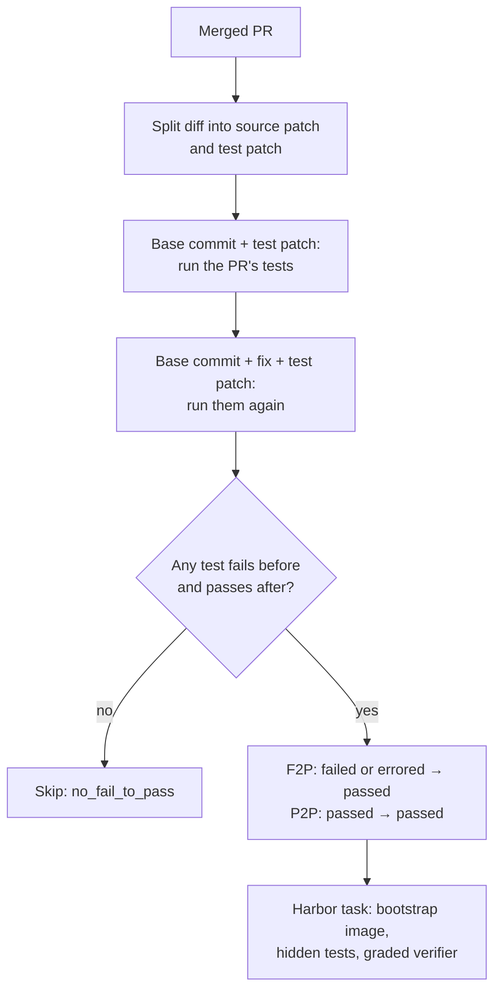

Each task is a merged pull request that fixed a bug and added a test for it. The
agent gets the linked issue and changes the source; the PR's own tests, hidden
until verification, decide the reward. The pipeline runs every candidate's tests
twice in a Docker image built for the repository and keeps a PR only if some tests
fail before the fix and pass after it.

## At a glance

| | |
|---|---|
| Input | A GitHub or GitLab repository with merged PRs that add tests |
| Task | Resolve the issue a merged PR fixed, starting from its base commit |
| Reward | Graded `f2p_rate × p2p_rate`, plus strict `resolved` and `command_resolved` flags |
| Needs an LLM | Yes, for the one-time repository [bootstrap](../concepts/glossary.mdx#bootstrap) (cached) |
| Needs Docker | Yes, for bootstrap, validation and running tasks |
| Hosts | GitHub (needs `gh` on `PATH`) and GitLab |
| Languages | Any repository the bootstrap can build whose tests run under pytest, `go test`, `cargo test`, Jest, Mocha or Vitest. The reference dataset has 63 Python and 37 Go tasks |
| Status | Stable |
| Reference dataset | [`FineEnvs/repo2rlenv-pr-runtime`](https://huggingface.co/datasets/FineEnvs/repo2rlenv-pr-runtime): 100 tasks from 13 repositories |

Two test sets define each task ([F2P and P2P](../concepts/glossary.mdx#f2p-and-p2p)). **FAIL_TO_PASS** (F2P) tests fail or error at the
base commit and pass once the fix is applied: they prove the bug existed.
**PASS_TO_PASS** (P2P) tests pass both before and after: they guard against
regressions.

## Quickstart

```bash
repo2rlenv generate \
  --repo pallets/click \
  --pipeline pr_runtime \
  --pipeline-opt limit=20 \
  --llm anthropic/claude-sonnet-4-6 \
  --out ./tasks/click-pr-runtime
```

The first run bootstraps the repository: an LLM agent builds a Docker image in
which the test suite runs, capped by `--max-spend-usd` (default 5.0). The image is
cached, so later runs go straight to mining. `limit` counts PRs listed, not tasks
emitted; PRs without a test that flips from failing to passing are skipped, so
expect fewer tasks than `limit`. Each task lands in
`./tasks/click-pr-runtime/pallets__click-<pr>/`. Run the oracle, which should
score 1.0:

```bash
harbor run -p ./tasks/click-pr-runtime -a oracle --env docker
```

Each task's Dockerfile starts `FROM` the local bootstrap image, so tasks run on
the machine that generated them until you publish them with `repo2rlenv push`,
which pushes or inlines the image.

## How it works



1. **Bootstrap** the repository once. An LLM agent iterates in Docker until the
   test suite runs, and records the image and test commands. Results are cached.
   See [Bootstrap](../reference/BOOTSTRAP.md).
2. **List merged PRs**, newest first, exactly as [`pr_diff`](pr_diff.md) does.
3. **Filter on metadata.** Skip drafts, unmerged PRs, PRs with no files, and titles
   that mark chores rather than fixes: backports, cherry-picks, reverts, version
   bumps, releases, changelogs and branch merges or syncs. Optionally require a
   minimum description length (`min_problem_statement_words`).
4. **Split the diff** into a source patch and a test patch by file path. Skip the
   PR if either is empty.
5. **Filter on structure.** Skip PRs whose source changes are all under `.github/`
   (`skip_ci_only`), whose test patch adds no test function or class
   (`require_new_test_funcs`), or that touch more than `max_source_files_per_pr`
   source files. `lite_filter` adds SWE-bench Lite-style constraints.
6. **Validate twice** in one container started from the bootstrap image. Reset to
   the base commit, apply the test patch and run the tests that patch touches; then
   reset, apply the fix and the test patch, and run them again. Keep the PR if at
   least `min_fail_to_pass` tests move from failed or errored to passed.
7. **Write the instruction** from the linked issue (`Fixes #123`, including the
   `[#123](url)` form) when there is one, otherwise from the PR title and
   description. Solution pointers and template sections are stripped.
8. **Emit the task** with the fix as the oracle and the test patch hidden inside
   `tests/test.sh`.

## Options

Pass each option with `--pipeline-opt key=value`.

| Key | Default | What it does |
|---|---|---|
| `limit` | `50` | Maximum merged PRs to list. You get at most this many tasks |
| `since` / `until` | none | ISO dates (`2026-01-31`) bounding the merge date |
| `skip_drafts` | `true` | Skip draft PRs |
| `require_fail_to_pass` | `true` | Skip PRs with fewer than `min_fail_to_pass` F2P tests after validation |
| `min_fail_to_pass` | `1` | Minimum number of F2P tests |
| `validation_timeout_sec` | `600` | Timeout for each of the two validation test runs |
| `skip_validation` | `false` | Emit candidates without running tests. Tasks then have no F2P/P2P lists and a pass/fail exit-code reward. For debugging |
| `require_new_test_funcs` | `true` | Require the test patch to add at least one test function or class |
| `skip_ci_only` | `true` | Skip PRs whose source changes are all under `.github/` |
| `max_source_files_per_pr` | `50` | Skip PRs that touch more source files than this |
| `min_problem_statement_words` | `0` | Minimum word count of the PR description. `0` disables the check |
| `lite_filter` | `false` | SWE-bench Lite-style sampling: exactly one source file, a description of at least 40 words, and no images, non-GitHub links or commit hashes in it |
| `state` | `merged` | Only `merged` is accepted |
| `require_linked_issue` | `true` | Accepted but not enforced: PRs without a linked issue use the PR description |
| `languages` | `["python"]` | Accepted but not enforced: the language comes from the bootstrap |

## Output

```files
pallets__click-<pr>
├── task.toml
├── instruction.md
├── environment
│   ├── Dockerfile
│   └── docker-compose.yaml
├── solution
│   ├── patch.diff
│   └── solve.sh
└── tests
    ├── test.sh
    ├── verifier.py
    ├── f2p.json
    └── p2p.json
```

- `task.toml`: Harbor 1.0 task with `[metadata.repo2env.pr_runtime]` (PR URL, merge time, base commit, F2P and P2P lists, `validation_status`, bootstrap image digest), `reward_calibration` (`f2p_count`, `p2p_count`, `source_files`, `loc_changed`, `difficulty`) and an [evaluation label](task_evaluation_labels.md) that starts as `unverified`.
- `instruction.md`: the issue (or PR) title and description with solution pointers removed.
- `environment/Dockerfile`: `FROM` the bootstrap image, reset to the base commit, with git history past it removed.
- `environment/docker-compose.yaml`: an egress guard that points PyPI and GitHub hosts (plus `gitlab.com` for GitLab sources) at `0.0.0.0`, so the agent can't download the fixed release or the merged PR. See [contamination defenses](../concepts/tasks.mdx#contamination-defenses).
- `solution/patch.diff`: the PR's source changes only (the [oracle](../concepts/glossary.mdx#oracle)); `solve.sh` applies it.
- `tests/test.sh`: resets the PR's test files to the base commit, applies the hidden test patch, runs the targeted test commands and calls the verifier.
- `tests/verifier.py`: the standalone graded verifier (Python standard library only).
- `tests/f2p.json`, `tests/p2p.json`: the F2P and P2P test names.

## Reward

The verifier parses the test log into a status per test and scores:

```text
f2p_rate = F2P tests now passing / F2P tests
p2p_rate = P2P tests still passing / P2P tests   (1.0 when there are none)
reward   = f2p_rate × p2p_rate                    → /logs/verifier/reward.txt
```

The graded reward is the training signal: fixing four of five failing tests
earns 0.8 instead of 0. Two booleans in `/logs/verifier/reward-details.json` are
the evaluation signals:

- **`resolved`**: every F2P and P2P test passes. This is SWE-bench resolution;
  the oracle satisfies it on every task.
- **`command_resolved`**: `resolved`, no failing test outside the F2P and P2P
  sets, and a test command that exits 0. Tasks whose test command also runs
  unrelated failing or flaky tests stay usable for training but miss this flag.

The details file also records per-set totals and rates, `regressions`,
`untracked_failed_count`, the first 20 `untracked_failed` names, `runner`,
`tests_parsed`, `exit_code` and `parse_status`. The published manifest adds
`eval_grade` (`command_resolved` and a non-empty P2P set); filter on it for a
benchmark-grade subset.

The agent can't pass by editing tests: `test.sh` restores the PR's test files and
re-applies the hidden test patch before running them. If the patch doesn't apply,
the task fails closed with reward 0 and `parse_status` set to
`test_patch_apply_failed`. If the log can't be parsed, the verifier falls back to
1.0 for a zero exit code and 0.0 otherwise, marks `parse_status` as
`fallback_exitcode`, and never reports `resolved` for a task with an F2P list.

`task.toml` also lists `diff_similarity` as a secondary reward kind. Trainers that
can't run code can score a patch against `solution/patch.diff` with
`repo2rlenv.reward.calculate_diff_similarity_reward`. See
[Rewards](../concepts/rewards.mdx#graded-test-execution).

## Yield and cost

No generation denominator or cost ledger was recovered for the reference dataset,
so yield is unmeasured. What drives it:

- **Test signal.** A PR must add a test function whose test fails before the fix
  and passes after it. Many merged PRs ship no test, or only change existing ones.
- **Repository health.** The suite must run inside the bootstrap container. Suites
  that need network access, GPUs or external services yield little whatever the
  options.
- **Filters.** `lite_filter`, `min_problem_statement_words` and
  `max_source_files_per_pr` trade count for focus.

Cost is one bootstrap per repository (LLM calls, capped and cached) and then two
test runs per candidate; mining itself makes no model calls. The run summary counts
each skip reason.

For the reference dataset, the gold patch scores 1.0 with every tracked test
passing on all 100 tasks; 88 are also `command_resolved` and 87 are `eval_grade`.
The release report describes roughly 55–60% solved in a Claude Sonnet pilot of
about 20 tasks, but the raw sample wasn't recovered. See
[native results](native_results.md#pr-runtime).

## Limits

- **A generated task isn't a verified environment.** Run the controls: the oracle
  should score 1.0 and a no-op agent (`-a nop`) 0. Record the outcome as an
  evaluation label; see [Quality](../concepts/quality.mdx).
- **Python means pytest.** Logs from `unittest` and Django's test runner produce no
  oracle ([#167](https://github.com/huggingface/Repo2RLEnv/issues/167)), and
  neither does `cargo nextest` ([#172](https://github.com/huggingface/Repo2RLEnv/issues/172)).
- **The egress guard is a denylist.** It blocks PyPI and the code host; general
  internet stays up so hosted agents can run. The Go module proxy and crates.io
  still serve fixed releases ([#160](https://github.com/huggingface/Repo2RLEnv/issues/160)).
  For trustworthy evaluation numbers, run without network access.
- **Instructions without an issue come from the fixer.** When a PR links no issue,
  the PR description is used, and it can describe the fix in prose.
- **One validation run per stage.** Flaky tests can land in the F2P or P2P sets,
  and `pr_runtime` doesn't cap the P2P set.
- **Tasks depend on a local image** until you publish them with `repo2rlenv push`.
- **GitLab listing sees at most the newest 100 merged MRs.**

## Related

- [RFC 0002: pr_runtime](../rfcs/0002-pr-runtime.md)
- [Reference dataset](https://huggingface.co/datasets/FineEnvs/repo2rlenv-pr-runtime) and its [validation evidence](native_results.md#pr-runtime)
- [`commit_runtime`](commit_runtime.md): the same verifier on commits instead of PRs
- [`pr_diff`](pr_diff.md): the same PRs, scored by diff similarity without running tests
- [Bootstrap](../reference/BOOTSTRAP.md), [Tasks](../concepts/tasks.mdx), [Rewards](../concepts/rewards.mdx) and [Run with Harbor](../guides/run-with-harbor.mdx)
- Adapted from the [SWE-bench](https://github.com/SWE-bench/SWE-bench) and [SWE-bench-Live](https://github.com/microsoft/SWE-bench-Live) collection and grading approach. No code is copied, and the `swebench` package isn't a dependency.

## Implementation notes

Source: [`pipelines/pr_runtime.py`](https://github.com/huggingface/Repo2RLEnv/blob/main/src/repo2rlenv/pipelines/pr_runtime.py),
[`pipelines/pr_runtime_validate.py`](https://github.com/huggingface/Repo2RLEnv/blob/main/src/repo2rlenv/pipelines/pr_runtime_validate.py),
[`pipelines/_pr_runtime_verifier.py`](https://github.com/huggingface/Repo2RLEnv/blob/main/src/repo2rlenv/pipelines/_pr_runtime_verifier.py)
and [`log_parsers/`](https://github.com/huggingface/Repo2RLEnv/tree/main/src/repo2rlenv/log_parsers).

### Test file classification

A file is a test file if any directory in its path is `test`, `tests`, `testing`,
`e2e` or `__tests__`, or if its name matches `test_*.py`/`.js`/`.ts`, `*_test.py`,
`*_test.go`, `*.test.ts`/`.js` or `*.spec.ts`/`.js`. Files under `docs/`, `doc/`,
`documentation/`, `examples/` or `example/` never count, so `src/click/testing.py`
and `docs/testing.md` stay in the source patch. A rename counts as a test if either
path does.

### Test commands

The bootstrap records fast, tolerant commands; before each run the pipeline
adapts them so they emit per-test lines, then targets them at the PR's test files:

| Runner | Adjustment | Targeting |
|---|---|---|
| pytest | Drop `--collect-only`, `--co`, `-q`; add `-v` | Append the changed `.py` test files |
| `go test` | Add `-v` | Replace `./...` with the changed test packages |
| `cargo test` | Drop `-q` | Whole suite (Rust filters by name, not file) |
| Jest, Mocha | Drop `--silent`; add `--verbose` | Append the changed JS/TS test files |
| Vitest | Use `--reporter=verbose` | Append the changed JS/TS test files |

Trailing `| head`/`| tail`, `2>&1` and `> /dev/null` are stripped first. The runner
is detected from the command; the bootstrap's language is the fallback. `test.sh`
prepends the usual Go, Rust, Node and Java toolchain directories to `PATH`, because
bootstrap agents don't always persist them.

### Validation and emission details

- Validation reuses one container for all candidates and fetches each base commit
  on demand, since the bootstrap image holds a shallow clone.
- `git clean` keeps dependency and build directories (`node_modules`, `target`,
  `vendor`, `.venv`, `.tox`, `.gradle`, …), so a reset doesn't break the suite.
- Test output is fenced by `R2E_START_TEST_OUTPUT` and `R2E_END_TEST_OUTPUT`
  markers on stdout, with stderr folded in, because unittest and Jest report there.
- F2P includes tests that error at the base commit, such as a new test importing a
  symbol the fix introduces.
- For Go, a failing subtest whose parent test also failed isn't counted again as an
  untracked failure.
- The task Dockerfile installs `git`, CA certificates and `python3` when the
  bootstrap image lacks them, since the verifier is Python.
- The instruction builder drops HTML comments and everything from the first
  checklist, changelog, test-plan or "tests added" heading, which would otherwise
  name the grading tests. The body is capped at 4,000 characters.
