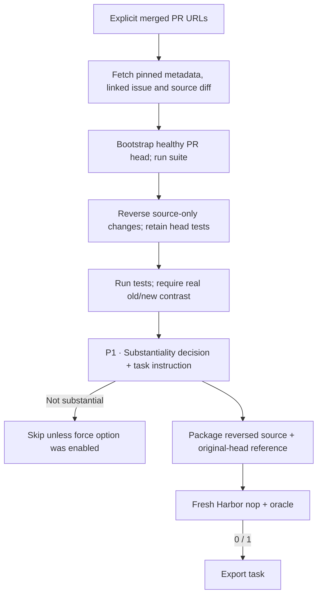

The SWE-gen recipe turns public GitHub PR URLs that you list into standalone
Harbor tasks. It keeps two things from upstream: the prompt that decides whether
a change is substantial and writes the instruction, and the workflow of
reverse-patching a healthy PR head. The Python environment profile is explicit.

## Pipeline, step by step

`P1`, `P2`, … mark real model calls. Unlabelled stages are code or remote execution.

**Recover the change.** You supply the PR URLs. The recipe fetches their metadata and a bounded source diff. It doesn't mine arbitrary history.

**Create the problem state.** The recipe bootstraps the PR head, then reverses only the implementation edits and leaves the rest of the healthy head snapshot alone. The head's tests stay private and act as the behavioral specification.

**Describe and package.** The author sees the title, body, linked issue and test evidence, plus a count of source files. It isn't sent the solution patch. The oracle restores the known head files.

## Every prompt and its data

After the execution contrast succeeds, one call decides whether the change is substantial and writes the instruction.

| Call | System prompt composition | User / input material | Output | Retry or branch |
|---|---|---|---|---|
| P1 · Instruction | instruction_prompt.md + /workspace and JSON adaptations | title, body, linked_issue, test_evidence, source_file_count. | TaskInstruction: is_substantial, reason, instruction, three tags | force_generate_instruction changes only the substantiality instruction; it never bypasses execution checks. |

The [complete swe_gen prompt reference](https://huggingface.github.io/Repo2RLEnv/pipelines/prompts/swe_gen/) has every retained template, appended instruction, substitution, example and output schema. The [shared prompt guide](prompt_reference.md) shows how to inspect the fully resolved request from a real run.

## Follow one task

Say a PR adds an option to a parser. Reversing the implementation but keeping the new tests gives a concrete unsolved state. The task asks for the option's behavior, and the merged implementation is the reference.

## What repeats, what is checked

Unsupported sources, a failed reversal, unhealthy head tests and a contrast that shows no real difference are all recorded as skips. There's no loop that repairs the instruction. A fresh Harbor failure rejects the candidate instead of triggering an open-ended rewrite.

An exported bundle is a generation result. Independent leakage review, shortcut probes and blind solver traces come later, in the quality campaign.

## Implementation map

- [`swe_gen/source.py`](https://github.com/huggingface/Repo2RLEnv/blob/main/src/repo2rlenv/pipelines/recipes/swe_gen/source.py)
- [`swe_gen/worker.py`](https://github.com/huggingface/Repo2RLEnv/blob/main/src/repo2rlenv/pipelines/recipes/swe_gen/worker.py)
- [`swe_gen/instruction.py`](https://github.com/huggingface/Repo2RLEnv/blob/main/src/repo2rlenv/pipelines/recipes/swe_gen/instruction.py)
- [`repository/export.py`](https://github.com/huggingface/Repo2RLEnv/blob/main/src/repo2rlenv/pipelines/recipes/repository/export.py)
- [`swe_smith/grade.py`](https://github.com/huggingface/Repo2RLEnv/blob/main/src/repo2rlenv/pipelines/recipes/swe_smith/grade.py)

## Run and supported profile

Run `repo2rlenv generate --config examples/owned-swe-gen.yaml` once you have a
campaign ledger, a Modal or Daytona worker receipt, and a wheel built from this
checkout. These are the same [recipe commands](owned_recipes.md) that SWE-smith
and SETA use. The default UI shows the source, bootstrap, instruction, Harbor and
export stages; `--no-ui` and `--json` give durable, machine-readable progress.

Inputs are merged public GitHub PRs and an explicit Python source and test
profile. All target code and image builds run remotely. Dependencies are
installed at build time, and the task runs offline. Source paths must point to
existing Python files or directories. Added or deleted source files, and other
languages, need a different artifact collection profile; for now they're
recorded as skips.

The reference restores the PR head's changed source files. The learner starts at
the head with those changes reversed, without Git history or the private tests.
Its allowed Python source files are then submitted to a fresh verifier
environment.

`force_generate_instruction` is the upstream option for skipping its complexity
filter. It doesn't skip the healthy-head, contrast or Harbor execution checks.
The 20-task campaign may use it to measure generation from small functional
changes. An exported task is a generated artifact, **not quality acceptance**.
Independent reviews, attack checks and model rollouts wait until every recipe
campaign reaches 20 generated tasks, and this integration hasn't been through
that review yet.

Credit: [SWE-gen](https://github.com/abundant-ai/SWE-gen) (Apache-2.0), commit
`14e185f413f7bff03f8f9fec6fb246681bf61d74`. See [RFC 0015](../rfcs/0015-swe-gen-recipe.md)
and the packaged `recipes/swe_gen/provenance.md` for the source map and deviations.

## Cost evidence

See the [measured yield and cost](economics.md) and
[swe-gen accounting](experiment_accounting.md#swe-gen) for the pilot/expansion
scope, model identities, stage costs, compute resources and validation limits.
