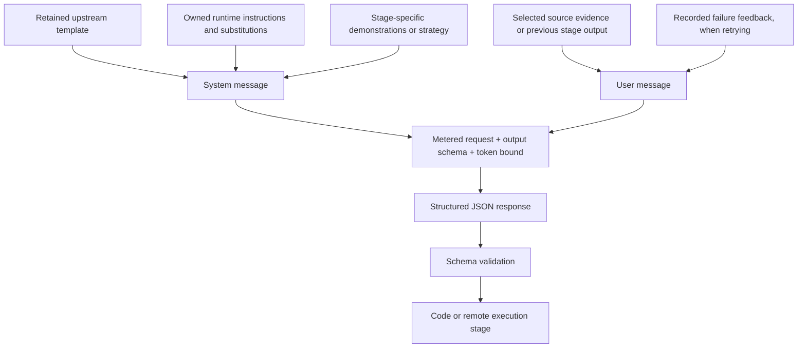
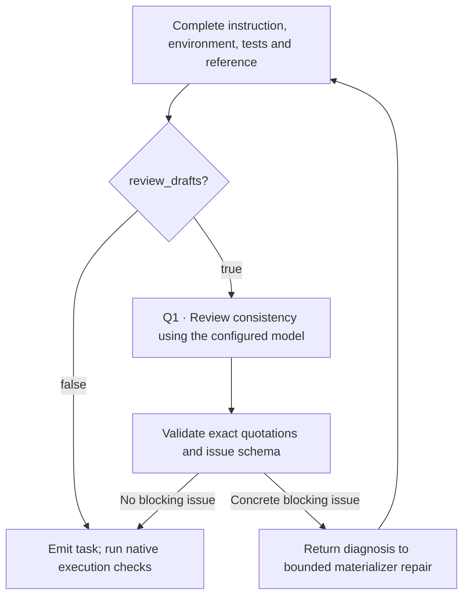

Each recipe guide numbers its real model calls `P1`, `P2` and so on. A role such
as “test author” is a stage in the controller. It isn't necessarily a different
model, or an autonomous coding agent. The current recipes send structured
requests through the configured `llm` and run the generated scripts on the remote
worker. They don't install an upstream research harness to do this.

## What is sent to the model



The template is only part of the request. The retained TMax environment prompt,
for example, describes a native file format, but the owned additions ask for
`TerminalDraft` JSON and Docker setup. If you read only the retained template,
you'd get the wrong picture of what actually runs.

The complete references below contain:

- The exact retained template text, including alternate templates and strategies.
- Demonstrations used by the call site, with any slice or selection documented.
- The Python that appends runtime instructions, substitutes variables and constructs
  the user message. This also shows inline prompts such as CLI-Gym's script author.
- Response models and the checks that decide whether a stage can continue.

| Recipe | Prompt sequence on the first successful attempt | Full reference |
|---|---|---|
| SWE-smith | Issue from failed-test evidence | [Templates and assembly](https://huggingface.github.io/Repo2RLEnv/pipelines/prompts/swe_smith/) |
| SETA Seed2Synth | Capability/design → complete task builder | [Templates and assembly](https://huggingface.github.io/Repo2RLEnv/pipelines/prompts/seta_seed2synth/) |
| SETA Evol | Strategy-specific child design → child builder | [Templates and assembly](https://huggingface.github.io/Repo2RLEnv/pipelines/prompts/seta_evol/) |
| SWE-gen | Substantiality and instruction in one call | [Templates and assembly](https://huggingface.github.io/Repo2RLEnv/pipelines/prompts/swe_gen/) |
| SWE-Flow | Function docstrings → test-based specification | [Templates and assembly](https://huggingface.github.io/Repo2RLEnv/pipelines/prompts/swe_flow/) |
| FrontierSmith | Formulation mutation → review → baseline and sampled programs → idea divergence → test generator → scorer → independent feasibility → infrastructure review → execution/repair | [Prompts and assembly](prompts/frontiersmith.md) |
| CodeMidas | Source exploration → behavioral contract → observed tests → assertion review → rollout review and screening | [Prompts and assembly](prompts/codemidas.md) |
| R2E | Differential tests → execution/coverage → refined specification | [Templates and assembly](https://huggingface.github.io/Repo2RLEnv/pipelines/prompts/r2e/) |
| TMax | Template → initial tests → final tests → environment/reference | [Templates and assembly](https://huggingface.github.io/Repo2RLEnv/pipelines/prompts/tmax/) |
| Endless Terminals | Template → initial tests → final tests → environment/reference | [Templates and assembly](https://huggingface.github.io/Repo2RLEnv/pipelines/prompts/endless_terminals/) |
| TerminalWorld | Score → extract → refine → instruction → environment → replay → tests | [Templates and assembly](https://huggingface.github.io/Repo2RLEnv/pipelines/prompts/terminalworld/) |
| CLI-Gym | Inversion goal → destruction/recovery scripts → symptoms instruction | [Templates and assembly](https://huggingface.github.io/Repo2RLEnv/pipelines/prompts/cli_gym/) |
| DataArc | Complete artifact variant from a selected seed and strategy | [Templates and assembly](https://huggingface.github.io/Repo2RLEnv/pipelines/prompts/dataarc/) |
| SWE-Next | Issue after historical old/new contrast | [Templates and assembly](https://huggingface.github.io/Repo2RLEnv/pipelines/prompts/swe_next/) |
| R2E-Gym | Issue after historical old/new contrast | [Templates and assembly](https://huggingface.github.io/Repo2RLEnv/pipelines/prompts/r2e_gym/) |
| SCALER | No model call; construct a concrete reasoning instruction | [Instruction construction](https://huggingface.github.io/Repo2RLEnv/pipelines/prompts/scaler/) |

[Shared terminal instructions and schemas](https://huggingface.github.io/Repo2RLEnv/pipelines/prompts/shared_terminal/) are included
where a recipe uses the common builder. TerminalWorld shares the output schema
but has its own materializer for the environment, replay and tests. DataArc has
no design-model call; its `design()` function wraps the input data before
artifact generation.

## Optional review before execution

The six terminal recipes also support `review_drafts: true` under
`pipeline.options`, which defaults to `false`. It adds a **Q1 consistency-review
call** after a complete draft, before the task is emitted and before the initial
and final checks. Later expansion batches turned it on for SETA Seed2Synth, SETA
Evol, TMax, TerminalWorld and DataArc. Each batch keeps its configuration and
review receipts. The option existing doesn't mean every earlier export was
reviewed.



Q1 gets the instruction, tests, reference, setup and bounded fixture contents.
It checks for contradictions, unusable deliverables, missing behavioral
verification, essential assets and exposed solutions. Its response has a short
summary and cited issues, and each quote must match a supplied document.
Correcting the schema or citations allows at most two model attempts, each capped
at 2,500 output tokens; materializer repair is still subject to `max_repairs`. A
later materialized draft gets its own Q1 call. Minor polish and unmeasured
difficulty aren't blockers.

The [shared prompt reference](https://huggingface.github.io/Repo2RLEnv/pipelines/prompts/shared_terminal/) includes the exact Q1
prompt, request assembly and correction code. The request is saved under
`review-<attempt>/model.request.json`, possibly with a
`model-repair-1.request.json` correction. This review uses the same configured
model as generation and consumes model tokens. It doesn't establish independent
quality acceptance, and the task's reward still comes from its executable
verifier.

## Inspect the exact request from your run

Templates show the program; a saved request shows the actual input to one call.
Before dispatch, `metered_complete` writes a companion `.request.json` with
`system`, `user`, `max_tokens` and `response_schema`. The matching model receipt
records the model, request hash, status and, when available, the response and
usage.

For a common terminal builder, the layout is:

```text
<campaign>/runs/<run-id>/
  run.json
  candidates/<candidate-id>/
    seed.json
    design-model.request.json
    design-model.json
    design.json
    builder-0.request.json
    builder-0.json
    attempt-0/<task-name>/
    trial-0-nop/
    trial-0-oracle/
    builder-1.request.json       # only if a repair was attempted
```

Repository recipes use `tasks/<candidate-id>/` for most per-task authoring, and
SWE-smith uses `models/<candidate-id>.request.json`. The method reference shows
the exact receipt names, such as R2E's `test-model-0.request.json` or
TerminalWorld's `tests-0.request.json`. These are patterns; not every stage runs
for every candidate.

```bash
# Substitute the campaign, run and candidate identifiers from your run.
jq '{system, user, max_tokens, response_schema}' \
  workspace/my-campaign/runs/my-run/candidates/my-candidate/builder-0.request.json
```

Keep these receipts out of the learner bundle, because authoring context can
contain hidden tests, reference code and solution details. `instruction.md` is the
learner's request. A model's private `analysis`, `truth`, `reason` or
`self_review` isn't automatically shown to the learner, and it isn't proof that
execution succeeded.

## Which operations consume tokens

Only the model-call stages in the walkthrough use generation-model tokens. The
current repository profiles call the existing bootstrap with an explicit
Dockerfile and `provider="none"`, so they don't use the bootstrap LLM agent.
Repository cloning, image builds, mutation enumeration, tracing, test execution
and Harbor nop and oracle trials use remote compute, not model tokens. SCALER's
expansion of released families uses only those programmatic operations.

Repair calls are new requests with their own usage. Successful cached responses
are reused only when the operation, model, input hash and ledger all match. A
dispatched request with an uncertain outcome keeps its reservation and isn't
blindly retried. The recipe's bounded repair loop handles known task failures.
It isn't a general retry mechanism for provider outages.

## Keep the reference in sync

The detailed prompt pages are generated from canonical source every time the
docs site builds, and Git ignores them. Each excerpt records its source path and
SHA-256. After you change prompt text, inline additions, examples or schemas,
run:

```bash
uv run python docs/_tools/generate_prompt_reference.py
uv run python docs/_tools/generate_prompt_reference.py --check
```

CI generates the pages, checks that they agree with the source, and builds the
site from a clean checkout. When control flow or the meaning of a stage changes,
edit the walkthroughs too, because generated source excerpts can't replace that
explanation. Upstream credits, source revisions, licenses and deviations stay in
each recipe's guide, RFC and packaged provenance file.
