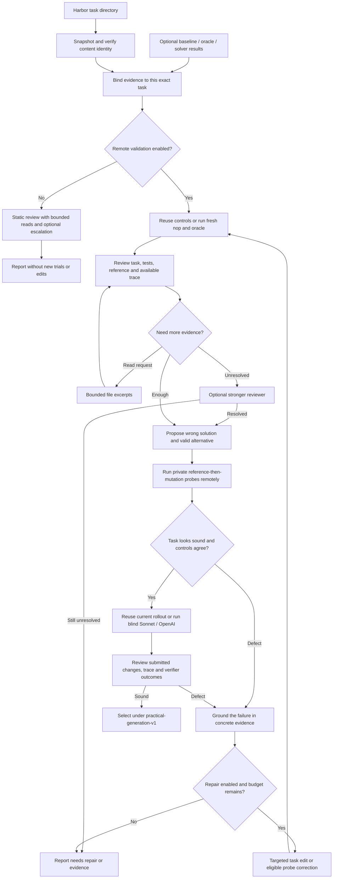

`repo2rlenv quality run` reviews an existing Harbor task. It can reuse a solver
[rollout](../concepts/glossary.mdx#blind-rollout) you already have, run whatever
validation is missing, and repair the task on a remote worker. Generation recipes
share it; it isn't another generator. It never overwrites the original task: each
repair is written to a separate Harbor directory.

Passing the generation [controls](../concepts/glossary.mdx#controls) (the
untouched task scores 0, the reference solution scores 1) doesn't show that a
task is semantically sound. So the loop checks the task, the verifier and
leakage against concrete evidence.
It does **not** replace the older, stricter `QualityReport.accepted` contract.

## Execution and decisions



The execution steps in the diagram only run with `--run-rollout` or `--repair`.
A review-only run still calls models, but it doesn't create a
[worker](../concepts/glossary.mdx#worker).

On CPU, the loop keeps one worker, with its runtime and Docker build cache, from
start to finish. Modal and Daytona implement the same CPU `RemoteWorker`
contract. GPU tasks pick native Modal automatically from their Harbor resource
declarations. Both the learner and the separate verifier must request one or two
L4 GPUs with networking disabled. Native GPU trials don't need a runtime wheel or
a Docker worker. Unsupported GPU and provider combinations fail before anything
is dispatched.

Target Docker builds, tests, probe scripts and solver commands all run remotely.
The [controller](../concepts/glossary.mdx#controller), the process on your
machine, only reads, hashes and edits artifacts.

## Use it

Install the provider and Harbor extras, then build the owned runtime wheel from
this checkout:

```bash
uv sync --extra modal --extra harbor
uv build --wheel
```

Point the loop at an existing [campaign](../concepts/glossary.mdx#campaign)
ledger. For a new campaign, allocate its budget explicitly:

```bash
repo2rlenv campaign init ./workspace/my-campaign --budget-usd 25
```

Review a task together with a solver trial you collected earlier:

```bash
repo2rlenv quality run ./tasks/example \
  --campaign ./workspace/my-campaign \
  --out ./workspace/reviews/example \
  --rollout ./jobs/example/trial/result.json \
  --review-model openai/gpt-6-astra
```

`--baseline` and `--oracle` take existing evidence as well. Each of these
arguments accepts one owned trial receipt or directory, one Harbor trial
`result.json`, or a job directory holding a single trial. A job with several
tasks is ambiguous, so it's rejected. Native Harbor results must match the input
task's Harbor checksum. Owned receipts must match its
[bundle hash](../concepts/glossary.mdx#bundle-hash) and the collected result
hash. These are content checks. They don't cryptographically prove that whoever
ran the trial ran an honest experiment.

Run the controls, review, probes, solver and up to three targeted repairs:

```bash
repo2rlenv quality run ./tasks/example \
  --campaign ./workspace/my-campaign \
  --out ./workspace/reviews/example-repaired \
  --repair --provider modal \
  --runtime-wheel ./dist/repo2rlenv-0.9.3-py3-none-any.whl \
  --review-model anthropic/claude-sonnet-4-6 \
  --repair-model anthropic/claude-opus-4-6 \
  --solver-model anthropic/claude-sonnet-4-6 \
  --max-repairs 3 --max-spend-usd 15
```

CPU tasks can run on Daytona instead: install `--extra daytona` and pass
`--provider daytona`. You can also pass `--worker-receipt` to use a worker that's
already running in the same campaign. The loop shuts down the workers it creates
and leaves the ones you supply alone. When a worker finishes, its compute
reservation stays held until you reconcile it with `repo2rlenv campaign settle`.
Model costs come from recorded provider usage and LiteLLM estimates. The budget
is an accounting limit, not a bill cap your provider enforces.

To evaluate without editing, use `--run-rollout` without `--repair`. With either
flag, pass an existing rollout so it isn't repeated on the original revision.
Once the task changes, it always needs fresh controls, fresh probes and a fresh
rollout.

Sometimes the first review blocks the rollout and the review after the probes
clears that concern. The loop then runs the solver on the same revision and
reviews its trace, so you don't need an unrelated task edit or a new campaign to
finish validation. Successful rollouts that already exist are reused. If the
budget denies a request, the loop stops before paying for another review.

### Resume and inspect

`--resume` reuses completed model requests and trial evidence when they're
identical. It refuses to continue if the inputs, execution settings, prompts or
evidence have changed. Provider effects that were interrupted, or whose outcome
is uncertain, need reconciliation. They're never retried automatically.

One case gets special handling: a native single-step solver that finished
normally, but whose private verifier was denied an allocation. The controller
seals the collected submission and trace. On `--resume` it may run **one
verifier-only continuation** that keeps the original model usage, timing and raw
result. Before dispatch it checks the task, file contents and modes, artifact
manifest, result hash and allocation receipts. It doesn't call the solver again.
A completed continuation is reused. A failed or uncertain continuation is kept,
not dispatched over and over. Earlier unsealed receipts stay in place for you to
reconcile explicitly.

Resuming still needs identical run inputs, the same runtime identity and options,
and allowance left in the campaign. It can't raise the budget, and it can't
resume an old runtime whose code has changed.

`repo2rlenv quality show OUTPUT_DIR` reads the report without making model or
cloud calls. Both commands support `--json`; a normal run prints stage progress
and criterion scores. Credentials come from the usual environment or `.env`. If
you run from another worktree, `--env-file PATH` can load the original checkout's
credentials. Keys are never copied into task bundles or model request receipts.

## Models and efficiency

Review, repair, escalation and solver models are separate `provider/model`
settings. Review and solving default to Sonnet 4.6, the model the loop was
previously tested with. Repair uses the review model unless you override it.
`--escalation-model` makes at most one attempt with a stronger model when
structured output or evidence retrieval is still unresolved. That's an explicit
escalation, not a silent retry of a failed provider request.

### Malformed repairs

If a repair patch is invalid, either as JSON or as a text edit, the model gets at
most one correction call, metered separately. It sees the validation error and
real source excerpts, along with its rejected draft as parsed and the probe
replacements it's allowed to make. No execution revision is used up until a
complete patch applies. A task or verifier defect has to be fixed by editing the
task; it can't justify replacing a retained probe. If fetching more source for
the repair would exceed the context limit, the controller reports that failure in
the correction feedback instead of dropping the correction call. Provider calls
with an unknown outcome are never retried this way.

When a mock's return value or arguments don't match the production code, both
prompts ask for the complete production unpacking or signature and the fixture
construction. The model must expand starred prefixes and map positions to fields
before it edits, and keep the real production call and assertions. Fresh controls
still decide whether the repair worked. This guidance adds no model calls or
repair rounds.

To register new cases in an existing `tests/contract.json`, a repair can use
`append_expected_passes` with only the new exact IDs. The old IDs, their order
and every other contract field stay as they were. The operation rejects duplicate
or empty IDs, invalid contracts, and a text edit to the same contract in the same
repair. An append still changes the verifier: protected-path rules apply, the
task gets a new unverified hash, and the usual controls, probes and rollout must
validate that revision. Mechanical correction suggests this operation, within the
existing two-call limit.

### Reviews must agree with rewards

Before it accepts a completed review, the controller checks that a verdict of
legitimate success or failure agrees with the latest solver reward and the
configured success threshold. A missing reward or an infrastructure exception
can't establish either outcome. An agent timeout that still recorded a reward
keeps its usual meaning. When verdict and reward disagree, the reviewer gets the
exact evidence path and reward, through the existing bounded review correction or
the configured escalation. The check doesn't decide whether a failure reveals a
task defect or whether a success exploits the verifier. The reviewer still has to
make those calls.

### Broken probes

A wrong-solution probe whose mutation never finished can be corrected within the
same repair limit. The controller checks for itself the exact variant, the
completed execution receipt, the result checksum, a nonzero agent exit and a
missing completion marker. Probe scripts run in a child shell, so a successful
`exit` can't skip the trusted change audit and completion marker. A nonzero exit
still fails the probe installation. The reviewer must diagnose that specific
attempt as a probe defect from its logs or trial summary. Missing or mismatched
evidence doesn't authorize a replacement.

An append-only `probe-attempts/` journal keeps every attempt and log hash across
task revisions and resumes. Once any installation under a given probe name
completes, that counterexample is frozen, even if it exposes a verifier gap or a
later attempt fails. An eligible correction keeps the name, kind and focus, keeps
the old receipts, and records its authorization in
`probe-replacement-evidence.json` next to the new repair. A broken probe on its
own can't justify editing the task or verifier. The corrected probe runs again,
and unchanged controls go through the existing strict evidence importer. The
default three repair rounds and the two patch-proposal calls stay the same.
Imported wrong-solution probe definitions are frozen too, because a probe
manifest alone doesn't show that no earlier installation completed in its
original run.

### What the reviewer sees

The first evidence pack puts selected private assertions ahead of large reference
patches and generic grading helpers. Reviews have to assess those assertions,
not infer coverage from test names or pass counts. Every omitted file stays
reachable by its exact inventory path. The compact context also lists the exact
selected verifier paths, even when the full inventory is truncated. If the
reviewer asks for a file that doesn't exist, it's shown matching basenames and
those selected paths, and it must request the actual file before citing it.

When a native Modal image build fails, the controller first settles the confirmed
failed build, then fetches its existing logs. A bounded, redacted excerpt of the
real build failure reaches the reviewer through the original exception, and the
private log receipts are kept for diagnosis. A log fetch that fails or times out
can't reopen the allocation or hide that it was settled.

Literal searches merge overlapping excerpts and keep whole matching windows as
long as they fit in the remaining context budget. Any omitted windows are named.
Evidence already supplied doesn't change. An explicit line range that's too large
is rejected as a whole, with a hint to narrow it.

### Model IDs

Current examples include `openai/gpt-6-astra`, `openai/gpt-5.6-terra`,
`openai/gpt-5.6-luna`, `anthropic/claude-sonnet-5` and `anthropic/claude-opus-5`.
IDs are passed straight through; there's no frozen allowlist. You still need
account access and a compatible SDK. See the official
[OpenAI model catalog](https://developers.openai.com/api/docs/models) and
[Anthropic model catalog](https://platform.claude.com/docs/en/models/overview).

The shared OpenAI client sends `max_completion_tokens` for current GPT reasoning
models and leaves out temperature parameters they don't support. Automatic SDK
retries are off. Every model request has a durable request hash, a response
receipt and a campaign reservation. When usage is unknown, the hold stays in
place instead of being counted as zero cost.

### Defaults and context budget

By default the loop allows three repairs, two extra file-reading rounds, two
semantic probes, 100,000 characters of document context, 6,000 output tokens per
review or repair call, and 24 solver turns at 4,096 tokens per call.

The context holds a file inventory, selected task files, trace excerpts and an
explicit list of what was left out. In each reading round a reviewer can request
up to six 400-line excerpts or bounded literal searches. Python tasks start with
the matching function and test excerpts plus their module headers. When a whole
selected test file is 24 KB or smaller, the first pack includes its complete body
and fixture helpers if the context allowance permits, and any truncation is
stated. Individually selected nodes and larger modules keep targeted excerpts.

When trials are present, the initial task files use at most 35% of the document
allowance and execution evidence can fill the next 35%. Actual assertion failures
come before verbose baseline inventories and captured source. Probe scripts stay
individually readable instead of bloating every result summary. The last 30% is
kept for follow-up reads. Binary and large files are recorded as uninspected
text, so the review makes no claim to have read every byte of every repository.

Private PR context is registered in the readable evidence inventory too. Its
first excerpt is capped at 32,000 characters or a quarter of the document
allowance, whichever is smaller. Large diffs stay reachable through bounded range
and search requests, so you don't have to hand-truncate a campaign prompt. Saved
campaign repair guidance comes first in that excerpt, so a long source diff can't
push the current diagnosis out of the first review input. The full context stays
searchable, and the document allowance doesn't grow.

## What the prompts ask

The full prompts ship with the package. The
[prompt and request-assembly reference](https://huggingface.github.io/Repo2RLEnv/pipelines/prompts/quality_loop/)
reproduces them in full.

| Stage | Input | Output | Prompt |
|---|---|---|---|
| Initial review | Public instruction, build inputs, private reference/tests, available controls/rollout | Task/verifier/leakage assessments, grounded issues, bounded read requests, semantic probes | [review.md](https://huggingface.github.io/Repo2RLEnv/pipelines/prompts/quality_loop/#reviewmd) |
| Evidence read / escalation | Same evidence pack plus requested excerpts or protocol correction | Completed grounded review | Same review prompt |
| Post-execution review | Task plus actual control/probe/solver results, logs and captured artifacts | Legitimate success/failure, task defect, grading shortcut, infrastructure issue or insufficient evidence | Same review prompt |
| Repair | Grounded issues, execution failures, exact files and retained probes | Exact text replacements, appended expected case IDs, eligible probe corrections, and rationale | [repair.md](https://huggingface.github.io/Repo2RLEnv/pipelines/prompts/quality_loop/#repairmd) |

Every citation must quote text the model was actually given. Scores run from 0 to
4 and are only descriptive; code works out the final disposition from the
evidence. A model declaring success can't override a failed negative control or
probe.

There's one small allowance for citations. In a unique Markdown prose excerpt,
the controller can restore single-backtick formatting without another model call.
Words, case, punctuation and numbers must match exactly, and code blocks, escaped
delimiters and ambiguous matches are still rejected. The corrected citation must
pass normal grounding, and both forms are recorded.

### Semantic probes

A [probe](../concepts/glossary.mdx#probe) is a private variant of the task. The
reference runs first, then the probe installs either a plausibly wrong submission
or a valid alternative. Instruction, environment and verifier files stay
byte-identical. A completion marker and the oracle exit code tell a failed probe
installation apart from a verifier rejection.

Wrong-solution probes are kept across repairs. A valid alternative can be
corrected only after a grounded diagnosis finds a bug in that probe, and its
name, kind and requirement focus must stay the same. The original probe receipts
stay available. A repair that only touches probes reuses the unchanged task's
controls and rollout, then replays both probes. Whether the probes themselves are
correct still needs grounded model review. They aren't a complete
adversarial suite or a privilege test.

When a task explicitly requires lazy output or a numeric tolerance, the loop
picks focused probes for it, and a different wrong implementation can't stand in
for them. This came out of calibration: two generic probes missed that the R2E
`collapse` verifier never checked laziness. Probe focus is still a narrow
heuristic. It doesn't extract every requirement from natural language.

Tasks can also declare an explicit, validated requirement:

```toml
[metadata.repo2env.quality_requirements]
probe_focus = ["compiled_execution"]
```

This field is part of the executable task identity, outside the advisory
`evaluation` label. `compiled_execution` requires a wrong-solution probe that
keeps wrapper types, shapes and setup while corrupting an executed output or
gradient. The verifier must call the real compiled path and reject the mutation;
structural checks alone aren't enough. Option forwarding and integration checks
stay limited to the original PR's behavior. No fixed speedup or extra hardware is
required. Historical tasks without the field keep their existing requirements.
Tasksmith's `required_probe_focus` option annotates a new copy of the input before
the controls run, and it never carries old evidence over to the changed hash.

For neural-model tasks, `model_behavior` targets a wrong implementation that
keeps valid interfaces and tensor shapes but changes a central computation the
task promises, such as register placement, pooling values, adapter output or
sampling behavior. The verifier must catch that change with independent
numerical or behavioral assertions. A dimension error or a missing import doesn't
count as this coverage. The requirement is opt-in and changes the task hash, so
earlier evidence can't carry over to the annotated copy. Probe focus is a
reviewed coverage constraint. It doesn't prove that every mathematical
requirement is tested.

Negative controls for `model_behavior` and `compiled_execution` also have a
deterministic execution floor. A new mutation can't turn a previously parseable
submitted Python file into one that won't parse. The attempt journal binds the
mutation audit to the verifier's structured JSON or JUnit results, and at least
one failing test must get past collection, setup and import errors. Missing or
changed evidence blocks acceptance, reuse and publication. The reviewer must
diagnose the failure as a blocking probe issue within the existing review limits.
Generic controls keep their existing policy. Old journals stay as they are and
can't gain evidence bindings after the fact. Counterexamples that were already
installed keep their replacement protection.

Alternative implementations are judged by their public behavior. A failing test
that dictates how a private flag is represented may be a verifier defect, so it
doesn't automatically prove the alternative is invalid. Repairs must keep the
real behavioral assertions, including caching and recomputation guarantees.

To keep known counterexamples or valid alternatives from an earlier review, pass
`--probes FILE.json`. The manifest holds a `bundle_hash` and a `probes` list;
each probe has `name`, `kind`, `focus`, `rationale`, `evidence` (`path`/`quote`)
and `script`. The hash must match the task, and the number of probes must fit
within `--max-probes`. Known probes replay against every revision. New
suggestions can't push them out; only the diagnosed valid-alternative correction
described above can change a known probe.

## Live validation and calibration

The component was tested on September 12 with real model APIs and Harbor trials
hosted on Modal. These canaries tested the component itself, not a new
acceptance pass over the whole corpus.

| Input | Models exercised | Observed result |
|---|---|---|
| Existing SCALER task | GPT-6 Astra reviewer | The structured review completed and flagged a numerical-tolerance contract the task never established. No new task execution or repair. |
| Small iterable-sum coding task with weak tests and a broken verifier image | Sonnet 4.6 review and solver, Opus 4.6 repair | One repair fixed the image packaging and added behavioral coverage. Fresh baseline 0, reference 1, wrong solution 0, valid alternative 1, Sonnet 1: `usable`. |
| Existing R2E `collapse` task, early generic probes | Sonnet 4.6 | **False acceptance during calibration.** Ordinary wrong and valid implementations never tested the promised lazy evaluation. This led to explicit requirement-focused probes. |
| Same R2E task, focused probes | Sonnet 4.6 | The eager implementation earned 1, which showed a verifier defect. A generated test repair brought it to 0 while the reference still earned 1. A separate defective alternative stayed unresolved, so the run wasn't selected. |
| Same R2E task, full repair attempt after fixing the context | Sonnet 4.6 review, Opus 4.6 repair | The reviewer found the real `base_type` failure. A generated laziness test had an undefined import, and a fresh oracle run rejected it. The next patch didn't match its target. The run ended `needs_evidence`, which led to bounded patch correction and module-header context. |
| Earlier generated R2E laziness revision, with retained probes | GPT-6 Astra review and repair, Sonnet 4.6 solver | One more revision clarified outer-container atomicity, tightened partial-consumption grading and fixed the recursive alternative. Fresh baseline 0, reference 1, eager probe 0, recursive alternative 1, Sonnet 1. The final review called the rollout legitimate and returned `usable`. |

The iterable canary recorded $0.224319 of model usage and a conservative compute
and build estimate of $1.038314. These are measurements of one small case, not a
general price per task. Cloud accounting uses the
[Modal sandbox rate card](https://modal.com/pricing) with recorded worker duration
plus a $1 allowance for image builds; it isn't a provider invoice. The SCALER
review reused existing evidence, so its $0.583783 model cost doesn't include the
earlier execution.

The final R2E run used $3.477980 in API calls and a conservative compute and
build estimate of $1.075085. It started from an earlier generated repair and
known probes, so it's an incremental result, not a measure of one-shot success.
Across all development canaries, recorded API usage was $8.218809 and
conservative cloud and build accounting was $6.274614, for $14.493423 combined.
All six workers created were terminated and their holds reconciled. Historical
campaign reservations are separate and weren't touched.

For the final component verification, 869 local tests passed, one opt-in GitLab
test was skipped, and external and live test suites were left out of the local
run. GitHub CI passed lint, tests on Python 3.12, 3.13 and 3.14, the optional
owned and Harbor contract checks, and package builds. The canaries didn't replace
any original export or newly admit one, and all 291 original bundle hashes still
match their recorded identities.

Calibration also caught two controller bugs. Current OpenAI models need the
completion-limit parameter their API supports, and long baseline result files
must not hide later probe failures. Both now have regression tests. Invalid
quotes, truncated responses and unresolved execution evidence stop the loop; they
never become accepted tasks. Daytona uses the existing adapter but wasn't
exercised in these canaries.

## Output and acceptance

| Status | Meaning |
|---|---|
| `usable` | All three review criteria pass, the initial state fails, the reference passes, the wrong-solution probe fails, the valid-alternative probe passes, and the blind rollout is reviewed as a legitimate success or failure. |
| `reviewed` | The review is sound but some execution evidence is missing or unresolved. This isn't validated acceptance. |
| `needs_repair` | Concrete defects remain in the task, reference, packaging or verifier. |
| `needs_evidence` | Parsing, evidence binding or retrieval, provider execution or infrastructure needs a diagnosis. |
| `budget_exhausted` | The per-run or campaign allowance blocked the next step. |

The exit code is 0 for `usable` or `reviewed`, 1 for any other completed
disposition, and 2 for invocation or setup failures. Automation that needs
validated tasks must check `status == "usable"`, not just the exit code.

```text
OUTPUT_DIR/
  result.json                 # Current disposition, scores, evidence, cost and task path
  run.json                    # Input/options/evidence identity
  events.jsonl                # Durable progress
  calls/                      # Exact prompts, responses and budget receipts
  reviews/                    # Structured review per revision/stage
  revisions/r0/TASK/           # Original snapshot
  revisions/r1/TASK/           # New Harbor task; adjacent repair.json has lineage
  probes/r0-probe0/TASK/       # Private control variant; never a published training task
  trials/                     # Harbor results, trajectories and artifacts
  workers/                    # Owned worker recovery/cleanup receipts
```

## Python integration and current boundaries

```python
from pathlib import Path
from repo2rlenv.campaigns.budget import BudgetLedger
from repo2rlenv.quality.loop import LoopOptions, QualityLoop

loop = QualityLoop(
    LoopOptions(), Path("workspace/review"),
    BudgetLedger(Path("workspace/campaign/budget.sqlite3")),
)
result = loop.run(Path("tasks/example"), rollout=Path("jobs/trial/result.json"))
```

To execute trials, pass `RemoteTrials` as `trial_runner`, or assign it to
`loop.remote` using `loop.budget`. The model and trial adapters can be injected,
for tests and for Tasksmith integration. This layer doesn't depend on any recipe
or upstream research package.

The remote adapter supports Linux Dockerfile tasks with `no-network`, including
the separate Harbor verifier environment that owned recipes use. It doesn't run
multi-service, Windows, step-based or online tasks. Repairs are bounded text
edits to the instruction, environment, solution and tests. Task configuration,
binary assets and externally hosted artifacts need a separate, explicit change.
The loop won't quietly invent a task contract that's invalid or missing. Which
artifacts you can see depends on the input task's Harbor collection
configuration. Missing final files limit the review; they aren't evidence that
no exploit happened.
