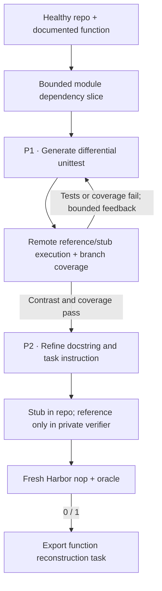

The R2E recipe writes differential tests for real functions in a repository:
tests that compare a candidate implementation with the original. It repairs
those tests using execution and coverage feedback, then uses the observed
behavior to refine the task's specification.

## Pipeline, step by step

`P1`, `P2`, … mark real model calls. Unlabelled stages are code or remote execution.

**Extract a real function.** The recipe picks supported functions (documented, top-level and synchronous) along with a bounded slice of their module-level dependencies.

**Generate and execute tests.** The tests compare the function under test with `reference_function` through `fut_module`. Remote execution measures the real contrast, and the branch coverage that comes from the generated tests. The repository's existing tests run separately.

**Refine the public contract.** The specification call only runs once a useful test exists. It sees the function's source, the generated tests and what was observed. The learner gets the refined docstring and instruction, with the function body stubbed out.

## Every prompt and its data

A candidate gets between one and `max_rounds` test-author calls. A successful one then gets one specification call.

| Call | System prompt composition | User / input material | Output | Retry or branch |
|---|---|---|---|---|
| P1 · Tests / repair | test_prompt.md + fut_module binding and offline adaptations | function_name, dependency context, prior test and execution/coverage feedback. | EquivalenceTest: test_code | Up to max_rounds; default three. Default minimum branch coverage is 0.8. |
| P2 · Specification | specification_prompt.md + behavioral-only instruction adaptation | Original function, generated tests, observed executions. | RefinedSpecification: docstring, instruction | One call after the test-generation loop succeeds. |

The [complete r2e prompt reference](https://huggingface.github.io/Repo2RLEnv/pipelines/prompts/r2e/) has every retained template, appended instruction, substitution, example and output schema. The [shared prompt guide](prompt_reference.md) shows how to inspect the fully resolved request from a real run.

## Follow one task

Say the function to reconstruct consumes iterators. The generated tests must compare equivalent fresh inputs and materialize finite iterators, so the verifier measures behavior and not object identity.

## What repeats, what is checked

Syntax and schema errors, failed execution, and coverage below the configured threshold all go back to P1 as feedback. The final Harbor check sits outside this loop; if it fails, the task is skipped. The private Python reference runs in the same process as the differential tests, which is a limitation for later adversarial review.

An exported bundle is a generation result. Independent leakage review, shortcut probes and blind solver traces come later, in the quality campaign.

## Implementation map

- [`r2e/extract.py`](https://github.com/huggingface/Repo2RLEnv/blob/main/src/repo2rlenv/pipelines/recipes/r2e/extract.py)
- [`r2e/pipeline.py`](https://github.com/huggingface/Repo2RLEnv/blob/main/src/repo2rlenv/pipelines/recipes/r2e/pipeline.py)
- [`r2e/worker.py`](https://github.com/huggingface/Repo2RLEnv/blob/main/src/repo2rlenv/pipelines/recipes/r2e/worker.py)
- [`r2e/reference.py`](https://github.com/huggingface/Repo2RLEnv/blob/main/src/repo2rlenv/pipelines/recipes/r2e/reference.py)
- [`repository/export.py`](https://github.com/huggingface/Repo2RLEnv/blob/main/src/repo2rlenv/pipelines/recipes/repository/export.py)

## Run and supported profile

Use `repo2rlenv generate --config examples/owned-r2e.yaml`. The native
`equivalence_tests` pipeline keeps its original options and behavior. Setting
`recipe: r2e` switches to this execution loop, which has its own options. Cloud
workers, budget accounting, resume receipts and Rich or JSON progress work as
described in the [shared interface](owned_recipes.md).

This first profile needs a working public GitHub Python repository with a
`tests/` directory. It selects documented, module-level synchronous functions
and includes a bounded slice of their module-level dependencies. Classes, async
functions, nonstandard source roots and reconstructed cross-module import slices
need another extraction profile.

Generated tests use the native `function` / `reference_function` API. The
reference and the test bindings are added only to the separate verifier image.
The learner sees a stub in the real repository, plus the refined requirements.
Coverage is collected only while the generated tests run. The repository's
existing tests run too, but they don't count toward that coverage score. The
defaults are three rounds and 80% branch coverage. These are native generation
controls, separate from later quality review.

The current verifier loads the private Python reference in the same process as
the differential tests. Whether a submission can reach the reference during
adversarial grading is still part of the deferred audit, and no quality-accepted
claim is made. The first campaign aims for **20 generated tasks** with fresh
Harbor baseline and reference checks.

On top of the Python source, build and test profile, the options are `target`,
`max_candidates`, `seed`, `max_rounds` and `min_branch_coverage`. The default
build dependencies include pytest and Coverage.py. If you override the
dependencies, include both.

Credit: [R2E](https://github.com/r2e-project/r2e) (MIT), commit
`bcbed156711bb939de14aa46b27eee15073f5272`. See [RFC 0017](../rfcs/0017-r2e-recipe.md)
and the packaged `recipes/r2e/provenance.md` for the source map and adaptations.
The execution report uses Coverage.py's [branch measurement](https://coverage.readthedocs.io/en/latest/branch.html)
and [JSON reporting](https://coverage.readthedocs.io/en/latest/commands/cmd_json.html).

## Cost evidence

See the [measured yield and cost](economics.md) and
[r2e accounting](experiment_accounting.md#r2e) for the pilot/expansion
scope, model identities, stage costs, compute resources and validation limits.
