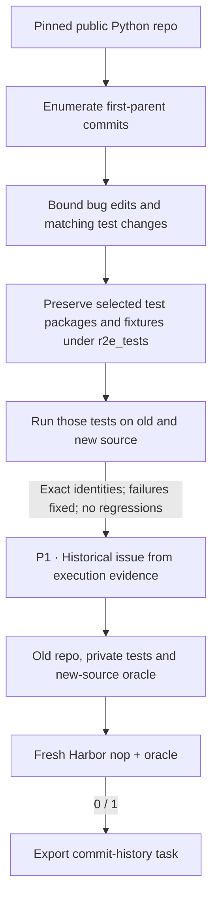

R2E-Gym / SWEGEN turns real commits from a repository's history into repair
tasks.

## Pipeline, step by step

`P1`, `P2`, … mark real model calls. Unlabelled stages are code or remote execution.

**Mine commits.** The recipe walks first-parent history instead of PR metadata. By default, filters modelled on the native pipeline require bug-like edits and matching test changes, within bounded change sizes.

**Materialize comparison tests.** The selected post-change test modules keep their names and package layout under `r2e_tests/`, along with their package fixtures and helper files. The old and new implementations both run the same selected modules. Companion files stay private, and copying them doesn't add their unrelated tests to the list that runs.

**Package a repair.** The shared history author uses R2E-Gym's own issue prompt and examples. The reference restores the selected new-source files in an otherwise old repository.

## Every prompt and its data

There's one issue-author call once the remote contrast succeeds. Commit discovery and filtering don't use an LLM.

| Call | System prompt composition | User / input material | Output | Retry or branch |
|---|---|---|---|---|
| P1 · Historical issue | instruction_prompt.md + issue_examples.json + shared history adaptation | Bounded authoring view of the evaluated candidate: commit context, private source diff and observed tests. Complete test identities remain in the private verifier contract. | HistoricalIssue: analysis, instruction | Same call machinery as SWE-Next; different source and test layout. |

The [complete r2e_gym prompt reference](https://huggingface.github.io/Repo2RLEnv/pipelines/prompts/r2e_gym/) has every retained template, appended instruction, substitution, example and output schema. The [shared prompt guide](prompt_reference.md) shows how to inspect the fully resolved request from a real run.

## Follow one task

Say a commit changes a function and its regression test, and there's no useful PR record. The commit pair gives the old and new behavior, and the generated instruction explains the defect that was observed.

## What repeats, what is checked

`require_bug_edit` and `require_test_match` default to true. The first profile supports ordinary pytest; the repository-specific heuristics for Pillow, NumPy, Datalad and Tornado are out of scope. A failed contrast or a failed final Harbor check skips the candidate. No interactive coding agent repairs the repository during this recipe.

An exported bundle is a generation result. Independent leakage review, shortcut probes and blind solver traces come later, in the quality campaign.

## Implementation map

- [`history/selection.py`](https://github.com/huggingface/Repo2RLEnv/blob/main/src/repo2rlenv/pipelines/recipes/history/selection.py)
- [`history/test_suite.py`](https://github.com/huggingface/Repo2RLEnv/blob/main/src/repo2rlenv/pipelines/recipes/history/test_suite.py)
- [`history/worker.py`](https://github.com/huggingface/Repo2RLEnv/blob/main/src/repo2rlenv/pipelines/recipes/history/worker.py)
- [`history/pipeline.py`](https://github.com/huggingface/Repo2RLEnv/blob/main/src/repo2rlenv/pipelines/recipes/history/pipeline.py)
- [`r2e_gym/pipeline.py`](https://github.com/huggingface/Repo2RLEnv/blob/main/src/repo2rlenv/pipelines/recipes/r2e_gym/pipeline.py)
- [`repository/export.py`](https://github.com/huggingface/Repo2RLEnv/blob/main/src/repo2rlenv/pipelines/recipes/repository/export.py)

## Run and supported profile

Run `repo2rlenv generate --config examples/owned-r2e-gym.yaml`.
The first profile supports public GitHub Python repositories with ordinary pytest
files. Source paths, dependency installation and test roots are all explicit.
All repository execution and image builds happen on the configured Modal or
Daytona worker.

The strict test-ID comparison is kept. The packaging adaptation keeps test
package imports working under `r2e_tests/`, and `private_test_paths` keeps every
companion fixture out of the learner image. The repository-specific import and
runner heuristics for Pillow, NumPy, Datalad and Tornado aren't supported in this
first ordinary-pytest profile. The native bug-edit and test-match switches are
optional and default on, as in the published generation guide.

`target`, `max_candidates`, `history_limit` and the change-size bounds control
the run. `require_bug_edit` and `require_test_match` expose the native filter
switches. `pytest_args` records explicit runner options and applies them the same
way during generation and in the exported verifier. Use it to keep runtime
testing separate from optional CI reporting.
The released collection has **100 generated tasks**, listed in the
[release inventory](releases.md). The runtime records source exclusions,
bootstrap failures and execution results. A passing reference is a generation
check; detailed quality acceptance comes after the full campaign.

The export carries the old repository context, private post-change tests, a
reference repair and a deterministic test reward. Changed source files must
already exist. Added or deleted implementation files, and specialized test
runners, need a separate supported profile. Dependencies are installed before the
offline solve.

Credit: [R2E-Gym / SWEGEN](https://github.com/R2E-Gym/R2E-Gym) (Apache-2.0),
commit `0d94c4eb9431cd195c55a7ea3abd54006c9a1735`. See
[RFC 0024](../rfcs/0024-r2e-gym-recipe.md), the packaged `recipes/r2e_gym/provenance.md`,
and the [shared CLI and cloud guide](owned_recipes.md).

## Cost evidence

See the [measured yield and cost](economics.md) and
[r2e-gym accounting](experiment_accounting.md#r2e-gym) for the pilot/expansion
scope, model identities, stage costs, compute resources and validation limits.
