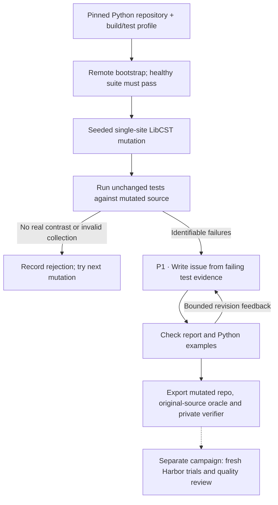

**Status:** experimental. Generation and Harbor execution are at the pilot
stage; no 20- or 100-task quality campaign is claimed as complete yet.

The `swe_smith` recipe starts from a healthy Python repository and plants seeded,
single-site defects. It keeps the mutations that make the existing test suite
fail in a way you can pin to specific tests. An issue writer then describes the
behavior it observed, and the original implementation is the reference repair.

## Method and attribution

Inspired by [SWE-smith](https://github.com/SWE-bench/SWE-smith) (MIT), source
commit `9b74ac08118a85c39c356802f7961893af73e07f`. The owned code adapts three of
its stages: procedural operator and control-flow mutations, execution contrast,
and writing the issue from test evidence. It doesn't implement the upstream LLM
rewrite or the strategies that combine several mutations. See [RFC 0012](../rfcs/0012-swe-smith-recipe.md) and the
packaged `pipelines/recipes/swe_smith/provenance.md` and `UPSTREAM_LICENSE`.

## Pipeline, step by step



`P1`, `P2`, … mark real model calls. Unlabelled stages are code or remote execution.

**Prepare and mutate.** Starting from a healthy source tree and its passing test report, the recipe makes one seeded edit to an operator, condition or constant, and keeps the file's formatting. No model picks the mutation.

**Measure behavior.** The same tests run against the broken code. If collection fails, nothing meaningful fails, or expected passing behavior is lost, the mutation is rejected before anything is spent on issue writing.

**Author and export.** The issue writer sees only excerpts of the failing tests and the log from the broken run. The learner gets the mutated repository and the public issue. The reference restores the original source.

## Every prompt and its data

There's one issue-writing call when the first attempt succeeds, and at most two attempts in total.

| Call | System prompt composition | User / input material | Output | Retry or branch |
|---|---|---|---|---|
| P1 · Issue | issue_prompt.md | Selected failing test source and imports, defective stdout, optional review feedback. No mutation patch is passed. | IssueReport: issue, reason | Malformed JSON, private test names, unsupported test-oriented wording and invalid/undefined Python examples produce revision feedback. |

The [complete swe_smith prompt reference](https://huggingface.github.io/Repo2RLEnv/pipelines/prompts/swe_smith/) has every retained template, appended instruction, substitution, example and output schema. The [shared prompt guide](prompt_reference.md) shows how to inspect the fully resolved request from a real run.

## Follow one task

Say a seeded boundary-condition edit makes a batching helper mishandle the last group. The issue describes that symptom the way a user would see it. Existing tests, hidden from the learner, show the failure, and the reference restores the original helper.

## What repeats, what is checked

The issue writer gets two attempts by default. The recipe exports as soon as the remote source-level contrast holds. Unlike recipes that call Harbor inside `author_export`, SWE-smith runs fresh Harbor trials as a separate campaign step, so don't read per-export Harbor success into the shared repository runner.

An exported bundle is a generation result. Independent leakage review, shortcut probes and blind solver traces come later, in the quality campaign.

## Implementation map

- [`swe_smith/worker.py`](https://github.com/huggingface/Repo2RLEnv/blob/main/src/repo2rlenv/pipelines/recipes/swe_smith/worker.py)
- [`swe_smith/mutations.py`](https://github.com/huggingface/Repo2RLEnv/blob/main/src/repo2rlenv/pipelines/recipes/swe_smith/mutations.py)
- [`swe_smith/issue.py`](https://github.com/huggingface/Repo2RLEnv/blob/main/src/repo2rlenv/pipelines/recipes/swe_smith/issue.py)
- [`swe_smith/export.py`](https://github.com/huggingface/Repo2RLEnv/blob/main/src/repo2rlenv/pipelines/recipes/swe_smith/export.py)
- [`swe_smith/grade.py`](https://github.com/huggingface/Repo2RLEnv/blob/main/src/repo2rlenv/pipelines/recipes/swe_smith/grade.py)

## Run

You need a checkout of this repository to build the worker wheel. The controller
checks that the wheel matches its own package before uploading it, and it never
runs generated code or a Docker image itself.

```bash
uv sync --extra modal --extra mutation --extra harbor
uv build
uv run repo2rlenv campaign init workspace/smith --budget-usd 25
uv run repo2rlenv workers start --campaign workspace/smith --provider modal \
  --name smith-worker --reserve-usd 3 --timeout-sec 3600
uv run repo2rlenv generate --config examples/owned-swe-smith.yaml
```

Put `--no-ui` before `generate` for plain progress output, or use
`generate --json` for JSON Lines. Both come from the same typed events that drive
the Rich display and the durable journal.

The sample config aims for one execution-valid candidate before issue
generation. It uses a pinned revision of more-itertools with a public, CPU-only
pytest profile. For another repository, change the source and test paths, the
build dependencies and the install command. Only public GitHub repositories are
supported. Private sources, non-Python mutations and GPU profiles aren't
implemented.

| Option | Default | Meaning |
|---|---|---|
| `source_paths` | required | Existing Python source files/directories to mutate and collect |
| `test_paths` | required | Trusted pytest files/directories, hidden in the learner image |
| `base_image` | `python:3.12-slim` | Explicit build base; use a digest for reproducibility |
| `dependencies` | `pytest==9.0.3` | Packages installed before the repository |
| `install_command` | `python -m pip install --no-cache-dir -e .` | Profile-specific installation |
| `seed` | `24` | Mutation ordering seed |
| `max_candidates` | `100` | Maximum mutation executions |
| `max_per_entity` | `2` | Maximum execution-valid mutations per function |
| `test_timeout_sec` | `90` | Deadline for each clean test run |
| `target` | `20` | Target execution-valid candidates; not accepted tasks |

## What grading receives

The learner and verifier build contexts both start from the broken source. The
learner image leaves out the configured test paths and has no Git history. The
reference lives only under `solution/`. Harbor copies the allowed Python source
files into a fresh verifier environment. Test files, the interpreter,
configuration and the reward writer never come from the learner.

A trusted parent process runs pytest as an unprivileged user and checks for an
exact, nonempty set of expected passing test IDs. Empty reports, missing tests,
collection errors and contradictory exit codes can't produce success. That
closes off common verifier shortcuts. Arbitrary Python can still attack an
in-process test runner, though, so attack probes and trace review are still
required for acceptance.

## Recovery

Run receipts live at `execution.campaign_dir/runs/execution.run_id`. An explicit
`generate --resume --config ...` picks up a remote job that was already
dispatched and reuses matching completed model responses. It won't silently
repeat a model request whose outcome is uncertain. If you change the
configuration or the worker code, use a new run ID. A worker launch that was
interrupted before it had a recoverable identity needs provider reconciliation,
not a blind retry.

Keep the worker running until you've downloaded the generation evidence, then run
`workers stop`. Completed exports and quality reports have separate identities
and lifecycles, and editing a task invalidates its earlier quality evidence.

## Pilot evidence

The first candidate, at more-itertools revision
`9ed3dbb0ae527230cd156d91d0af305478558fba`, caused the intended failure against
749 baseline passing test IDs. Its Harbor task scored 0 for nop and 1 in two
fresh oracle trials through the remote offline adapter. The instruction still
needed semantic review and repair. These results show execution contrast, not
training-quality acceptance or population yield.

The first generation campaign has 24 distinct exports from 29 mutation attempts.
Twenty of them have also passed fresh Harbor checks on Modal (nop 0, oracle 1).
These are generation results; quality acceptance is still pending.

## Cost evidence

See the [measured yield and cost](economics.md) and
[swe-smith accounting](experiment_accounting.md#swe-smith) for the pilot/expansion
scope, model identities, stage costs, compute resources and validation limits.
