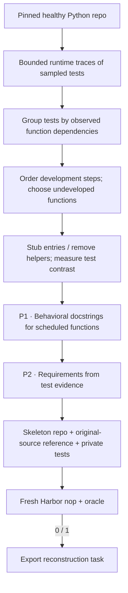

SWE-Flow builds reconstruction tasks from the functions a working repository's
tests actually call at runtime. It doesn't need PR history.

The collection has **100 Harbor tasks** across seven Python repositories: 24 kept
from earlier runs and 76 new from the September expansion. Each of the 76 new
exports has a baseline reward of 0 and a reference reward of 1, both matched to
its hash. The expansion cost **$22.91**, about **$0.30 per new export**, counting
failed attempts and estimated worker and build costs. Two pilot instructions
still have known specification issues. Their published copies carry
`evaluation.status = "needs_repair"`, and the original exports are kept.

The [published manifest](https://huggingface.co/datasets/FineEnvs/repo2rlenv-swe-flow/resolve/main/manifest.json)
records source diversity, costs and both findings. The generation checks don't
amount to independent quality acceptance of the collection. The complete bundles
are published as
[FineEnvs/repo2rlenv-swe-flow](https://huggingface.co/datasets/FineEnvs/repo2rlenv-swe-flow).

## Pipeline, step by step

`P1`, `P2`, … mark real model calls. Unlabelled stages are code or remote execution.

**Observe dependencies.** Runtime traces record which supported functions each sampled test calls. Incomplete traces are dropped, and groups are ordered by how many dependencies they have.

**Choose a development step.** Each task introduces only functions that haven't been developed yet. Entry points keep their signatures; new helpers are removed. The full configured suite checks both the healthy and the skeleton state.

**Write two views of the requirement.** P1 reads the source of the scheduled functions. P2 gets the public docstrings P1 generated, the complete scheduled functions and the test evidence, including parametrization decorators. It reconciles the public behavior and limits the requirements to the missing functions. Before insertion, the generated docstrings are checked for exactly one entry per scheduled `node_id`.

## Every prompt and its data

Each candidate gets two author calls, one for docstrings and one for the specification. Tracing and dependency scheduling don't use an LLM.

| Call | System prompt composition | User / input material | Output | Retry or branch |
|---|---|---|---|---|
| P1 · Docstrings | docstring_prompt.md + first two docstring demonstrations + adaptation | candidate.functions, indexed by node_id. | Docstrings: functions[{node_id, docstring}] | Names must match scheduled nodes exactly once. |
| P2 · Specification | specification_prompt.md + first two specification demonstrations + adaptation | candidate.test_evidence, P1 public docstrings, complete scheduled functions and scope constraints. | Specification: markdown | A separate call; bounded correction rejects private fixture/test references. |

The [complete swe_flow prompt reference](https://huggingface.github.io/Repo2RLEnv/pipelines/prompts/swe_flow/) has every retained template, appended instruction, substitution, example and output schema. The [shared prompt guide](prompt_reference.md) shows how to inspect the fully resolved request from a real run.

## Follow one task

Say the tests exercise a public iterator helper and two internal helpers. A development step removes the implementations that step newly needs, keeps the rest of the repository, and asks the learner to implement the specified behavior.

## What repeats, what is checked

Tracing is bounded by `trace_max_tests` and `trace_seed`, and no model repairs a failed trace. An authoring or Harbor failure skips the candidate. This profile doesn't go back and rewrite the schedule after a failed solver rollout.

An exported bundle is a generation result. Independent leakage review, shortcut probes and blind solver traces come later, in the quality campaign.

## Implementation map

- [`swe_flow/worker.py`](https://github.com/huggingface/Repo2RLEnv/blob/main/src/repo2rlenv/pipelines/recipes/swe_flow/worker.py)
- [`swe_flow/schedule.py`](https://github.com/huggingface/Repo2RLEnv/blob/main/src/repo2rlenv/pipelines/recipes/swe_flow/schedule.py)
- [`swe_flow/author.py`](https://github.com/huggingface/Repo2RLEnv/blob/main/src/repo2rlenv/pipelines/recipes/swe_flow/author.py)
- [`repository/export.py`](https://github.com/huggingface/Repo2RLEnv/blob/main/src/repo2rlenv/pipelines/recipes/repository/export.py)
- [`swe_smith/grade.py`](https://github.com/huggingface/Repo2RLEnv/blob/main/src/repo2rlenv/pipelines/recipes/swe_smith/grade.py)

## Run and supported profile

Run `repo2rlenv generate --config examples/owned-swe-flow.yaml`. Cloud workers,
campaign budgets, resume receipts and the Rich or JSON CLI work through the
[shared recipe interface](owned_recipes.md).

This first profile supports top-level synchronous Python functions in the source
paths you supply. By default, tracing samples 128 tests with seed 24. Each traced
test gets a five-second profiling window, and incomplete traces are left out of
scheduling. The healthy and skeleton states still run the complete configured
test suite. Extra threads, subprocesses, classes and async functions would need
another tracing profile.

Tests that call the same functions form a group. Groups are ordered by
dependency count, and each step introduces only functions that no earlier step
developed. Entry points keep their signatures and get generated behavioral
docstrings. Helpers the step newly introduces have their implementations
removed. The reference restores the original source, and the rest of the
repository provides realistic context.

Two separate model stages, using the upstream prompts, write the function
docstrings and the test-grounded task requirements. Fresh Harbor checks confirm
an unsolved baseline and a working reference. The target grew from 20 tasks to
**100 generated tasks**. Independent quality review, attack checks and model
rollouts come later.

On top of the Python build, source and test profile, the options are `target`,
`max_candidates`, `trace_max_tests` and `trace_seed`. Every trace, schedule,
source snapshot, model request and trial is kept in the campaign evidence
directory.

Credit: [SWE-Flow](https://github.com/Hambaobao/SWE-Flow) (MIT), commit
`7da5b046fa1dc184674e4e94a9989be56c39e4e7`, and
[SWE-Flow-Trace](https://github.com/Hambaobao/SWE-Flow-Trace). See
[RFC 0016](../rfcs/0016-swe-flow-recipe.md) and the packaged
`recipes/swe_flow/provenance.md` for how this implementation differs.

## Cost evidence

See the [measured yield and cost](economics.md) and
[swe-flow accounting](experiment_accounting.md#swe-flow) for the pilot/expansion
scope, model identities, stage costs, compute resources and validation limits.
