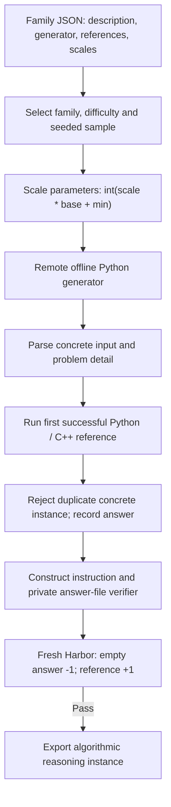

SCALER expands released, parameterized problem families into concrete reasoning
tasks. It runs the supplied generator and reference programs, and makes no LLM
calls.

## Pipeline, step by step

**Expand a family.** The recipe loads the native generator and reference definitions as data. It picks a difficulty and a random seed, maps the difficulty to a scale, and calculates each parameter. Supplied code never runs on the controller.

**Compute a concrete answer.** The generator and reference run in bounded, offline remote containers. The recipe records the input, parameters, actual seed, code hash and answer. Duplicate concrete instances are rejected.

**Create the learner contract.** `instruction_for` combines the family description with the concrete input. The learner writes a boxed answer to `/workspace/answer.txt`, and a separate verifier applies the active native math-verify route.

## Every prompt and its data

There are no LLM calls. All task content comes from the released family definitions and deterministic program execution.

| Call | System prompt composition | User / input material | Output | Retry or branch |
|---|---|---|---|---|
| No model prompt | instruction_for in scaler/families.py | Family description, concrete input dictionary and optional native instruction. | Learner instruction.md, assembled as text | This is task text, not an API call. |

The [complete scaler prompt reference](https://huggingface.github.io/Repo2RLEnv/pipelines/prompts/scaler/) has every retained template, appended instruction, substitution, example and output schema. The [shared prompt guide](prompt_reference.md) shows how to inspect the fully resolved request from a real run.

## Follow one task

Say a hotel-room allocation family generates one sequence of arrival and departure operations. The reference computes the final allocation for that instance. The task asks the learner for that concrete answer; it isn't a repository patch task.

## What repeats, what is checked

The generator gets at most `max_generator_attempts` (three by default) per sampled instance. Supported references are Python and C++17. A reference timeout rejects the candidate. Harbor export requires the native -1/+1 parity. This profile expands released families; it doesn't synthesize new families or reproduce adaptive training.

An exported bundle is a generation result. Independent leakage review, shortcut probes and blind solver traces come later, in the quality campaign.

## Implementation map

- [`scaler/families.py`](https://github.com/huggingface/Repo2RLEnv/blob/main/src/repo2rlenv/pipelines/recipes/scaler/families.py)
- [`scaler/worker.py`](https://github.com/huggingface/Repo2RLEnv/blob/main/src/repo2rlenv/pipelines/recipes/scaler/worker.py)
- [`scaler/pipeline.py`](https://github.com/huggingface/Repo2RLEnv/blob/main/src/repo2rlenv/pipelines/recipes/scaler/pipeline.py)
- [`scaler/export.py`](https://github.com/huggingface/Repo2RLEnv/blob/main/src/repo2rlenv/pipelines/recipes/scaler/export.py)
- [`scaler/grade.py`](https://github.com/huggingface/Repo2RLEnv/blob/main/src/repo2rlenv/pipelines/recipes/scaler/grade.py)

## Run and supported profile

Run `repo2rlenv generate --config examples/owned-scaler.yaml`. The input is a
native mapping such as the released `SCALER-data/train/SCALER-8.json`, or a file
in the same format with your own families. All supplied code runs inside offline
containers on Modal or Daytona. The controller only reads JSON and packages
artifacts.

`difficulties`, `samples_per_difficulty`, `seed`, `target`, `max_candidates` and
the execution bounds control the batch. Input hashes, actual random seeds, scaled
parameters and reference-code hashes are all recorded. Duplicate concrete
instances are rejected. The released collection has **100 distinct reasoning
tasks** from the recorded family bank. It doesn't claim 100 new families, or any
repository coding tasks. See the [release inventory](releases.md).

The learner writes its boxed answer to `/workspace/answer.txt`. A separate
verifier applies the active upstream math-verify metric and keeps its native
−1/+1 reward. The reference answer never enters the learner image. Generation
checks confirm execution and packaging; detailed quality acceptance comes later.

This profile expands existing families. Synthesizing new families, adaptive
difficulty training and the verl training stack are out of scope. See the
[shared CLI and cloud guide](owned_recipes.md).

Credit: [SCALER](https://github.com/ALEX-nlp/SCALER) (Apache-2.0), commit
`60c6c5037866c718f4c001ea338f9c5a91cb01ae`.
[RFC 0026](../rfcs/0026-scaler-recipe.md) and the packaged
`recipes/scaler/provenance.md` map the source and runtime adaptations.

## Cost evidence

See the [measured yield and cost](economics.md) and
[scaler accounting](experiment_accounting.md#scaler) for the pilot/expansion
scope, model identities, stage costs, compute resources and validation limits.
