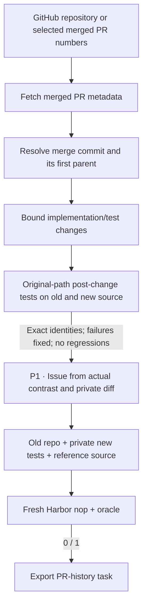

SWE-Next turns real, merged code changes from a repository's PR history into
repair tasks.

## Pipeline, step by step

`P1`, `P2`, … mark real model calls. Unlabelled stages are code or remote execution.

**Mine merged history.** Each selected PR is resolved to its merge commit and that commit's first parent. That's different from SWE-gen, which reverses the source of a PR head you supply.

**Choose and run tests.** The supported profile takes bounded edits to existing Python implementation files, plus the changed test files. Post-change tests keep their original paths. The new, healthy source and the old source must produce comparable, nonempty sets of test IDs.

**Author from verified evidence.** The author gets the evaluated candidate, including the private diff and failure evidence. Its analysis stays private; the learner only sees the instruction.

## Every prompt and its data

A candidate gets one issue-author call once it passes the remote old-versus-new execution contrast.

| Call | System prompt composition | User / input material | Output | Retry or branch |
|---|---|---|---|---|
| P1 · Historical issue | instruction_prompt.md + issue_examples.json + shared history adaptation | Evaluated candidate.json: metadata, source changes, profile and observed test contrast. | HistoricalIssue: analysis, instruction | One call; analysis is not copied into instruction.md. |

The [complete swe_next prompt reference](https://huggingface.github.io/Repo2RLEnv/pipelines/prompts/swe_next/) has every retained template, appended instruction, substitution, example and output schema. The [shared prompt guide](prompt_reference.md) shows how to inspect the fully resolved request from a real run.

## Follow one task

Say a merged PR fixes boundary behavior and adds tests. The old repository is the task's starting state, the new tests are private, and the post-change source is the repair oracle.

## What repeats, what is checked

The shared history worker evaluates each eligible change. Bootstrap failures, unsupported paths and contrast failures reject a candidate before any issue is written. This profile deliberately requires exact test IDs instead of the native fallback that compares intersections or whole files. The author is never asked to fix a repository that won't build.

An exported bundle is a generation result. Independent leakage review, shortcut probes and blind solver traces come later, in the quality campaign.

## Implementation map

- [`history/source.py`](https://github.com/huggingface/Repo2RLEnv/blob/main/src/repo2rlenv/pipelines/recipes/history/source.py)
- [`history/selection.py`](https://github.com/huggingface/Repo2RLEnv/blob/main/src/repo2rlenv/pipelines/recipes/history/selection.py)
- [`history/worker.py`](https://github.com/huggingface/Repo2RLEnv/blob/main/src/repo2rlenv/pipelines/recipes/history/worker.py)
- [`history/pipeline.py`](https://github.com/huggingface/Repo2RLEnv/blob/main/src/repo2rlenv/pipelines/recipes/history/pipeline.py)
- [`repository/export.py`](https://github.com/huggingface/Repo2RLEnv/blob/main/src/repo2rlenv/pipelines/recipes/repository/export.py)

## Run and supported profile

Run `repo2rlenv generate --config examples/owned-swe-next.yaml`.
The first profile supports public GitHub Python repositories with ordinary pytest
files. Source paths, dependency installation and test roots are all explicit.
All repository execution and image builds happen on the configured Modal or
Daytona worker.

The default layout, with tests at their original paths, is kept. Two upstream
pieces are replaced. The quarterly LLM environment profiles give way to an
explicit dependency profile and the existing content-addressed bootstrap cache.
The native fallback that compares intersections or whole files gives way, on
purpose, to exact equality of nonempty test IDs.

`target`, `max_candidates`, `history_limit` and the change-size bounds control
the run. `max_prs` caps API discovery, and the optional `pr_numbers` picks
specific merged PRs.
The released collection has **100 generated tasks**, listed in the
[release inventory](releases.md). The runtime records source exclusions,
bootstrap failures and execution results. A passing reference is a generation
check; detailed quality acceptance comes after the full campaign.

The export carries the old repository context, private post-change tests, a
reference repair and a deterministic test reward. Changed source files must
already exist. Added or deleted implementation files, and specialized test
runners, need a separate supported profile. Dependencies are installed before the
offline solve.

Credit: [SWE-Next](https://github.com/TIGER-AI-Lab/SWE-Next) (Apache-2.0),
commit `b55c0841f364f9fe7363b2012cd0ae8d8afdf872`. See
[RFC 0023](../rfcs/0023-swe-next-recipe.md), the packaged `recipes/swe_next/provenance.md`,
and the [shared CLI and cloud guide](owned_recipes.md).

## Cost evidence

See the [measured yield and cost](economics.md) and
[swe-next accounting](experiment_accounting.md#swe-next) for the pilot/expansion
scope, model identities, stage costs, compute resources and validation limits.
