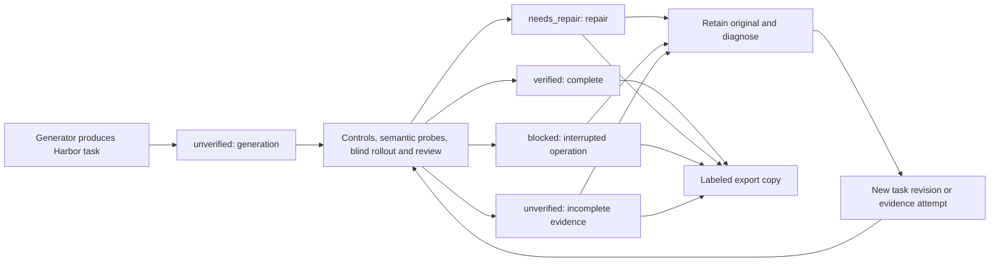

Every emitter writes the same `[metadata.repo2env.evaluation]` table into
`task.toml`. A task starts as `unverified` when it's generated, and a saved
quality result can promote it to `verified`. Defective and interrupted tasks stay
available so you can diagnose and repair them. A label describes the evidence
currently kept for one executable bundle. Reading the label alone doesn't prove
that the evidence is there, or that it's sound.



## Uniform meanings

| Status | Meaning | Typical reason codes |
| --- | --- | --- |
| `unverified` | Generated, partially checked, or missing decisive evidence. | `validation_not_run`, `validation_incomplete`, `evidence_missing` |
| `verified` | The retained quality result and execution evidence meet its stated profile. | `quality_verified` |
| `needs_repair` | Review or execution found a task, reference, verifier or probe defect. | `quality_defect` |
| `blocked` | An operational limit prevents completing the attempt. | `budget_exhausted`, `runtime_incompatible`, `provider_failure` |

`stage` is separate from status: `generation`, `bootstrap`, `construction`,
`review`, `controls`, `probes`, `rollout`, `repair`, `complete`, or `unknown`.
The quality importer reports the last stage it completed. A campaign controller
can record a more specific bootstrap or provider diagnosis when it has one.

`reason_codes` are unique `snake_case` identifiers for filtering. Reuse an
existing code when its meaning fits, and add a specific code for a new diagnosis.
`detail` holds the actual finding and the next useful diagnostic step. Missing
original trial files add `evidence_unavailable`; they never imply that validation
succeeded.

`provenance` records whether a person or a supervising agent was involved:
`assisted`, `unattended` or `unknown`. The default is `unknown`, and a missing
intervention log isn't enough to claim an unattended run. A task can be verified
even when the solver legitimately fails. Solver success isn't the quality
criterion for a task.

## What is stored

The initial table is deterministic, so repeated generation produces the same
configuration bytes:

```toml
[metadata.repo2env.evaluation]
schema_version = "1"
status = "unverified"
stage = "generation"
reason_codes = ["validation_not_run"]
detail = "Generated task; validation has not been established."
provenance = "unknown"
evidence = []
```

After review, the same schema adds:

| Field | Purpose |
| --- | --- |
| `checked_at` | Timezone-aware timestamp of this evidence check. Omitted before a check. |
| `subject_bundle_hash` | Exact executable task identity to which the label applies. |
| `profile` | Quality policy used, currently `practical-generation-v1`. |
| `evidence` | Quality result and trial paths, SHA-256 digests, subject bundle hashes, and preserved original Harbor checksums when available. |
| `source_task_path` | The source of a labeled historical copy. |
| `source_task_toml_sha256` | Original configuration bytes before the annotation was added. |

Probe evidence keeps its own variant hash and needs a preserved probe manifest
that links that variant to the reviewed task. It's never rewritten to pretend
that a deliberately mutated reference was the original task.

## Identity and evidence preservation

When it computes a bundle's executable identity, Repo2RLEnv excludes **only**
`metadata.repo2env.evaluation` and the `bundle_hash` field, which was already
excluded. Existing unlabeled hashes stay compatible. Changing instructions,
tests, reference files, environment configuration, permissions or any other
metadata changes the identity, and old evidence can no longer be reused.

Harbor's physical directory checksum includes `task.toml`, so it **does change**
when you add a label. Labeling a historical task writes an atomic copy to a new
directory and records the original configuration digest. It doesn't edit source
tasks, raw trial records, stored Harbor checksums or completed quality results.
Keep the original task and evidence alongside any labeled corpus you export.
When you distribute that corpus, package the local evidence paths or remap them
deliberately; the referenced content hashes must not change.

The importer checks the baseline and reference contrast, both the wrong-solution
and valid-alternative probes, rollout outcomes reviewed as legitimate, raw result
digests, recorded rewards and agent identities, controller receipt bindings, and
the evidence that each probe was created and completed. A result that looks
usable but has missing or altered proof can't produce a verified label. Attempts
that weren't accepted can still be kept, with a diagnosis that their evidence is
unavailable.

## CLI

```bash
# Preserve an incomplete task and record an operational diagnosis.
repo2rlenv tasks label ./attempt/task --out ./catalog/task \
  --status blocked --stage bootstrap --reason-code runtime_incompatible \
  --detail "Verifier used the wrong interpreter; rebuild and rerun controls." \
  --provenance assisted

# Derive acceptance from the retained quality result and execution evidence.
repo2rlenv tasks label ./quality/revisions/r1/task --out ./catalog/reviewed-task \
  --quality-result ./quality/result.json --provenance assisted

repo2rlenv tasks show ./catalog/reviewed-task --json
repo2rlenv tasks list ./catalog --status needs_repair
repo2rlenv tasks list ./catalog --status unverified --json
```

`--status verified` is deliberately unavailable; import checked evidence with
`--quality-result` instead. Existing destinations are never overwritten.
Publishing a fresh labeled revision keeps the earlier task and its diagnosis
available.

## Pipeline integration

Once a quality run saves `result.json`, it publishes a labeled copy under
`quality/labeled/<result-digest>/<task-name>` and writes `labeled-task.json` with
the output path. Publishing again checks the same evidence and reuses that copy.
An export failure is recorded separately and leaves the completed quality result
intact. Tasksmith's CLI shows the labeled copy when there is one.

Repairs and semantic probes invalidate the inherited evaluation when their
executable identity changes. They start as unverified revisions, with a
`task_changed` reason, until the current revision has been evaluated.

`emitter.evaluation.generated_evaluation()` supplies the shared initial table.
`quality.labels.label_from_quality()` checks a saved result without changing the
task. `write_labeled_copy()` writes the annotation to a new copy and rechecks
verified evidence before publishing. `read_evaluation()` is a uniform read API;
historical unlabeled tasks read as unverified, with unknown provenance.

None of these operations use an LLM, launch a sandbox, import target code or
spend generation budget. The executable task and its evidence stay the source of
truth. A corpus can keep every generated revision while separately counting the
unique PRs that have verified environments.
