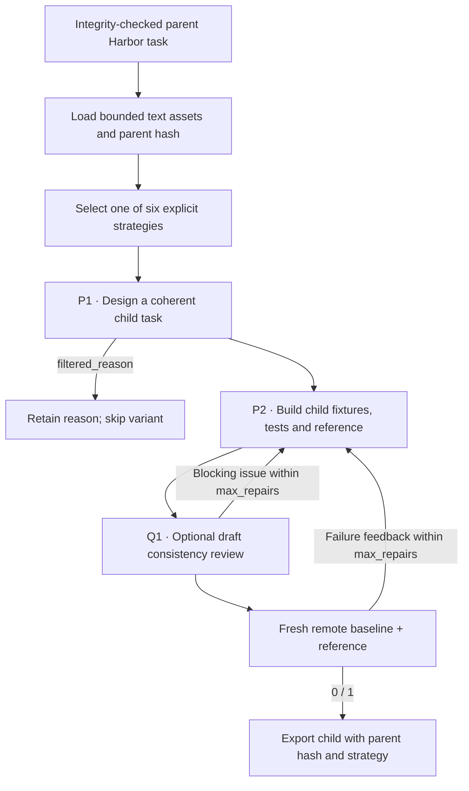

`seta_evol` takes a complete parent Harbor task, applies an explicit evolution
strategy to it, then rebuilds the fixtures, instruction, reference and tests. The
parent's files aren't changed. The child's metadata records the parent bundle
hash, the strategy and the variant number. The workflow follows
[SETA's evolution pipeline](https://github.com/camel-ai/seta/blob/e4715b01174e6c9503fc46120d81dd692ced75e6/datasynth/evol_pipeline/evol_task_pipeline.py).

## Pipeline, step by step



`P1`, `P2`, … mark real model calls. Unlabelled stages are code or remote execution.

**Read the complete parent.** The author sees the parent's instruction, environment, private tests and reference, as private source evidence. The parent bundle hash must still match.

**Select and apply a strategy.** Variants take strategies in round-robin order: increase, decrease, change context, increase and change context together, slight increase or slight decrease. No model calibrates difficulty here.

**Rebuild the child.** The builder generates a standalone child from the evolution design, and the common terminal runner validates and runs it. Parent files aren't edited.

## Every prompt and its data

If the first attempt succeeds, there are two authoring calls: evolution design,
then builder. Strategy selection is deterministic. With `review_drafts: true`,
[Q1](prompt_reference.md#optional-review-before-execution) reviews each complete
draft before execution, and a blocking issue goes back into the bounded builder
loop.

| Call | System prompt composition | User / input material | Output | Retry or branch |
|---|---|---|---|---|
| P1 · Evolution | evolution_prompt.md + selected strategies/*_adapter.md + owned adaptation | Complete parent files, strategy, parent hash and ordinal variant. | EvolutionDesign: core_capabilities, draft_spec, filtered_reason | A reason filters the variant without building it. |
| P2 · Child builder | builder_prompt.md + shared materialization instructions | Child design and execution/schema feedback. | TerminalDraft | Default initial attempt plus two repairs. |

The [complete seta_evol prompt reference](https://huggingface.github.io/Repo2RLEnv/pipelines/prompts/seta_evol/) has every retained template, appended instruction, substitution, example and output schema. The [shared prompt guide](prompt_reference.md) shows how to inspect the fully resolved request from a real run.

## Follow one task

Say you evolve a log-aggregation task by adding a time-window requirement. The child must change the requested behavior and the tests together, coherently. Changing only filenames isn't a valid transformation.

## What repeats, what is checked

Each variant gets the strategy prompt once. Build retries repair the selected design; they don't quietly switch to another strategy. Difficulty labels are design intentions until later solver measurements test them.

An exported bundle is a generation result. Independent leakage review, shortcut probes and blind solver traces come later, in the quality campaign.

## Implementation map

- [`seta_evol/recipe.py`](https://github.com/huggingface/Repo2RLEnv/blob/main/src/repo2rlenv/pipelines/recipes/seta_evol/recipe.py)
- [`terminal/runner.py`](https://github.com/huggingface/Repo2RLEnv/blob/main/src/repo2rlenv/pipelines/recipes/terminal/runner.py)
- [`terminal/draft.py`](https://github.com/huggingface/Repo2RLEnv/blob/main/src/repo2rlenv/pipelines/recipes/terminal/draft.py)
- [`terminal/grade.py`](https://github.com/huggingface/Repo2RLEnv/blob/main/src/repo2rlenv/pipelines/recipes/terminal/grade.py)

## Run and supported profile

Use `source.kind: task` with either one owned task directory or a directory of
owned tasks. The current profile needs integrity-checked text assets totalling at
most 150 kB per parent. Binary-heavy tasks and legacy tasks without hashes need a
dedicated input adapter; they aren't quietly accepted as equivalent inputs.

```bash
repo2rlenv generate --config examples/owned-seta-evol.yaml
```

The shared [terminal generation options](terminal_synth.md) apply, plus:

| Option | Default | Meaning |
|---|---|---|
| `variants_per_parent` | 1 | Distinct variant slots per parent, at most 20 |
| `strategies` | increase, context change, decrease | Round-robin strategy selection |

The exact strategy identifiers are `increase_difficulty`, `decrease_difficulty`,
`change_context`, `increase_difficulty_and_change_context`, `slight_increase` and
`slight_decrease`. The slight strategies are design directions. Their effect on
model success rates won't be measured until the later rollout campaign.

The recipe keeps the upstream evolution, strategy and builder prompts, with their
Apache-2.0 notices. Typed responses, offline execution and owned Harbor and JUnit
materialization replace the upstream agent's filesystem interface and legacy
task templates. This is an adaptation of the workflow, not a byte-identical
reproduction.

The released collection has **100 children**: 20 kept from earlier runs and 80
new exports. Each of the 80 new exports has fresh evidence of a baseline reward
of 0 and a reference reward of 1. By strategy, there are 13 increase, 21
decrease, 15 context change, 20 combined increase and context change, 14 slight
increase and 17 slight decrease. Those are the transformations requested, not
measured difficulty.

The expansion recorded **$44.72**: $30.75 of estimated model cost across 392
calls and $13.97 of estimated worker and build costs. That's **$0.56 per new
export**, counting unsuccessful attempts. One model request timed out and keeps a
separate **$1.25 uncertain reservation**; it isn't reported as either billed or
free. All expansion workers have been terminated. These costs leave out the 20
kept tasks and any later independent quality evaluation. See the
[generation economics](economics.md) and
[published Harbor dataset](https://huggingface.co/datasets/FineEnvs/repo2rlenv-seta-evol).

Generating a task doesn't mean its difficulty is calibrated or its quality
independently accepted. See [RFC 0014](../rfcs/0014-seta-evol-recipe.md) and the
packaged recipe's `provenance.md`.

## Cost evidence

See the [measured yield and cost](economics.md) and
[seta-evol accounting](experiment_accounting.md#seta-evol) for the pilot/expansion
scope, model identities, stage costs, compute resources and validation limits.
