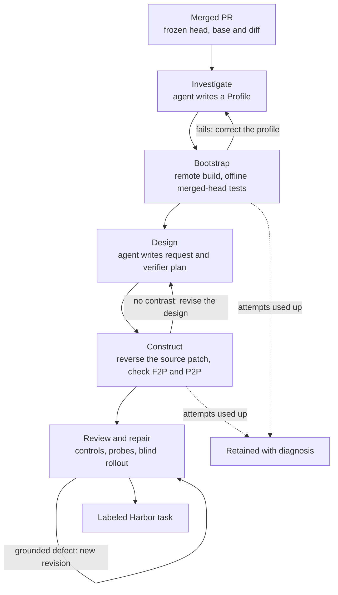

Tasksmith turns one merged pull request into a verified [Harbor task](../concepts/glossary.mdx#harbor-task). A coding agent investigates the repository, and a remote worker builds and tests its environment. The agent then designs the instruction and a private verifier, and a review loop checks the result against execution evidence and repairs what it can.

Deterministic mining keeps a PR only when it already fits one shape. [`pr_runtime`](pr_runtime.md), for example, needs the PR's own tests to flip from failing to passing in one repository-wide image. Tasksmith adapts to each PR instead. It picks the dependencies, tests and GPU count that PR needs, and writes behavioral tests where the PR's own tests fall short.

> [!TIP]
> Start with [Build an evaluation suite for your codebase](../tutorials/evaluate-your-codebase.md)
> for a complete walkthrough from selecting your own PR to comparing agent runs.

## At a glance

| | |
|---|---|
| Best for | One carefully built task per PR, including PRs whose own tests don't fully cover the change |
| Input | Merged public GitHub PRs, listed in a panel JSON file |
| Supported changes | Added or modified Python source. PRs that delete or rename source, or change C, C++, CUDA, Rust, Go, JavaScript or TypeScript source, are rejected at intake, before any spend |
| Output | A schema 1.3 Harbor bundle with an offline learner image, a separate offline verifier image, the merged code as [oracle](../concepts/glossary.mdx#oracle), and an [evaluation label](../concepts/glossary.mdx#evaluation-label) |
| Reward | 0 or 1. It's 1 when the tests that pass are exactly the recorded fail-to-pass and pass-to-pass set ([F2P and P2P](../concepts/glossary.mdx#f2p-and-p2p)) |
| Authoring | LangGraph routes the stages, and a Pi or OpenCode agent investigates and designs. The author model must be `anthropic/…` (default `anthropic/claude-sonnet-4-6`) |
| Quality | Built in: [controls](../concepts/glossary.mdx#controls), verifier [probes](../concepts/glossary.mdx#probe), a [blind rollout](../concepts/glossary.mdx#blind-rollout) by Sonnet, and bounded repair |
| Execution | A remote Modal or Daytona [worker](../concepts/glossary.mdx#worker). GPU tasks run on native Modal with one or two L4 GPUs. Your machine only orchestrates |
| Status | Experimental |
| Reference dataset | [`FineEnvs/HF_ML_Tasksmith`](https://huggingface.co/datasets/FineEnvs/HF_ML_Tasksmith): 50 tasks, all labeled `verified` |

## How it works



1. **Freeze the PR.** Before any paid work, Tasksmith reads the PR through `gh`. It pins the head and base commits and the complete diff, and separates Python source changes from tests. It re-reads the PR at the end to catch a force-push during intake. The frozen record, saved in `panel.json`, is the task's lineage.
2. **Investigate.** A Pi or OpenCode agent explores the pinned checkout on the worker through a shell tool, within `author_turns` model calls (default 18). It submits a typed `Profile`: CPU or GPU, the source roots the learner edits, private test paths and a small offline pytest selection, dependencies and the install command, and test container resources. It runs no builds itself. The [controller](../concepts/glossary.mdx#controller) rejects a profile that hides or omits any changed source file.
3. **Bootstrap.** Deterministic code builds the environment on the worker, reusing a cached dependency image when the same dependency inputs were built before. It then runs the selected tests at the merged head with no network. It also builds the filtered learner workspace, so a missing README or build input fails here, before design. A failure goes back to investigation with the real build or test log, up to `max_stage_attempts` (default 3). GPU tasks build on native Modal instead, with a CUDA check that the requested L4 GPUs are present.
4. **Design.** The agent writes a human-style request and maps each requirement to how it's verified and where the source supports it. It keeps or replaces the selected upstream tests, can add private behavioral tests where coverage is weak, and proposes wrong and valid implementations for the later probes.
5. **Construct.** Deterministic code reverses the PR's source patch, so modified files return to their pre-PR content and added files disappear. It runs the verifier twice. The merged code must pass, and the reverted code must fail some tests (fail-to-pass) while others still pass (pass-to-pass). Without both, the design is revised. With both, the exporter writes the Harbor bundle, with the merged source as the oracle.
6. **Review and repair.** The shared [quality loop](quality_loop.md) reviews the exact bundle and runs the controls: the untouched baseline must fail and the oracle must pass. It then probes the verifier with a wrong solution and a valid alternative, and runs a blind Sonnet rollout. Each grounded defect gets a targeted repair as a new, immutable revision, up to `quality.max_repairs` (default 3), and every check the repair invalidates runs again. The outcome is written as an evaluation label.

## Stage contracts

| Stage | Agent receives | Agent produces | Checked deterministically |
|---|---|---|---|
| Investigate | Frozen PR (title, description, source diff, full diff up to 32,000 characters), remote checkout, previous profile and failure, requested resources | `Profile`: resource, source and private test paths, test selectors, dependencies and install command, dependency manifests, rationale | Source roots cover every changed source file and stay clear of private and excluded paths. Every selector sits in a private test path. The resource matches the requested GPU count, and test CPU and memory fit the worker |
| Bootstrap | No agent | No agent | Merged-head tests pass offline, and the filtered learner workspace builds. Dependency cache hits are recorded |
| Design | Frozen PR, accepted profile, readiness results, previous design and failure | `Design`: instruction, 1–10 requirements with verification and source evidence, verifier rationale, upstream test policy, optional private tests, 1–4 wrong and 1–4 valid implementation ideas | Private tests parse and don't grade by reading source text. Replacing the upstream tests requires private tests |
| Construct | No agent | No agent | Merged code passes. Reverted code fails at least one test, and at least one adjacent test still passes |
| Review and repair | Exact bundle, private PR intent and diff, bounded file reads, trial evidence | Task, verifier and leakage assessments, grounded issues, probes, targeted edits | Evidence binds to the [bundle hash](../concepts/glossary.mdx#bundle-hash). Failed controls or probes override an optimistic review. Repairs can't touch `solution/` or `environment/source/` |
| Blind rollout | Public instruction and learner workspace | A source change and its full trace | The hidden verifier runs in a fresh, separate offline container |

Read the exact author prompts for [investigation](prompts/tasksmith.md#investigatemd) and [design](prompts/tasksmith.md#designmd). The review and repair prompts are in [the quality loop guide](quality_loop.md). The implementation lives in [`src/repo2rlenv/tasksmith`](https://github.com/huggingface/Repo2RLEnv/tree/main/src/repo2rlenv/tasksmith).

## Run one PR

You need Python 3.12 or later, Node.js 22.19 or later with npm (for the agent runtime), and `gh` on `PATH` and signed in, since intake reads PRs through it. You also need Modal or Daytona credentials and `ANTHROPIC_API_KEY`. Put the keys in `.env` at the checkout root; the CLI loads it automatically. See [Remote execution](../guides/remote-execution.mdx#connect-a-provider) and [Authentication](../reference/AUTH.md).

1. Install from a checkout with the Tasksmith, provider and Harbor extras. Use `--extra modal` instead of `--extra daytona` for Modal, which GPU tasks require.

   ```bash
   git clone https://github.com/huggingface/Repo2RLEnv
   cd Repo2RLEnv
   uv sync --extra tasksmith --extra daytona --extra harbor
   ```

2. Install the pinned Pi and OpenCode runtime once. It goes into your user cache under `~/.cache/repo2rlenv/tasksmith/runtimes/`.

   ```bash
   uv run repo2rlenv tasksmith install-runtime
   ```

3. Build the runtime wheel that the worker installs. This writes `dist/repo2rlenv-0.9.3-py3-none-any.whl`. Rebuild it whenever the checkout changes; a stale wheel is refused.

   ```bash
   uv build --wheel
   ```

4. Create a [campaign](../concepts/glossary.mdx#campaign) with an explicit spending limit. Every worker, model call and trial reserves against it before dispatch. The $50 here is an example limit, not a price estimate.

   ```bash
   uv run repo2rlenv campaign init workspace/tasksmith --budget-usd 50
   ```

5. Pick your PRs. A panel is a lowercase name and 1–100 unique PR URLs. `examples/tasksmith-pr.json` holds one, and `examples/tasksmith-prs.json` holds two.

   ```json
   {
     "name": "tasksmith-pr",
     "prs": ["https://github.com/more-itertools/more-itertools/pull/1193"]
   }
   ```

6. Run the panel:

   ```bash
   uv run repo2rlenv tasksmith run examples/tasksmith-pr.json \
     --options examples/tasksmith-options.json \
     --campaign workspace/tasksmith \
     --output workspace/tasksmith/run \
     --runtime-wheel dist/repo2rlenv-0.9.3-py3-none-any.whl
   ```

   Progress prints stage by stage. The command exits `0` only when every PR in the panel produced a usable task. If the run is interrupted, run the same command again: completed stages are reused.

7. Read the report. It makes no paid calls and lists each PR's status and the path of its labeled task.

   ```bash
   uv run repo2rlenv tasksmith show workspace/tasksmith/run
   ```

   To run the task yourself, copy that directory into a folder such as `./tasks` and follow [Run with Harbor](../guides/run-with-harbor.mdx). The oracle should score 1. A GPU task needs a Harbor environment with matching L4 GPUs.

### Options

`--options` takes a JSON file with these fields. Without it, `--provider` and `--author` pick the provider and agent, and everything else keeps its default.

| Field | Default | Effect |
|---|---|---|
| `provider` | `modal` | `modal` or `daytona`: the worker and CPU trials |
| `gpus` | `0` | `1` or `2` requests L4 GPUs on native Modal. Requires `provider: modal`. See `examples/tasksmith-gpu-options.json` |
| `author_runtime` | `pi` | `pi` or `opencode` |
| `author_model` | `anthropic/claude-sonnet-4-6` | Must be an `anthropic/…` model. Quality models can be OpenAI or Anthropic |
| `author_turns` | `18` | Model calls per authoring stage (2–50) |
| `author_stage_usd` | `4.00` | Cost cap per authoring stage |
| `max_stage_attempts` | `3` | Profile and design corrections per PR (1–5) |
| `max_spend_usd` | `100.00` | Cap for the whole run, inside the campaign limit |
| `worker_cpus`, `worker_memory_mb`, `worker_timeout_sec` | `2`, `4096`, `14400` | Builder worker size and lifetime |
| `required_probe_focus` | `[]` | Up to four probe focuses the review must cover: `general`, `lazy_output`, `numeric_tolerance`, `compiled_execution` or `model_behavior` |
| `quality` | Repair and rollout on, 3 repairs, 4 probes, $20 cap | Quality loop settings, including review, repair and solver models |

> [!NOTE]
> A `quality` object in your options replaces the default above entirely. Fields you leave out take the [quality loop's](quality_loop.md) own defaults, where `repair` and `run_rollout` are off and two probes run. Set `"repair": true` and `"run_rollout": true` explicitly when you include it.

Other `run` flags: `--stop-after N` processes only the first N PRs while the report keeps the full panel as its denominator. `--env-file FILE` loads credentials from a specific file, and `--json` prints the report as JSON. The reuse flags are covered [below](#reuse-and-resume), and the full list is in the [CLI reference](../reference/cli.mdx#tasksmith-run).

### What the run writes

```files
workspace/tasksmith/run
├── panel.json              # frozen configuration and PR records
├── report.json             # per-PR status, counts and spend
├── events.jsonl            # stage-by-stage progress
├── workers/                # worker receipts
└── candidates/<pr-id>/
    ├── graph.sqlite3       # LangGraph checkpoint for resume
    ├── authors/            # agent sessions and charges, per stage
    ├── remote/             # stage artifacts, including the first bundle
    ├── quality/
    │   ├── revisions/      # r0, r1, …: immutable task revisions
    │   ├── result.json     # quality verdict and trial evidence
    │   ├── labeled/        # labeled copy of the final revision
    │   └── labeled-task.json
    └── result.json
```

`<pr-id>` is a 12-character hash of the PR's URL, head commit and source diff, and the task directory is named `tasksmith-<pr-id>`. `labeled-task.json` points at the labeled task. Each PR's `status` in `report.json` is the quality outcome (`usable`, `reviewed`, `needs_evidence`, `needs_repair` or `budget_exhausted`). If no bundle was produced, it's `bootstrap_failed` or `construction_failed`, and an interrupted PR is `incomplete`.

## Run many PRs

`tasksmith run` handles a panel's PRs one after another, on one worker, with one set of options. To generate at scale, use `repo2rlenv tasksmith batch`. It runs several PRs at once, each in its own isolated controller process and worker, under a shared spending cap, and stops when a target number of verified tasks is reached. Each PR can carry its own options, including its GPU count, and every generated task and revision is kept. See [Run Tasksmith on many PRs](tasksmith_parallel_campaigns.md).

## What the verifier sees

The learner starts from the merged head with the PR's source changes reversed. It gets filtered source without Git history, private tests or the files the profile excludes, such as changelogs and release notes. The instruction's requirements must match the PR's behavior. Existing tests are the starting point, and the design can add private behavioral tests for missing coverage.

Grading runs in a separate verifier container built from the same install recipe. It copies in only the learner's Python source from the declared source roots, where new Python helper files are allowed. Symlinks, special files and changes to fixed non-Python assets are rejected. The verifier runs the selected tests as an unprivileged user and writes 1 only when the tests that pass are exactly the recorded fail-to-pass and pass-to-pass set. The learner never sees the selected test collection.

Both containers run offline. Required datasets and models must be pinned and available when the image is built. Use small real fixtures or models when they preserve the behavior, and don't replace a required model with a stub just to pass readiness. A static check rejects generated tests that grade by reading source text, such as `inspect.getsource`. That's a narrow safeguard, not proof of behavioral coverage.

## Review, repair and reuse

### Acceptance

A task is **generated** once construction proves the fail-to-pass contrast and writes a bundle. It becomes **usable**, labeled `verified`, only when the quality loop, under the `practical-generation-v1` profile, finds the instruction and verifier sound, and its evidence shows all of the following:

- the untouched baseline fails and the reference passes;
- a wrong solution is rejected and a valid alternative is accepted;
- the blind rollout is a legitimate success or a legitimate failure.

The solver doesn't have to succeed. The other outcomes map to labels as follows: `reviewed` and `needs_evidence` to `unverified`, `needs_repair` to `needs_repair`, and `budget_exhausted` to `blocked`. See [Evaluation labels](task_evaluation_labels.md).

### Repair

Review sees the PR's intent and diff privately, along with selected verifier evidence and the rollout's tool calls and source changes. Each repair writes a new, immutable revision and reruns the checks it invalidates. A repair can't replace the PR oracle in `solution/` or rewrite the learner's starting source in `environment/source/`. Required probe focuses are part of the task's identity, so old trials don't validate a changed requirement. See [Review and repair](quality_loop.md).

### Reuse and resume

Run the same command again to resume. LangGraph checkpoints each PR's stage graph in SQLite, and every remote stage keeps a receipt. Completed stages are reused, and an interrupted remote job is observed rather than launched twice. Changing the panel, options or wheel requires a new `--output` directory, which keeps the old receipts intact.

| To reuse | Use |
|---|---|
| A finished generation, under the current quality policy | `--generation-run DIR` from an identical panel. Add `--reuse-evidence` to also reuse matching baseline, reference and solver trials. Semantic probes always rerun |
| An existing generated task, with fresh quality checks | `--prepared-task DIR` with its frozen PR record in `--sources FILE` |
| A prebuilt Modal snapshot and dependency hints | `--bootstrap-report FILE` from `tasksmith bootstrap --resource cpu` |
| A known-good profile or design | `prepared_profiles` or `prepared_designs` in options, keyed by PR id. Bootstrap still runs |

Dependency layers are cached on the provider worker, keyed by base image, dependency inputs and install settings. Each PR still checks its own pinned head and learner workspace. For Transformers, Accelerate, TRL, Diffusers, PEFT and tokenizers, `repo2rlenv tasksmith bootstrap` builds and smoke-tests pinned checkouts on CPU and GPU workers ahead of a campaign ([CLI](../reference/cli.mdx#tasksmith-bootstrap)). Saved snapshots are scoped to your provider account and expire; they are not portable public images. See [RFC 0029](../rfcs/0029-tasksmith-hf-scale.md).

### Spend

Every worker, model call and trial reserves spend in the campaign ledger before dispatch. An interrupted or ambiguous request keeps its receipt and reservation until you reconcile it; it's never blindly replayed. GPU builds and trials run remotely on native Modal, and a CPU fallback is refused when GPUs were requested. Tasksmith uses Harbor 0.22.0.

## Results

[`FineEnvs/HF_ML_Tasksmith`](https://huggingface.co/datasets/FineEnvs/HF_ML_Tasksmith) holds 50 tasks, all labeled `verified`, from Accelerate (13), Diffusers (9), PEFT (10), Transformers (5) and TRL (13). Thirty-nine request CPU only, six request one GPU and five request two. For example, [`tasksmith-03a6a091b12f`](https://huggingface.co/datasets/FineEnvs/HF_ML_Tasksmith/blob/main/tasks/tasksmith-03a6a091b12f/instruction.md) asks the learner to add TR-DPO-style reference-model synchronization to TRL's KTO trainer, matching its DPO implementation.

| Measure | Result |
|---|---|
| Tasks labeled `verified` | 50 of 50 |
| Fully solved by the blind Sonnet rollout | 19 of 50 |
| Recorded cost per added accepted task | $15.08, across the 26 tasks the measured expansion added, covering authoring, review and repair, rollouts and compute |

Each verified task carries evidence bound to its bundle hash: the baseline fails, the oracle passes, a wrong solution is rejected, a valid alternative is accepted, and the rollout was judged legitimate. The 31 tasks the rollout didn't fully solve are still verified, because their rollouts were judged legitimate failures. Solver success and acceptance are separate measures.

These numbers don't establish unattended conversion yield. The cohort came from an assisted campaign with recorded repairs, and no deduplicated attempt count exists for it. Controls and probes also don't prove a verifier complete, measure difficulty, or rule out every reward hack. See the [release inventory](releases.md) and [yield and cost](economics.md).

## Limits

- **Python source only.** Added and modified `.py` source is supported. Deleted or renamed source, other-language source changes and multi-service tasks are not.
- **Merged public GitHub PRs only**, read through `gh`.
- **Offline tasks.** The learner and verifier have no network, so everything a test needs must be installed or pinned at build time.
- **GPU means native Modal**, with one or two L4 GPUs. Worker snapshots and bootstrap reports also require Modal.
- **Anthropic authoring.** The Pi and OpenCode bridge accepts only `anthropic/…` author models; quality models can be OpenAI or Anthropic.
- **A generated task is a generation result.** Only a quality result bound to the bundle hash makes it `verified`, and the published cohort is not a yield measurement.

## Related

- [RFC 0028: Tasksmith PR pilot](../rfcs/0028-tasksmith-pr-pilot.md): design, source ownership and lineage. It adapts PR regression contrast from SWE-bench and [SWE-gen](pr_to_env.md), source reconstruction from [R2E](r2e.md), and execution-grounded probes.
- [RFC 0029: repository bootstrap and resource profiles](../rfcs/0029-tasksmith-hf-scale.md)
- [Tasksmith prompts](prompts/tasksmith.md): the exact investigation and design prompts and schemas
- [Run Tasksmith on many PRs](tasksmith_parallel_campaigns.md)
- [Review and repair](quality_loop.md) and [evaluation labels](task_evaluation_labels.md)
- [Recipe and Tasksmith bundles](../concepts/tasks.mdx#recipe-and-tasksmith-bundles-schema-13): the schema 1.3 layout
- [`tasksmith` CLI reference](../reference/cli.mdx#tasksmith)
- [`FineEnvs/HF_ML_Tasksmith`](https://huggingface.co/datasets/FineEnvs/HF_ML_Tasksmith)

## Cost evidence

See the [measured yield and cost](economics.md) and
[tasksmith accounting](experiment_accounting.md#tasksmith-development-and-quality-work) for the pilot/expansion
scope, model identities, stage costs, compute resources and validation limits.
