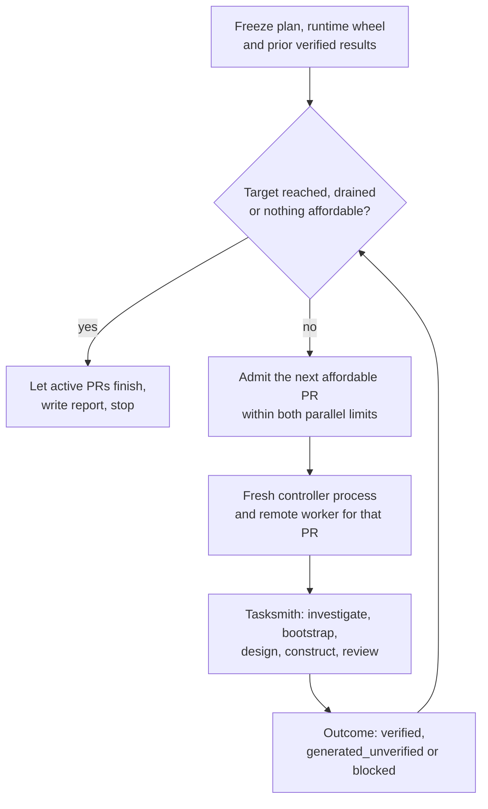

A batch runs [Tasksmith](tasksmith.md) over a list of PRs in parallel, under one spending cap, until it reaches a target number of verified tasks. Each PR runs in its own isolated [controller](../concepts/glossary.mdx#controller) process with its own remote [worker](../concepts/glossary.mdx#worker), and the batch keeps every generated task and revision, including those that need repair. Start one once a single PR works end to end ([Run one PR](tasksmith.md#run-one-pr)).

## When to use a batch

| | `tasksmith run` | `tasksmith batch` |
|---|---|---|
| Input | A panel: a name and 1–100 PR URLs | A plan: 1–1,000 candidates, each with its own options |
| Concurrency | One PR at a time, on one worker | Up to `max_parallel` PRs, each in its own process and worker |
| Options | One set for the whole panel | Per candidate, including GPU count |
| Stops when | Every selected PR has been processed | The verified target is reached, nothing affordable remains, or the plan is exhausted |
| Spending cap | `max_spend_usd` in the options | The batch's `max_spend_usd`, plus each candidate's own cap |
| Earlier results | `--generation-run` and the other reuse flags | `prior_verified` counts toward the target, plus per-candidate reuse |

## Run a batch

You need the same setup as for one PR: the extras, `tasksmith install-runtime`, a fresh runtime wheel and an existing [campaign](../concepts/glossary.mdx#campaign). A batch never creates, raises or resets the campaign limit.

```bash
uv run repo2rlenv tasksmith batch plan.json \
  --campaign workspace/tasksmith \
  --output workspace/tasksmith-batch \
  --runtime-wheel dist/repo2rlenv-0.9.3-py3-none-any.whl
```

Add `--env-file FILE` to load credentials from a specific file, or `--json` for a machine-readable report. The command exits `0` only when the plan's verified target is reached. Check progress at any time, without paid calls:

```bash
uv run repo2rlenv tasksmith show workspace/tasksmith-batch
```

## Write the plan

A minimal plan names the batch, sets a target and a cap, and lists candidates. Each candidate's `options` takes the same object as `tasksmith run --options`, so `{}` uses the defaults.

```json
{
  "name": "more-itertools-batch",
  "target_verified": 2,
  "max_parallel": 2,
  "max_spend_usd": "50.00",
  "candidates": [
    {
      "url": "https://github.com/more-itertools/more-itertools/pull/1193",
      "options": { "provider": "daytona" }
    },
    {
      "url": "https://github.com/more-itertools/more-itertools/pull/1251",
      "options": { "provider": "daytona" }
    }
  ]
}
```

| Plan field | Default | Meaning |
|---|---|---|
| `name` | required | Lowercase name: a letter, then up to 30 letters, digits or hyphens |
| `candidates` | required | 1–1,000 unique PRs. A trailing slash doesn't make a URL distinct |
| `target_verified` | `50` | Stop once this many verified tasks exist, counting `prior_verified` (1–1,000) |
| `max_parallel` | `2` | PR controllers running at once (1–8) |
| `max_gpu_parallel` | `2` | How many of those may be GPU tasks (1–8) |
| `max_spend_usd` | `"200.00"` | Batch spending cap. The campaign limit still applies |
| `prior_verified` | `[]` | Quality `result.json` paths for tasks you already verified. They count toward the target, and their PRs are skipped |

| Candidate field | Meaning |
|---|---|
| `url` | A merged public GitHub PR URL. Required |
| `options` | Tasksmith [options](tasksmith.md#options) for this PR. Required |
| `source_record` | A previously frozen PR record, validated before any paid work. Without one, intake freezes the PR from GitHub |
| `generation_run`, `reuse_evidence` | Reuse a checksum-bound generation from an earlier run and apply the current quality policy |
| `prepared_task` | An existing generated task to revalidate with fresh quality checks. Requires `source_record`, and can't be combined with `generation_run` |
| `prepared_probes` | Probe definitions to replay on `prepared_task`. See [Reuse earlier work](#reuse-earlier-work) |

The amounts are caps for bounded allocation. They don't predict what a task costs or guarantee how many succeed.

## How scheduling works



The scheduler starts a PR only when a slot is free under `max_parallel` and, for a GPU candidate, under `max_gpu_parallel`. It walks the plan in order and takes the first candidate whose `worker_reservation_usd` fits the budget that remains and whose GPU need fits. A CPU PR later in the list can therefore start while the GPU slots are full. A two-GPU PR counts as one GPU controller and still requests both devices.

Running PRs hold target slots. With 49 verified tasks and a target of 50, the batch runs one PR at a time, whatever `max_parallel` says. A PR that finishes without a verified task frees its slot for the next pending one.

Each admitted PR runs in a fresh Python subprocess started with `-I`. It imports the Repo2RLEnv package extracted from the exact runtime wheel into a read-only directory, so editing your checkout doesn't change a running batch. Supervisor threads in the parent only launch and wait for these processes. Credentials come from the environment and are never written into the request. Third-party libraries still come from the Python environment you run the command in.

## Budget

A batch's paid operations reserve through nested scopes: the campaign limit, the batch's `max_spend_usd`, the candidate's `max_spend_usd` and its quality cap. The shared SQLite ledger checks all of them in one transaction at dispatch, so no stage can bypass the batch cap. The check before a PR starts only avoids launches that obviously can't be afforded; the reservation at dispatch is what enforces the limits.

A completed operation can cost more than it reserved. The overrun is recorded and counts against later work. Operations with uncertain outcomes keep their reservation. When a Modal worker's termination is confirmed, the batch settles it automatically with a conservative allocation-time estimate, which is not a provider invoice. Other providers' reservations stay open until you settle them with [`campaign settle`](../guides/remote-execution.mdx#stop-the-worker-and-settle-its-cost).

## What the batch writes

| Path | Contents |
|---|---|
| `configuration.json` | Frozen plan, controller identity, runtime hash, prior verified results and campaign path |
| `runtime/` | The exact wheel and a read-only copy of its package |
| `report.json` | Verified count and target, new verified, generated-but-unverified and blocked counts, per-PR rows, budget totals, stop reason and pending PRs |
| `candidates/<pr-hash>/` | The PR's complete Tasksmith output, in the [same layout](tasksmith.md#what-the-run-writes) as a single run |
| `candidates/<pr-hash>/batch-result.json` | The PR's outcome and the path of every task it produced |
| `candidates/<pr-hash>/controller.stdout`, `controller.stderr` | Subprocess logs, saved with private file permissions |

Each PR ends with one outcome:

| Outcome | Meaning |
|---|---|
| `verified` | Its quality result passes the shared label validator: controls, probes, trial evidence and a judged rollout |
| `generated_unverified` | At least one Harbor task exists, but none is verified |
| `blocked` | No Harbor task was produced, or its controller was interrupted |

These outcomes describe scheduling. The detailed diagnosis is the [evaluation label](task_evaluation_labels.md) in each task's `task.toml`. Revisions and probe variants stay evidence for their PR and never count as extra verified environments, and the batch rejects duplicate PRs or bundle hashes among its verified results.

The report's `stop_reason` says why the batch stopped:

| `stop_reason` | Meaning |
|---|---|
| `target_reached` | The verified count met `target_verified`. The only reason that exits `0` |
| `panel_exhausted` | Every candidate ran |
| `budget_headroom` | Candidates remain, but none fits the remaining budget |
| `drained` | A drain request stopped admission |
| `reconciliation_required` | A controller was interrupted or a worker's cleanup is uncertain |

## Resume, drain and stop

**Resume.** Run the identical command with the identical plan. PRs that already finished are imported rather than rerun, and a saved success is rechecked against its evidence. Changing the plan, options, controller code or wheel requires a new output directory, which leaves the old evidence untouched. Candidates that already ran aren't retried.

**Drain.** Create `drain-request.json` in the batch directory to stop admission while active PRs finish normally:

```bash
touch workspace/tasksmith-batch/drain-request.json
```

The report then shows `stop_reason: "drained"` and keeps the pending list. The marker stays on disk, so rerunning the unchanged command admits nothing until you delete it. Use a drain as a clean boundary before you switch to a new wheel or concurrency setting. A new batch directory starts its own cap, so size it with the earlier spend and any unresolved reservations in mind.

**Interruptions.** If the batch process stops, rerunning it imports every child that wrote its result. A worker whose cleanup is uncertain stops all new dispatch until you reconcile its receipt ([Stop the worker and settle its cost](../guides/remote-execution.mdx#stop-the-worker-and-settle-its-cost)), after which the same command continues. A child that was interrupted without a result stays `blocked` and keeps the batch at `reconciliation_required`. Reconcile its receipts, then continue in a new output directory that lists the verified results under `prior_verified`. The runner never kills an unknown sandbox or relaunches an uncertain model call.

## Reuse earlier work

**Tasks you already verified.** List each one's quality `result.json` under `prior_verified`. The batch checks its controls, probes, raw trial evidence and judged rollout with the shared label validator, reads the PR URL from the task's metadata, counts it toward the target and skips that PR.

**An existing generated task.** Give a candidate `prepared_task` and its frozen `source_record`. The batch runs fresh quality validation on it and imports no old trials.

**Specific counterexamples.** Add `prepared_probes` to that candidate, in the quality loop's probe manifest format:

```json
{
  "bundle_hash": "sha256:…",
  "probes": [
    {
      "name": "drops-last-chunk",
      "kind": "wrong_solution",
      "focus": "general",
      "rationale": "…",
      "evidence": [{ "path": "…", "quote": "…" }],
      "script": "…"
    }
  ]
}
```

`kind` is `wrong_solution` or `valid_alternative`, and `script` is what the probe runs. The bundle hash must match the prepared task exactly, probe names must be unique, and the count must fit within `options.quality.max_probes`. If the options set `required_probe_focus`, the task must already carry those annotations, so create that revision first and bind the probes to its hash. The batch checks all of this before any provider work. It then freezes the definitions and replays them through the quality loop, importing no earlier rewards or trial receipts. Changing the definitions requires a new batch directory. Without `prepared_probes`, the review proposes probes as usual.

**From Python.** Campaign controllers that call `run_batch` directly can pass `expected_prior_verified`, a proof inventory bound when the campaign was prepared, and the batch rejects any fresh result that differs before allocating work. They can also pass `preallocation_check`, a callback that rechecks shared capacity and budget after evidence validation; raising an exception prevents dispatch.

## Limits

- **At most eight parallel controllers.** Each PR creates its own worker, so your provider account's concurrency limits apply as well.
- **One attempt per PR per batch directory.** A PR that ends `blocked` or `generated_unverified` isn't retried implicitly.
- **Estimated compute.** Modal settlements are allocation-time estimates, not invoices, and other providers need manual settlement.
- **A target isn't a yield.** Reaching `target_verified` says nothing about the share of attempted PRs that convert.
