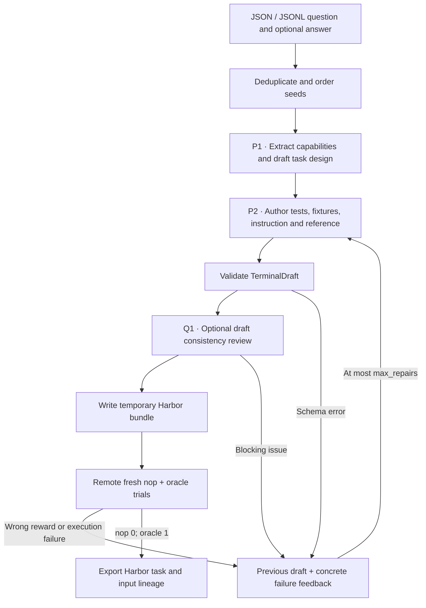

**`seta_seed2synth`** was the first recipe implemented. It's adapted from
[SETA](https://github.com/camel-ai/seta/tree/e4715b01174e6c9503fc46120d81dd692ced75e6)
and keeps SETA's two released stages: turning a seed into a task idea, and
building the datapoint test-first. The controller writes the structured author
output as a Harbor task, runs a fresh baseline and reference, and sends failures
back to the builder for a bounded number of repairs.

## Pipeline, step by step



`P1`, `P2`, … mark real model calls. Unlabelled stages are code or remote execution.

**Choose the skill.** A seed is evidence of a real workflow. One design call extracts `core_capabilities` and a `draft_spec`; capability extraction and task design aren't separate API calls.

**Materialize the task.** The builder returns every file through `TerminalDraft`. It's told to think about the tests first, but this recipe has no separate test-author call.

**Execute and repair.** The controller owns the Dockerfile scaffolding, test contracts and reward code. It rebuilds the task remotely and sends the actual schema, baseline or oracle failures back to the same builder.

## Every prompt and its data

If the first attempt succeeds, there are two authoring calls: design, then
builder. With `review_drafts: true`, Q1 adds a consistency review before
execution. Each repair reruns the builder and, when it's enabled, Q1. See the
[shared Q1 walkthrough](prompt_reference.md#optional-review-before-execution).

| Call | System prompt composition | User / input material | Output | Retry or branch |
|---|---|---|---|---|
| P1 · Design | idea_prompt.md + owned adaptation | Full seed JSON: question, optional answer, source metadata. | TaskDesign: core_capabilities, draft_spec | Invalid schema skips this seed. |
| P2 · Build / repair | builder_prompt.md + shared materialization instructions | Design and accumulated feedback, including the previous draft after a failure. | TerminalDraft | Initial call plus max_repairs retries; default three builder attempts. |

The [complete seta_seed2synth prompt reference](https://huggingface.github.io/Repo2RLEnv/pipelines/prompts/seta_seed2synth/) has every retained template, appended instruction, substitution, example and output schema. The [shared prompt guide](prompt_reference.md) shows how to inspect the fully resolved request from a real run.

## Follow one task

Say the seed is a question about filenames that contain spaces. It becomes a directory-processing task with awkward filenames, a precise output contract, a shell reference, and tests that inspect the resulting files. The seed's answer informs the design, but it isn't copied into the learner's instruction automatically.

## What repeats, what is checked

A completed pair must score exactly 0 for the unsolved task and 1 for the reference. The model's `self_review` is a consistency note, not proof that either run passed. Parent and source metadata, and the model requests, stay separate from the files the learner can see.

An exported bundle is a generation result. Independent leakage review, shortcut probes and blind solver traces come later, in the quality campaign.

## Implementation map

- [`seta_seed2synth/recipe.py`](https://github.com/huggingface/Repo2RLEnv/blob/main/src/repo2rlenv/pipelines/recipes/seta_seed2synth/recipe.py)
- [`terminal/runner.py`](https://github.com/huggingface/Repo2RLEnv/blob/main/src/repo2rlenv/pipelines/recipes/terminal/runner.py)
- [`terminal/draft.py`](https://github.com/huggingface/Repo2RLEnv/blob/main/src/repo2rlenv/pipelines/recipes/terminal/draft.py)
- [`terminal/grade.py`](https://github.com/huggingface/Repo2RLEnv/blob/main/src/repo2rlenv/pipelines/recipes/terminal/grade.py)

## Input and CLI

Supply a JSON array or a JSONL file of seed objects. Each one needs `source`,
`title` and `question_text`; include `answer_text`, `tags`, `url`, attribution
and license metadata when you have them. Exact duplicate records are removed
before any model call. Seed files are input data, not an upstream package
dependency.

```json
{"source":"unix_linux_se","title":"Preserve filenames with spaces","question_text":"A batch script splits paths containing spaces. How can its traversal preserve complete filenames?","answer_text":"Use a delimiter that cannot occur in filenames and keep expansions quoted."}
```

Create a campaign and a remote worker as described in [owned recipes](owned_recipes.md),
build the runtime with `uv build`, then run:

```bash
repo2rlenv generate --config examples/owned-seta.yaml
repo2rlenv generate --config examples/owned-seta.yaml --resume --json
```

| Option | Default | Meaning |
|---|---:|---|
| `target` | 20 | Number of execution-verified generated tasks |
| `max_candidates` | 40 | Maximum distinct input records to try |
| `max_repairs` | 2 | Builder repairs after the first attempt |
| `seed` | 24 | Deterministic ordering of the input records |
| `max_tokens` | 10000 | Maximum output tokens per builder call |
| `test_timeout_sec` | 120 | Time limit for the generated tests |

Run receipts keep the source identity, model requests, task designs, every
materialized attempt, the author's self-review and the actual Harbor trial
results. A completed export is reused only when its content matches the recorded
identity. Ambiguous remote outcomes stop dispatch; they're never silently
retried.

## Supported profile and adaptations

The current profile is a Linux CPU container based on Python 3.12, with bash,
jq, sqlite3, git, curl, tmux, uv and pytest. Tasks can install more dependencies
during the image build. Execution is offline. Systemd, privileged networking,
GPUs and external services are outside this profile. Verifiers inspect the final
container state, and reference and test files are kept out of the learner
image's build context.

The upstream idea and datapoint prompt files are kept, with their Apache-2.0
license. The runtime changes three things. Folder and tool output becomes strict
JSON, legacy Harbor metadata becomes schema 1.3, and test scripts that install
from the network are replaced by preinstalled dependencies and deterministic
JUnit parsing. Five to ten weighted tests and an author self-review are still
part of the method, and the reward is binary. This is a documented adaptation of
the workflow, not byte-identical upstream execution.

The released collection has **100 tasks**: 23 kept from earlier runs and 77 new
exports. Each of the 77 new exports has receipts showing a baseline reward of 0
and a reference reward of 1. The expansion recorded **$54.64**: $41.74 of model
usage across 617 calls and $12.90 of estimated worker and build costs. That's
**$0.71 per new export**, counting unsuccessful attempts, with no reservations
outstanding. The kept tasks and any later independent validation aren't included
in that cost.

The new exports map to **77 distinct source questions**. Common source tags are
jq (18), bash (15), find (15), awk (13), sed (13) and tar (10); a question can
carry several tags. Source URLs and question and answer attribution stay attached to
the task lineage. Eight source records have no recorded content license, and the
report leaves that gap visible instead of guessing a license. See the
[dataset manifest](https://huggingface.co/datasets/FineEnvs/repo2rlenv-seta-seed2synth/resolve/main/manifest.json),
[generation economics](economics.md) and
[published Harbor dataset](https://huggingface.co/datasets/FineEnvs/repo2rlenv-seta-seed2synth).

Specification audits, adversarial verifier checks and blind solver evaluations
come after generation. A passing author self-review isn't independent quality
acceptance. The [release inventory](releases.md) records the labels for every
method.

See [RFC 0013](../rfcs/0013-seta-seed2synth-recipe.md) and the packaged
`pipelines/recipes/seta_seed2synth/provenance.md` for the source mapping and
notices.

## Cost evidence

See the [measured yield and cost](economics.md) and
[seta-seed2synth accounting](experiment_accounting.md#seta-seed2synth) for the pilot/expansion
scope, model identities, stage costs, compute resources and validation limits.
