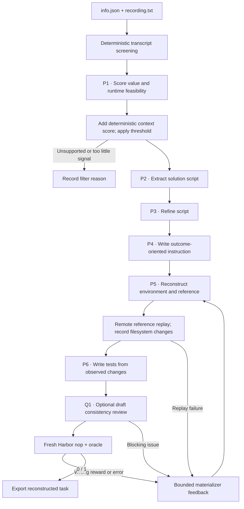

TerminalWorld rebuilds executable tasks from real terminal recordings. Its tests
come from the public goal and from what the reference actually did when it ran.

## Pipeline, step by step



`P1`, `P2`, … mark real model calls. Unlabelled stages are code or remote execution.

**Screen the input.** Before any model call, transcripts that match credential or PII patterns are filtered out. P1 scores three axes from 0 to 3 and reports the tools, the command count and whether the recording is supported. A bounded probe of public links adds a fourth context score, also from 0 to 3.

**Recover intent and actions.** A recording needs `supported=true`, at least three commands, and a total score of at least `min_score`. The recipe extracts and refines the script, then writes the instruction from the metadata and the refined script.

**Observe before verifying.** The environment builder sees the transcript evidence and produces real dependencies, starting fixtures and a reference. The test author only comes in after a successful replay that leaves persistent changes, and it sees bounded initial and final paths, contents and stdout.

## Every prompt and its data

A successful first attempt makes six authoring calls: score, extract, refine,
instruction, environment and tests. Filtered inputs use zero or one call. With
`review_drafts: true`, the shared runner adds a
[Q1 consistency review](prompt_reference.md#optional-review-before-execution)
after P6, and blocking issues go back into the materializer's existing bounded
loop.

| Call | System prompt composition | User / input material | Output | Retry or branch |
|---|---|---|---|---|
| P1 · Score | score_long_prompt.md for >40 transcript lines; otherwise score_short_prompt.md | Screened metadata and transcript. | RecordingScore: three scores, reasoning, supported, command_count, required_tools | Default total threshold four out of twelve; not a final quality score. |
| P2 · Extract | extract_prompt.md | Full screened seed. | Script: solution_shell | One call after filtering. |
| P3 · Refine | refine_prompt.md | Extracted Script only. | Script: solution_shell | A separate call. |
| P4 · Instruction | instruction_prompt.md | Title, description and refined solution. | Instruction: instruction | No tests exist yet. |
| P5 · Environment / repair | environment_prompt.md + owned environment adaptation | RecordingDesign, including transcript evidence, and accumulated feedback. | EnvironmentBuild: setup, files, solution_shell, self_review | Reference is executed remotely before P6. |
| P6 · Tests | tests_prompt.md + observed-state adaptation | Instruction, reference script and execution_snapshot. | TestProgram: code | Repeated when a repaired environment reaches replay successfully. |

The [complete terminalworld prompt reference](https://huggingface.github.io/Repo2RLEnv/pipelines/prompts/terminalworld/) has every retained template, appended instruction, substitution, example and output schema. The [shared prompt guide](prompt_reference.md) shows how to inspect the fully resolved request from a real run.

## Follow one task

Say a recording shows a Git workflow. It becomes a self-contained starting repository fixture. The reference performs the recorded transformation, and the tests inspect the resulting files or Git state that were observed. The original transcript is evidence for authoring, not the learner's prompt.

## What repeats, what is checked

A materialization retry rebuilds the environment and, if the replay succeeds, regenerates the tests. This loop doesn't regenerate the extraction or the instruction. Recordings that need an opaque TUI, external accounts, a GPU or unsupported services are filtered out at input. A provider timeout counts as an uncertain request, not a verdict that the task is low quality.

An exported bundle is a generation result. Independent leakage review, shortcut probes and blind solver traces come later, in the quality campaign.

## Implementation map

- [`terminalworld/source.py`](https://github.com/huggingface/Repo2RLEnv/blob/main/src/repo2rlenv/pipelines/recipes/terminalworld/source.py)
- [`terminalworld/privacy.py`](https://github.com/huggingface/Repo2RLEnv/blob/main/src/repo2rlenv/pipelines/recipes/terminalworld/privacy.py)
- [`terminalworld/recipe.py`](https://github.com/huggingface/Repo2RLEnv/blob/main/src/repo2rlenv/pipelines/recipes/terminalworld/recipe.py)
- [`terminalworld/materialize.py`](https://github.com/huggingface/Repo2RLEnv/blob/main/src/repo2rlenv/pipelines/recipes/terminalworld/materialize.py)
- [`terminalworld/worker.py`](https://github.com/huggingface/Repo2RLEnv/blob/main/src/repo2rlenv/pipelines/recipes/terminalworld/worker.py)
- [`terminal/runner.py`](https://github.com/huggingface/Repo2RLEnv/blob/main/src/repo2rlenv/pipelines/recipes/terminal/runner.py)

## Run and supported profile

Provide a directory with one or more native recording folders, each containing
`info.json` and `recording.txt`. The metadata includes `title`, `description`,
`id` and `url`. To fetch public source recordings by numeric ID:

```bash
python -m repo2rlenv.pipelines.recipes.terminalworld.source \
  --ids-json workspace/recording-ids.json --out workspace/recordings
repo2rlenv generate --config examples/owned-terminalworld.yaml
```

The ID file is a JSON list such as `["100135"]`. Acquisition fetches only text
and metadata, checks robots.txt and records download failures. Existing inputs
are reused. Export the generated task bundles, not the raw recordings.

To find new sources without using an upstream task dataset, index a bounded
number of public explore pages first:

```bash
python -m repo2rlenv.pipelines.recipes.terminalworld.discovery \
  --feeds recent featured popular --pages-per-feed 5 --out workspace/recording-index
python -m repo2rlenv.pipelines.recipes.terminalworld.source \
  --ids-json workspace/recording-index/ids.json --out workspace/recordings
```

Discovery uses the native public, recent, featured and popular feed URLs. It
keeps only numeric recording IDs and page receipts, caps pages and response
sizes, checks robots.txt, waits between requests, and stops a feed when a page is
empty or repeats. Completed pages are reused on restart. New inputs still go
through the same privacy and feasibility filters; finding a recording doesn't
make it a task. Use one acquisition process per recording directory so its
receipt stays intact.

You can also pass a JSON list of explicit public profile paths, such as
`["/~example"]`, with `--profiles-json workspace/profiles.json`. Profile paths
are limited to Asciinema, and a combined discovery run allows at most 200 pages.
This is Repo2RLEnv's own source-curation extension to the native explore feeds.
Once the explore feeds started repeating, the scale campaign picked public
profiles linked from earlier usable recordings. So it samples related workflows,
and it isn't a random or representative terminal benchmark.

Acquisition writes `acquisition.json` with a state of running, interrupted or
completed. Completion is bound to the current `retrieval.json` hash. A controller
can wait for a useful batch of new recordings, then take a smaller final batch
only once acquisition completes. A download failure stays in the retrieval
receipt and never counts as a successful input.

The first runtime profile supports a single offline CPU Linux container. It
installs real dependencies during the build. As the native builder allows, it can
synthesize missing input files when the recorded workflow gives enough evidence.
It excludes opaque TUI, GPU, privileged networking, multi-service and
external-account workflows. The value score is an upstream input-selection
stage, separate from the later task-quality audit.

An empty `environment_files` list is valid when the learner builds the requested
deliverables from scratch. The owned Dockerfile and dependencies still define the
environment, and the reference and verifier requirements are unchanged. Before
the schema accepted this, a recorded compilation task with a valid starting state
used up its repair reservation because a placeholder fixture was required.

Options include the shared terminal generation bounds and `min_score`, which
defaults to four out of twelve, the native bronze threshold. The snapshot records
file changes and bounded content prefixes. The test author reads that execution
evidence before the fresh baseline and reference trials.

## Measured results and limits

The [dataset](https://huggingface.co/datasets/FineEnvs/repo2rlenv-terminalworld)
has 100 tasks. The measured sample produced 80 new exports from 1,293 recorded
candidate IDs, counting recordings rejected during design screening. Generation
cost averaged **$1.26 per new task**, including estimated compute and failed
attempts. That isn't the conversion rate among designs that were already
approved. See [economics](economics.md) for the counting rules and sample scope.

Three published tasks are labeled `needs_repair`. Two have verifiers that don't
run the required scripts. The third checks C source keywords and the executable
format without establishing the process behavior the task asks for. The other 97
are still `unverified`, pending independent quality acceptance. One task was
completed by an assisted recovery of saved authoring output after the
empty-fixture schema fix, and its provenance records that intervention. Passing
baseline and reference controls doesn't show resistance to reward shortcuts, and
it doesn't replace independent review and blind solver rollouts.

Credit: [TerminalWorld](https://github.com/EuniAI/TerminalWorld) (Apache-2.0),
commit `784698ba93735470ce1664bff2ec44bcd7b28e15`. See
[RFC 0019](../rfcs/0019-terminalworld-recipe.md) and the packaged
`recipes/terminalworld/provenance.md` for the exact source map and adaptations.

## Cost evidence

See the [measured yield and cost](economics.md) and
[terminalworld accounting](experiment_accounting.md#terminalworld) for the pilot/expansion
scope, model identities, stage costs, compute resources and validation limits.
