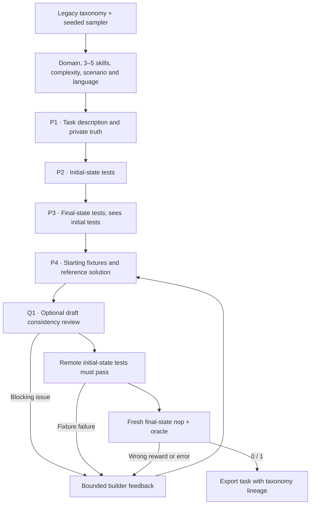

TMax combines several terminal skills into a new task, and checks that the
starting environment really contains the fixtures the task describes.

## Pipeline, step by step



`P1`, `P2`, … mark real model calls. Unlabelled stages are code or remote execution.

**Sample requirements.** The sampler keeps the legacy TMax domain and skill axes, weighted languages and optional anchors in real software. This profile uses the first three task-complexity categories.

**Separate starting and solved states.** P1 writes a public description and a private truth. P2 writes tests for what must exist before solving. P3 sees those tests and describes the finished state.

**Build and test both states.** The builder creates the starting fixtures and the reference. The initial-state tests run before the final-state baseline and oracle trials. The common builder can use execution feedback to fix an expectation that doesn't hold.

## Every prompt and its data

The first successful attempt makes four calls: template, initial tests, final
tests, and the environment and reference builder. With `review_drafts: true`, a
[Q1 consistency review](prompt_reference.md#optional-review-before-execution)
follows these four native authoring stages. Q1 runs on each complete draft
before the initial-state tests and sends blocking defects back to P4, within its
existing repair limit.

| Call | System prompt composition | User / input material | Output | Retry or branch |
|---|---|---|---|---|
| P1 · Template | template_prompt.md with domain_label and DOMAIN_MODULES substitutions; v2_block is empty | Sampled taxonomy requirements. | TaskTemplate: description, truth | Legacy corpus only. |
| P2 · Initial tests | initial_prompt.md + shared adaptation | Description, private truth; initial_tests is null. | TestProgram: code | Five to ten top-level pytest tests. |
| P3 · Final tests | final_prompt.md + shared adaptation | Description, truth and generated initial_tests. | TestProgram: code | Separate model call. |
| P4 · Build / repair | environment_prompt.md + templates.builder_prompt additions + common materialization | Complete TemplateDesign and failure feedback. | TerminalDraft | Default initial build plus two repairs. |

The [complete tmax prompt reference](https://huggingface.github.io/Repo2RLEnv/pipelines/prompts/tmax/) has every retained template, appended instruction, substitution, example and output schema. The [shared prompt guide](prompt_reference.md) shows how to inspect the fully resolved request from a real run.

## Follow one task

Say the sampled skills are time series, encoding and aggregation, and they become a sensor-data task. The initial tests check the supplied input fixture, the final tests check the cleaned aggregate the task asks for, and the reference performs the transformation.

## What repeats, what is checked

P1 to P3 run once per sampled design. Failed initial fixtures, or failed final baseline or reference checks, go back to P4. The first runtime supports text fixtures and an unprivileged offline solver. The reward is binary: 1 only if every required test passes. Stored weights don't make the current grader fractional.

An exported bundle is a generation result. Independent leakage review, shortcut probes and blind solver traces come later, in the quality campaign.

## Implementation map

- [`tmax/sampler.py`](https://github.com/huggingface/Repo2RLEnv/blob/main/src/repo2rlenv/pipelines/recipes/tmax/sampler.py)
- [`tmax/recipe.py`](https://github.com/huggingface/Repo2RLEnv/blob/main/src/repo2rlenv/pipelines/recipes/tmax/recipe.py)
- [`terminal/templates.py`](https://github.com/huggingface/Repo2RLEnv/blob/main/src/repo2rlenv/pipelines/recipes/terminal/templates.py)
- [`terminal/runner.py`](https://github.com/huggingface/Repo2RLEnv/blob/main/src/repo2rlenv/pipelines/recipes/terminal/runner.py)
- [`terminal/preflight.py`](https://github.com/huggingface/Repo2RLEnv/blob/main/src/repo2rlenv/pipelines/recipes/terminal/preflight.py)
- [`terminal/grade.py`](https://github.com/huggingface/Repo2RLEnv/blob/main/src/repo2rlenv/pipelines/recipes/terminal/grade.py)

## Run and supported profile

Run `repo2rlenv generate --config examples/owned-tmax.yaml`. The seed file is a
JSON sampler configuration, for example:

```json
{"corpus_kind":"legacy","count":40,"seed":24,"domains":["data_processing","file_operations","data_querying"],"languages":["Python","Bash"]}
```

Omit `domains` or `languages` to keep the full taxonomy for that axis. The
sampler keeps the upstream legacy axes and weighted language selection, and a
restriction selects a conditional subset. The configuration and the sampled axes
are recorded with the generated artifacts. Options include `target`,
`max_candidates`, `max_repairs`, `seed`, `test_timeout_sec` and `max_tokens`.

This first profile generates text fixtures in a single CPU Docker container. All
dependencies are installed during the image build. The solver runs as `user`,
with no internet at runtime, and can edit `/workspace` and `/home/user`. The
initial-state tests, final-state tests and reference stay outside the learner
image. The builder gets execution errors back for a bounded number of repairs.

The [published dataset](https://huggingface.co/datasets/FineEnvs/repo2rlenv-tmax)
has 55 tasks. The measured sample added 35 of them, at an average of **$2.10 per
new task** including failed attempts and estimated compute. See
[economics](economics.md) for the sample denominator and unresolved charges.

Generation runs the native initial-state check and a fresh Harbor baseline and
reference pair. Detailed reward-hack review, blind solver trials and independent
acceptance are separate from generation. TMax v2 multimodal fixtures, metric
verifiers and the upstream stage that samples solutions at scale are outside this
first profile.

Use the [shared worker, budget and progress interface](owned_recipes.md) for
Modal or Daytona. Credit: [TMax](https://github.com/hamishivi/tmax) (Apache-2.0),
commit `7387d2f9142397a458dc39f0827a2ab0b4c03cda`. See
[RFC 0018](../rfcs/0018-tmax-recipe.md) and the packaged
`recipes/tmax/provenance.md` for the retained files and adaptations.

## Cost evidence

See the [measured yield and cost](economics.md) and
[tmax accounting](experiment_accounting.md#tmax) for the pilot/expansion
scope, model identities, stage costs, compute resources and validation limits.
