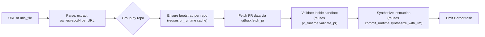

**Status:** draft
**Author:** `@adithya-s-k`
**Created:** 2026-07-15
**Implemented by:** _(pending)_
**Reference dataset:** _(pending)_

## Summary

Take a **single GitHub / GitLab PR URL** (or a curated list) and produce **one Harbor RL environment per PR**, verified end-to-end. Same task shape and verifier as `pr_runtime`; the difference is the input surface: a specific PR the user hands you, not a mining sweep over a repo's history. **First "import-shape" pipeline in the set.**

## Motivation

### The pattern this pipeline breaks

Everything we ship today is a **mining pipeline**: `--repo <owner/name>` → walk PRs / commits / CVEs → filter → keep whatever passes the yield gate. Mining is the right shape when you want to build a 100-env reference dataset from a repo you care about. It's the *wrong* shape for three real workflows we hit repeatedly:

1. **Reproducing a reported bug as an eval.** Someone (Slack, GitHub issue, a paper) says "this specific PR is a good regression to test agents on." Today the only way to consume it is `pr_runtime --repo <owner/name> --pipeline-opt limit=1000` and hope your target PR is in the surviving set. A single-URL input is a mining-shape hack.
2. **Curated hand-picked benchmarks.** A researcher hands you 50 PR URLs across 20 repos ("these are the ones we want in the benchmark"). Today: 20 separate `pr_runtime` invocations with narrow limits, then union the outputs. Mining machinery working against you when you already know the answer.
3. **Ad-hoc RL training on user-provided regressions.** A team wants to fine-tune their agent on the PRs *their own users* filed against their infra. They know the URLs; they don't want the mining framework.

### Mining vs. import: a naming distinction worth making

`pr_to_env` isn't just a mining pipeline with a smaller input; the assumption underneath it is *inverted*. Mining says "here's a corpus, tell me what qualifies." Import says "here's what qualifies, tell me if you can build it." The consequences ripple through the design:

|                | **Mining** (`pr_runtime`, `commit_runtime`, `cve_patches`, ...) | **Import** (`pr_to_env`) |
|---|---|---|
| Input | one repo, N candidates | N specific artifacts (PRs), no filtering promise |
| Yield semantics | `emitted ÷ candidates_examined`, expected < 100% | per-URL success/skip; user expects an env or a *specific reason* for each URL |
| `limit` / `since` / `lite_filter` | central | absent (user did the filtering) |
| Failure semantics | filtered → dropped silently | filtered → surface the reason per URL |
| CLI shape | `--repo` | `--pipeline-opt url=…` or `--pipeline-opt urls_file=…` |

The counter-argument: *"just add a `--pr-urls` option to `pr_runtime`."* That works up to a point but muddies the pipeline contract. `pr_runtime`'s options are all mining knobs (`limit`, `since`, `require_fail_to_pass`, `lite_filter`, `min_problem_statement_words`); the mental model is "walk history, apply gates, emit surviving." A URL-list input needs an entirely different failure-reporting story (per-URL, not aggregate) and forbids most of the mining options as meaningless.

`pr_to_env` is `pr_runtime`'s *consumption-side* sibling: same output, same verifier, different input assumption. If import turns out to be a useful shape, later RFCs can add `commit_to_env` (one commit URL → one env), `issue_to_env` (one issue URL → resolve it), etc. Same category, same "per-URL result" contract.

## Design

### Input

- **Source:** GitHub · GitLab (whatever URLs are given; the input-source abstraction routes per-URL).
- **Trigger:** two forms:

  ```bash
  # single URL
  repo2rlenv generate --pipeline pr_to_env \
    --pipeline-opt url=https://github.com/pallets/click/pull/3434 \
    --llm anthropic/claude-sonnet-4-6 \
    --out ./datasets/click-3434

  # curated file — one URL per line, comments ok
  repo2rlenv generate --pipeline pr_to_env \
    --pipeline-opt urls_file=./curated.txt \
    --llm anthropic/claude-sonnet-4-6 \
    --out ./datasets/curated
  ```

- **Options model:** `PrToEnvOptions`:

  ```python
  url: str | None = None                 # exactly one of url/urls_file must be set
  urls_file: Path | None = None
  strict: bool = True                     # if True, ANY per-URL failure is fatal (fail-fast)
                                          # if False, log + skip failures, emit the rest
  # Verification knobs inherited from pr_runtime — reused verbatim
  require_new_test_funcs: bool = True
  min_problem_statement_words: int = 0
  synthesize_with_llm: bool = True        # inherit commit_runtime's LLM synthesis for
                                          # leak-free instructions (same rationale)
  ```

  No mining knobs (`limit`, `since`, `lite_filter`), deliberately. If the user hands over 100 URLs, they get 100 attempts. `strict` controls what happens when a URL can't produce an env.

### Algorithm



1. **Parse URLs** into `(host, owner, name, pr_number)` tuples. Reject anything that isn't a PR URL with a clear error naming the URL.
2. **Group by repo** so bootstrap runs once per unique `(owner, name, ref)` rather than once per PR, the same optimization `pr_runtime` uses internally.
3. **For each repo**: ensure bootstrap (cache-hit path is instant); for each PR in that repo, fetch the PR metadata and diff via the existing `github.fetch_pr` / `gitlab.fetch_mr` (route through the input-source abstraction).
4. **Reuse `pr_runtime.validate_pr` verbatim** for the F2P/P2P validation inside the bootstrap container. No new verifier logic.
5. **Synthesize a leak-free instruction** the same way `commit_runtime` v0.8.4 does, because the raw PR body has the same leakage patterns as commit messages. `synthesize_with_llm=True` default.
6. **Emit a Harbor task** with the shared shape from `pr_runtime`.

### Output

- **Task shape:** identical to `pr_runtime`: `environment/Dockerfile`, `environment/docker-compose.yaml` (egress guard), `tests/test.sh`, `tests/verifier.py`, `tests/f2p.json`, `tests/p2p.json`, `solution/patch.diff`, `instruction.md`, `task.toml`.
- **Task ID:** `<owner>__<repo>-<pr_number>` (same as `pr_runtime`).
- **`[metadata.repo2env]` provenance:** same fields as `pr_runtime`, plus:
  - `pipeline = "pr_to_env"` (not `pr_runtime`, so consumers can distinguish curated tasks from mined ones)
  - `source_url = "<the URL that produced this task>"`: new field, so a consumer can trace back to what the user handed in.

## Verification

- **Reward kind(s):** `test_execution` + `diff_similarity` (same as `pr_runtime`).
- **Reward formula:** graded F2P/P2P: `reward = f2p_rate × p2p_rate`. Uses `_pr_runtime_verifier.py` verbatim, no fork.
- **Oracle invariant:** gold PR patch flips all F2P from FAIL→PASS while keeping all P2P green. `resolved=True`, `reward=1.0`. Same invariant as `pr_runtime`.
- **Non-tamper:** reuse `pr_runtime.build_eval_script`'s existing test-file reset + heredoc'd test-patch reapply. Nothing new.

## Anti-contamination

Same leak surface as `pr_runtime`: the PR is on GitHub, the fix is public. The existing `_env_guard.py` defenses apply verbatim:

- **Git-history scrub:** strip repo to `base_commit`, remove `origin`, prune future refs. Applies out of the box.
- **Egress guard:** blackhole `pypi.org` / `github.com` / their CDNs. Applies out of the box.
- **Instruction leak-strip:** reuse `commit_runtime`'s LLM synthesis path (`synthesize_with_llm=True` default) so the PR body's typical leaks (fix-commit SHA, "reverts b0e5..." lines, `Closes #N` trailers, `(#NNNN)` squash trailers) don't reach the prompt.

**Pipeline-specific leak concern:** the URL itself is a fix-pointer. Do NOT stamp `source_url` into `instruction.md`. It goes only into `task.toml`'s `[metadata.repo2env]` block for provenance; the agent never sees it. Confirmed: the emitter builds `instruction.md` from the PR body / linked issue only.

## LLM use

- **`at bootstrap` (cached):** one-time per (repo, ref). Reuses `pr_runtime`'s bootstrap; a curated list that reuses repos already in cache costs zero LLM.
- **`at synthesis` (per emitted task):** one call to rewrite the PR body into a leak-free problem statement. Same cost as `commit_runtime` v0.8.4 (single Sonnet call, ~$0.01–0.03 per task).

**Cost estimate for a 100-env curated dataset**: ~$1–3 of Sonnet calls if all bootstraps are cached; $3–8/uncached-repo for fresh bootstraps.

## Yield & repo suitability

Yield is fundamentally different from mining pipelines. **The user chose the URLs**, so there's no candidate-vs-emitted denominator in the usual sense. The relevant number is **per-URL success rate**:

- **~85–95% expected** on well-chosen PRs (has tests, tests are runnable, repo bootstraps clean).
- **Failure modes** worth surfacing to the user with distinct exit codes / skip reasons:
  - `no_test_patch`: PR doesn't add / modify any test file. Can't verify.
  - `bootstrap_failed`: the repo doesn't build in a slim container.
  - `no_fail_to_pass`: validation ran but no test flipped fail→pass with the fix applied.
  - `apply_failed`: the merged diff doesn't apply cleanly at `base_commit` (rare, but a rebased/squashed PR can hit this).
  - `network_error`: URL fetch failed.

When `strict=True`, any of these aborts the whole run with a clear per-URL error. When `strict=False`, log + skip, emit whatever succeeded, report the per-URL outcomes in `PipelineResult.skip_reasons`.

## Dependencies

**Reused pipeline machinery** (imported, not copied):
- `pr_runtime.validate_pr`: validation harness.
- `pr_runtime.build_eval_script`: graded test.sh emitter (with `fail_to_pass` + `pass_to_pass` args, the Arc 3 lesson).
- `pr_runtime.build_environment_dockerfile`: env Dockerfile.
- `pr_runtime._runtime_aux_files`: plain-artifact bakery.
- `pr_runtime._strip_info_leak`, `_reflow_pr_body`, `_linked_issue_number`: instruction hygiene.
- `commit_runtime`'s `synthesize_with_llm` path if we make it shared (currently in `commit_runtime.py`; may want to lift to `_synthesis.py`).
- `_env_guard.py`: anti-contamination guards.
- `github.fetch_pr` / `gitlab.fetch_mr`: via input-source abstraction.

**New code**: URL parser (owner/repo/number extraction, host detection), URL-list loader (`urls_file` reader), grouping-by-repo logic. Probably 100–150 LOC total.

**No new external deps.**

## Alternatives considered

1. **Add `--pr-urls` to `pr_runtime`:** rejected. Overloads `pr_runtime`'s contract (mining vs. curated). See Motivation.
2. **Make it a Python API function only** (`from repo2rlenv import pr_from_url`): rejected. CLI parity matters for users who consume everything through `repo2rlenv generate ...`. Nothing prevents adding a Python entry point too.
3. **Batch endpoint that takes a YAML manifest of PRs + per-PR overrides:** deferred. `urls_file` covers the common case; if users want per-URL overrides (different `require_new_test_funcs`, etc.) that's a follow-up option and a bigger design conversation.

## Rollout plan

1. **Smoke:** 5–10 individual PR URLs across `pallets/click`, `urfave/cli`, `gorilla/mux` (bootstraps cached from earlier arcs). Inspect emitted tasks; oracle-gate each; confirm `reward=1.0`.
2. **Scale:** a curated 100-PR list. The natural source: pick 100 top-scoring PRs from the existing `AdithyaSK/repo2rlenv-pr-runtime` dataset and re-import them via `pr_to_env`. Same envs should come out, which validates the pipeline against a known-good baseline.
3. **Oracle gate:** every URL that produced an env must score `reward=1.0`. Any that don't get dropped or investigated. Track resolved / command_resolved / eval_grade the same way.
4. **Real-agent eval:** stratified sample of 15 tasks with claude-code + Sonnet at `n=2`.
5. **Publish:** HF Hub dataset if we want a public reference; more likely `pr_to_env` is used ad-hoc without a public dataset.
6. **Docs:** `docs/pipelines/pr_to_env.md` with the "here's a URL, here's a task" walkthrough as the headline.
7. **Ship experimental:** `experimental = True` at merge. Not a mining pipeline, so no reference dataset requirement to promote. Promotion criterion is just "quality holds up on a diverse enough set of URLs."

## Open questions

- **Do we want `pipeline = "pr_to_env"` in the task.toml, or `pipeline = "pr_runtime"` with a `[metadata.repo2env.pr_to_env]` sub-block signaling the provenance?** The first makes the CLI + registry surfaces distinguish curated vs. mined, at the cost of two pipelines sharing a task shape. The second keeps everything as `pr_runtime` outputs but hides the difference. Leaning toward option 1 for clarity; open to being talked out of it.
- **Should we support commit URLs too?** A commit URL points at a specific commit (which may or may not be a merged PR). Would be `commit_import`: same design, separate pipeline for the same reason. Leave for RFC 0002 if there's demand.
- **How do we handle a URL to a merged PR whose `base_commit` no longer exists on the repo** (force-pushed / branch deleted)? Options: fail fast with a clear error, or fall back to the PR's stored `merge_base` from the API. Prefer the fallback.
- **`urls_file` format:** plain lines vs. TOML/YAML. Plain lines is simpler; TOML/YAML admits per-URL overrides down the road. Start with plain lines + `#` comments; upgrade if needed.

## References

- [`docs/pipelines/pr_runtime.md`](../pipelines/pr_runtime.md): the pipeline whose output shape + verifier `pr_to_env` reuses.
- [`docs/pipelines/commit_runtime.md`](../pipelines/commit_runtime.md): the pipeline whose LLM-synthesis instruction path `pr_to_env` inherits.
- [`docs/reference/RELATED_WORK.md`](../reference/RELATED_WORK.md): where the shipped provenance table will get its `pr_to_env` row on merge.
- SWE-bench (arXiv:2310.06770): the canonical "PR → RL env" mapping; `pr_to_env` differs from `pr_runtime` in *input surface*, not in the verifier.
