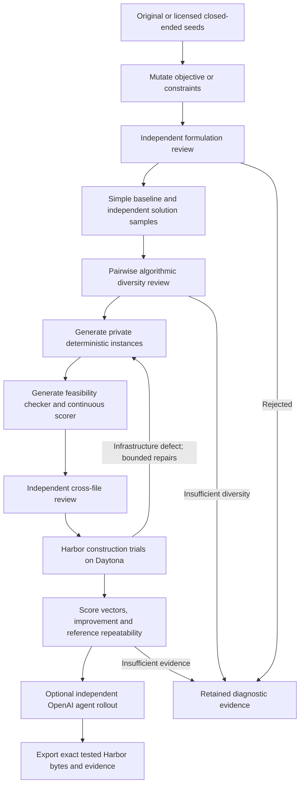

**Status:** implemented for 0.9.3; experimental; 100-task local collection completed

**Author:** adithya-s-k

**Created:** 2026-09-29

## Objective

Add `optimization_synth / frontiersmith` to the existing recipe CLI. Convert
closed-ended programming problems into offline optimization tasks with deterministic
graded rewards. Generation uses the OpenAI API; Docker builds and execution use a
remote worker, with Daytona selected for the pilot. The output is a standalone
Harbor task, not a record that depends on the generation checkout.

This is an independent implementation inspired by
[FrontierSmith](https://arxiv.org/abs/2605.14445). The upstream release at
`166c8be14a62b013ef78e6868e4355421c8c6456` explicitly withholds its orchestrator and
LLM-driven test/checker generators. We neither install that repository nor copy
its tasks, prompts or adapter. Credit describes method inspiration, not code reuse
or reproduction of the paper's training results.

## Stage contracts

1. **Source:** require stable seed IDs, problem text, source and license metadata.
   Record exact content and optional problem-family metadata in the campaign. Twenty original textbook-style seed
   descriptions are provided, plus a separate 200-seed set spanning 20 domains.
   They are original descriptions, not copied contest statements.
2. **Mutation:** make one change to the objective, output constraints or input
   assumptions. Require a complete public input/output contract, feasibility,
   computable score formula and example. No reference-dependent optimum.
3. **Filtering:** an independent context reviews the formulation. Reject ambiguous,
   infeasible, trivially solved or incorrectly normalized tasks.
4. **Diversity:** generate a simple baseline and three independent solution programs
   by default. A separate review compares every pair's core algorithm. Reject low
   diversity before paying for test construction.
5. **Construction:** separate model calls produce the generator, scorer and
   independent feasibility validator. A fourth call checks contract agreement. Repairs receive concrete review or execution
   evidence and previous infrastructure; two repairs are allowed by default.
   Smoke-test the generator at three seeds. Exhausted structured-output repairs
   retain a candidate failure and allow later seeds to continue.
6. **Execution:** use fresh Harbor trials for no-op, baseline, each sampled solution
   and a repeated best reference. Require no-op zero, a positive reference improving
   on baseline, meaningful per-case score diversity and repeatable reference scores.
   Baseline and at least two samples must be feasible on every case, including
   valid zero-reward outputs. A reference is best among samples, not necessarily optimal. Errors do not count
   as evidence of task difficulty.
7. **Rollout:** optionally run the shared Responses coding agent. Report its score
   independently; do not edit the task to make that agent succeed. A failed rollout
   remains recorded and does not discard a construction-checked task.
8. **Export:** use the shared content-bound Harbor emitter. Preserve raw diagnostics,
   request/response receipts and scores outside learner-visible task files.
   Construction checks alone do not imply the repository's full `verified` label.

## Reproduction boundaries

The paper uses HardTests seeds, C++/FrontierCS judging, ten solver samples and
iterative population selection. This pilot uses original seeds, Python standard
library programs, a shared Harbor verifier and three solver samples. Semantic and
execution diversity use explicit thresholds rather than population-wide top-N
ranking. Accepted tasks are not recursively added to the seed pool yet. The pilot
does not implement model training or reproduce the paper's reported model scores.
These differences are configuration/scope decisions, not undocumented substitutes.

The paper's default baseline-improvement normalization is one possible formula.
The implementation requires each task to publish its exact bounded score formula;
the checker must match that formula. No-op always scores zero; a feasible baseline
may have positive reward. No generic oracle-equals-one assertion is used.

The shared quality/repair loop still expects both the oracle and valid-alternative
probes to reach a fixed `success_reward`. It is not the acceptance path for this
recipe: changing the constant alone cannot represent graded feasible alternatives.
An optimization-aware full-quality profile remains outside this implementation.
The recipe's construction evidence must not be promoted using the binary profile.

## Isolation and reliability

The learner runs as `solver` with networking disabled. Tests and reference code
are not copied into the image. The root verifier restricts private directories,
protects verifier logs, copies only a bounded regular submission file, and invokes it as a different
unprivileged UID with CPU, memory, process and output limits. Each instance runs in
a fresh process using isolated Python. The checker receives parsed JSON output,
never executes the submitted source, and recomputes the objective itself.

An invalid submission gets zero. A broken checker, invalid score, failed image,
missing evidence or provider failure is an infrastructure error. This is a bounded
research profile, not a claim that generated checkers are formally proven safe.
Public dataset release requires further verifier review and artifact auditing.

Every paid request reserves budget in the existing ledger before dispatch. Record
the exact request, model and provider usage. Lost responses retain reservations;
resume cannot blindly redispatch an uncertain request. Run fingerprints bind
configuration, seeds and runtime wheel; changed source requires a new run identity.
Provider workers have explicit receipts and cleanup commands.

## Validation and acceptance

Unit tests cover schema rejection, discovery, Harbor parsing, private asset
placement, immutable resume, score-vector alignment, nonfinite rewards and durable
budget reservations. The cloud pilot must demonstrate actual task execution and
record yield, reasons for rejection, token costs and worker cost separately.
The collection produced 100 selected construction-checked environments from
153 candidate attempts across 152 distinct original seeds. It combines
ten retained development-pilot tasks with ninety exports from the fixed expansion
recipe, covering twenty problem families. All received a separate static contract
review; two generators required evidence-bound post-construction repair. Collection
diversity review found no unresolved duplicate formulations.

Twenty-four final bundles had blind rollout attempts; twenty-one completed and were
feasible on every graded case, while three stopped on agent-command timeouts.
Two truncated responses needed fresh attempts with larger output allowances. The
remaining seventy-six tasks have construction evidence only. All one hundred retain
unverified labels. Full quality acceptance and publication are separate decisions.
See the [measured collection](../pipelines/frontiersmith.md#measured-100-task-collection)
for costs, failures, exact bundle identities and assisted-campaign limitations.

Post-campaign implementation fixes make optional rollouts respect the configured
output allowance and record the exception type for uncertain author requests.
Live connection errors now skip the affected candidate while retaining its
reservation and diagnosis; they never redispatch that request. Previously unresolved
receipts still block resume until reconciled.
The collection manifest preserves the earlier generation revision and wheel hash;
these fixes do not rewrite the tested task bundles.

## Implementation

- Recipe: `src/repo2rlenv/pipelines/recipes/frontiersmith/`
- Shared options: `src/repo2rlenv/spec/recipe_options.py`
- Walkthrough: [FrontierSmith](../pipelines/frontiersmith.md)
- Example: `examples/owned-frontiersmith.yaml`
- Tests: `tests/test_frontiersmith.py`
