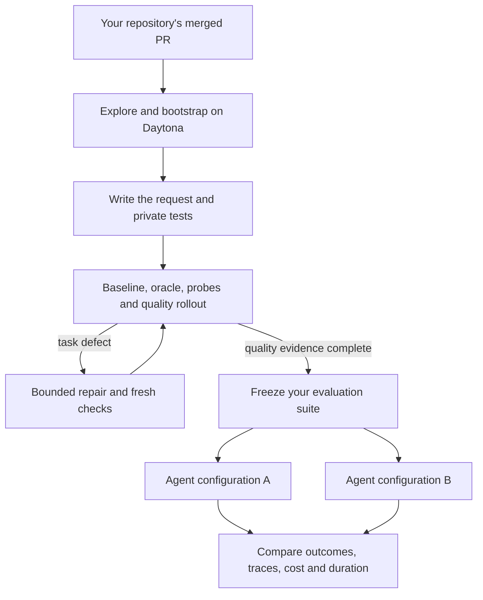

Your repository's merged pull requests contain examples of work that mattered to
your project: fixing a parser, preserving an API contract, handling an awkward
input, or adding a feature without breaking existing behavior. Those changes
are useful material for evaluating a coding agent on **your codebase**.

The challenge is turning a completed change into a fair, repeatable assignment.
The agent needs a starting workspace and a clear request. You need tests that
recognize the intended behavior, accept reasonable implementations, and catch
regressions. The agent should work from the request and repository; the verifier
should recognize correct behavior without demanding an identical patch.

[Tasksmith](../pipelines/tasksmith.md) builds that assignment from a PR and writes
it in the [Harbor format](../concepts/tasks.mdx). In this tutorial, you will
choose one change from your repository, generate and inspect its task, then
freeze a small suite that you can run against different agent configurations.

**The outcome:** a versioned folder of Harbor tasks, task-quality evidence, and
separate agent-evaluation results. You can use it to investigate whether a new
model or harness configuration handles your repository's work better.

> [!NOTE]
> This walkthrough covers **merged public GitHub PRs with added or modified
> Python source**, using CPU sandboxes on Daytona. Tasksmith currently rejects
> source deletions, source renames and changes in other languages. Private
> repositories, arbitrary local checkouts and GPU setup are outside this
> walkthrough. GPU tasks currently require Modal; see the
> [supported inputs and resources](../pipelines/tasksmith.md#at-a-glance).

## Start with a question about your repository

Before collecting tasks, write down the decision the evaluation should support.
For example: “Does the agent handle our input-validation fixes without breaking
other API behavior?” That gives you a much better selection rule than picking
whichever PRs happen to generate successfully.

For your first task, choose a small merged PR with a visible behavioral change,
existing tests, and dependencies that can run without external services. Save
model downloads, GPU kernels and multi-service integration for a later suite.

| A change in your codebase | What a useful task would ask | What the verifier should check |
|---|---|---|
| A parser mishandles an empty value | Handle the documented input consistently | Empty, ordinary and malformed inputs; preserve existing output types |
| A utility adds a new option | Implement the option's public behavior | The new mode, the default mode and interactions with existing arguments |
| A client retries the wrong errors | Correct the retry policy | Which errors retry, attempt limits and unchanged handling of other failures |

These are **selection examples**, not results from a measured campaign. A PR
that only changes formatting or reorganizes code without observable behavior is
usually a poor first evaluation task.

Use GitHub CLI to inspect your own candidates. Replace the repository name below:

```bash
export EVAL_REPO="your-org/your-repo"
gh pr list --repo "$EVAL_REPO" --state merged --limit 20 \
  --json number,title,url,mergedAt
```

Read the chosen PR's description, source changes and tests. Ask whether another
engineer could understand the intended behavior without seeing the patch. You
will check Tasksmith's generated instruction against the same standard.

## Understand what gets generated

Tasksmith freezes the PR's base and head, explores the repository, and builds an
environment on a remote worker. It starts from the merged head and reverses the
PR's **source patch** to create the learner workspace; this is not necessarily
a byte-for-byte checkout of the base commit. The merged implementation is the
reference solution.



There are two distinct uses of a rollout here. During construction, a blind
rollout helps diagnose the **task**: an ambiguous requirement, a broken
verifier, or a way to earn reward without solving it. After you freeze the
suite, rollouts measure the **agent**. A legitimate agent failure is useful
evaluation evidence; it is not a reason to simplify the task.

The learner receives the instruction and filtered source. Git history, private
tests and reference files are kept out of its workspace. A separate verifier
container grades the permitted source changes. Tasksmith's review uses models,
but the task's reward comes from deterministic test execution.

## Set up the controller and a budget

You need Python 3.12+, [uv](https://docs.astral.sh/uv/getting-started/installation/),
Node.js 22.19+ with npm, and an authenticated GitHub CLI. Your computer runs the
controller; repository builds and tests run in remote sandboxes. You do not
need local Docker for this walkthrough.

```bash
git clone https://github.com/huggingface/Repo2RLEnv
cd Repo2RLEnv
uv sync --extra tasksmith --extra daytona --extra harbor
gh auth status
uv run repo2rlenv tasksmith install-runtime
```

In the checkout's `.env`, set `DAYTONA_API_KEY` and `ANTHROPIC_API_KEY`. The CLI
loads that file without replacing variables already set in your shell. The
current Pi/OpenCode author bridge requires an Anthropic author model; changing
only the API key does not switch it to OpenAI. The quality loop has separate
model settings. See [authentication](../reference/AUTH.md) and
[provider setup](../guides/remote-execution.mdx#connect-a-provider).

Create a campaign and build the wheel that the remote worker will install:

```bash
mkdir -p workspace/codebase-eval
uv run repo2rlenv campaign init workspace/codebase-eval/campaign --budget-usd 50
uv build --wheel
R2R_WHEEL=$(uv run python -c 'import importlib.metadata as m; print("dist/repo2rlenv-" + m.version("repo2rlenv") + "-py3-none-any.whl")')
git rev-parse HEAD > workspace/codebase-eval/controller-commit.txt
```

**$50 is an example campaign limit, not an expected price or a promise that the
PR will finish.** Repo2RLEnv reserves estimated spend before dispatch; this does
not set a billing cap at Daytona or your model provider. Watch accounted and
reserved amounts with `campaign status`. Rebuild the wheel and reset
`R2R_WHEEL` if you change the checkout, or reopen your shell.

The tutorial's [options file](https://github.com/huggingface/Repo2RLEnv/blob/main/examples/tutorials/tasksmith-eval-options.json)
selects Daytona, CPU tasks and the Pi author runtime. It explicitly enables
quality repair and a blind rollout, with up to three repairs and four probes.
The quality budget is $20 inside the $50 run limit, not an extra allowance.

```bash
cat examples/tutorials/tasksmith-eval-options.json
```

Keep those settings for the first task. In particular, a custom `quality`
object replaces Tasksmith's usual defaults: set `repair` and `run_rollout`
explicitly rather than assuming they remain enabled.

## Generate one task from your PR

Replace the URL below with the merged PR you selected. The panel is simply a
name and a list of PR URLs; it is the input to Tasksmith, not an evaluation score.

```bash
export EVAL_PR="https://github.com/your-org/your-repo/pull/123"
uv run python - <<'PY'
import json
import os
from pathlib import Path

panel = {"name": "my-codebase", "prs": [os.environ["EVAL_PR"]]}
Path("workspace/codebase-eval/panel.json").write_text(json.dumps(panel, indent=2) + "\n")
PY

uv run repo2rlenv tasksmith run workspace/codebase-eval/panel.json \
  --options examples/tutorials/tasksmith-eval-options.json \
  --campaign workspace/codebase-eval/campaign \
  --output workspace/codebase-eval/generation \
  --runtime-wheel "$R2R_WHEEL"
```

You should see investigation, bootstrap, design, construction and quality
progress. Generation can stop at any of these stages. A stopped run still has
diagnostic artifacts; it does not imply that a usable task was produced.

```bash
uv run repo2rlenv tasksmith show workspace/codebase-eval/generation
uv run repo2rlenv campaign status workspace/codebase-eval/campaign
```

`tasksmith show` is read-only. A fully successful panel reports every input as
`usable`; it exits nonzero if any input is not usable. Resume an interrupted run
with the same generation command. To change inputs or options, use a new output
directory; do not overwrite a prior experiment's configuration.

| If the run stops at… | Inspect before spending more |
|---|---|
| Bootstrap | The saved dependency/profile and build logs. Can the merged-head tests run offline? |
| Construction | The test selection. Does reverting the source change actually break a behavior, while a regression guard still passes? |
| Review or repair | The quality result's reasons. Is there an instruction/verifier defect, or missing evidence? |
| Budget or provider failure | The ledger and worker receipts. Resolve uncertain operations before launching another attempt |

Keep unsuccessful candidates in your generation denominator. If you eventually
select five usable tasks from eight attempted PRs, report both numbers and the
three exclusions.

## Inspect the instruction and verifier

Open `generation/report.json`. Each candidate's `label_export` records the
labeled task directory, publication state and evaluation status. Its full
quality evidence is under `generation/candidates/<id>/quality/`.

```files
labeled-task/
├── instruction.md     # the assignment the agent reads
├── task.toml          # resources, environments and evaluation label
├── environment/       # filtered starting source and build recipe
├── tests/             # private verification logic
└── solution/          # reference solution, hidden during solving
```

Read the instruction as if you were the engineer receiving the assignment. It
should name the relevant behavior and constraints without quoting the fix.
Check that the tests exercise those requirements rather than matching one
implementation's source text or incidental output.

The two basic controls establish a necessary contrast:

- **Baseline / nop:** doing nothing must score 0.
- **Oracle:** applying the reference solution must score 1.

Those controls alone are not enough. A verifier can pass its reference and
still reject a valid alternative or reward a shortcut. Review the saved semantic
probes, rollout trace and explanations as well. A `verified` label describes
the evidence for that exact bundle under its named quality profile; it is not a
guarantee of exhaustive coverage.

This is where your knowledge of your codebase matters. If a task omits an
important contract, repair it before using it as an evaluation, then rerun the
checks it invalidates. Do not weaken a valid requirement because the agent
struggles with it. See [review and repair](../pipelines/quality_loop.md).

## Freeze the tasks you will evaluate

Keep your generation directory, including its evidence. Create a separate suite
for agent runs. The following snippet accepts only a completely usable panel
with verified labeled exports, copies the bundles with their file modes, and
records their identities. It refuses to overwrite an existing `suite-v1`.

```bash
uv run python - <<'PY'
import json
import shutil
from importlib.metadata import version
from pathlib import Path
from repo2rlenv.quality.loop.artifacts import task_identity

root = Path("workspace/codebase-eval")
report = json.loads((root / "generation/report.json").read_text())
rows = report["candidates"]
if not rows or len(rows) != report["inputs"]:
    raise SystemExit("Finish the panel before freezing it.")
for row in rows:
    label = row.get("label_export") or {}
    if (row["status"], label.get("state"), label.get("status")) != ("usable", "completed", "verified"):
        raise SystemExit("Review all candidates and exclusions before freezing a suite.")

suite = root / "suite-v1"
suite.mkdir(exist_ok=False)
manifest = {"repo2rlenv_version": version("repo2rlenv"), "tasks": []}
for row in rows:
    source = Path(row["label_export"]["task_path"])
    identity = task_identity(source)
    target = suite / source.name
    shutil.copytree(source, target, symlinks=True)
    if task_identity(target) != identity:
        raise SystemExit("Copied task differs from its source.")
    manifest["tasks"].append({"task": target.name, "pr": row["source"], "bundle_hash": identity})
(root / "suite-v1-manifest.json").write_text(json.dumps(manifest, indent=2) + "\n")
print(f"Frozen {len(rows)} task(s) in {suite}")
PY
```

This checks the recorded outcome and bundle integrity; it does not replace your
inspection of the evidence. Keep the manifest, controller commit, options,
original evidence and task files together. Do not feed the quality rollout's
transcript or the merged patch to the agent being evaluated.

For a small suite, add PRs that cover different components or behaviors before
starting a **new** generation run. Use a new output path and suite version.
Start with a handful of CPU tasks and review the failures before attempting a
large batch. The [batch guide](../pipelines/tasksmith_parallel_campaigns.md)
covers parallel workers and shared budgets when you are ready.

## Run controls and an agent with Harbor

Use the pinned Harbor installed by the `harbor` extra. First rerun the controls
on the frozen suite in your evaluation environment:

```bash
uv run harbor run --env-file .env \
  -p workspace/codebase-eval/suite-v1 -a oracle --env daytona -n 1 \
  --jobs-dir workspace/codebase-eval/jobs --job-name oracle-v1

uv run harbor run --env-file .env \
  -p workspace/codebase-eval/suite-v1 -a nop --env daytona -n 1 \
  --jobs-dir workspace/codebase-eval/jobs --job-name baseline-v1
```

Every oracle trial should score 1 and every nop trial 0. If either control is
wrong, stop the comparison and investigate the task or runtime. Record any
exclusion and use the same remaining cohort for every agent.

Now run a real agent. This example uses Harbor's **Terminus-2** harness with
Sonnet, matching the harness family used for Tasksmith's internal quality
rollout. The harness calls the model outside the offline learner sandbox; its
shell tools act inside that sandbox.

```bash
uv run harbor run --env-file .env \
  -p workspace/codebase-eval/suite-v1 \
  -a terminus-2 -m anthropic/claude-sonnet-4-6 \
  --ak max_turns=20 \
  --env daytona -n 1 -k 1 \
  --jobs-dir workspace/codebase-eval/jobs --job-name sonnet-v1
```

The 20-turn limit is an explicit evaluation setting. These direct Harbor jobs
**do not use the Tasksmith campaign ledger**; budget for model usage and Daytona
compute separately. A turn limit is not a dollar cap. The `.env` is loaded by
the host process; this walkthrough does not inject model keys into the learner
workspace.

To compare another model, repeat the command with its supported `-m` identifier
and a new job name. Keep the suite, harness, turn limit, resource settings and
number of attempts fixed. If your experiment changes the harness or its
configuration, name that change in the comparison. You are measuring the whole
agent configuration, not an isolated model capability.

A single attempt per task is a useful smoke test. For a more stable comparison,
repeat both configurations with the same `-k` and fresh job names. Keep each
attempt's outcome; retries after infrastructure failures should be identifiable.
See [Harbor execution](../guides/run-with-harbor.mdx) for further controls.

## Read outcomes without hiding failures

Harbor saves each job under `workspace/codebase-eval/jobs/<job-name>/`. Read the
job's `result.json`, individual trial results and agent traces. In the pinned
Harbor version, a trial records `task_name`, `verifier_result`, `exception_info`
and execution timings; available agent usage is under `agent_result`.

| Outcome | Interpretation | What to retain |
|---|---|---|
| Reward 1, completed trial, no exception | Agent passed this task's verifier | Patch, trace, task identity and cost |
| Reward 0, completed trial, no exception | Agent did not meet the verified requirements | Failing behavior and trace; this is evaluation evidence |
| Setup/provider exception or missing reward | Execution did not provide a clean task outcome | Error type, stage, attempted configuration and any billed usage |
| Suspected reward shortcut | The verifier may be measuring the wrong thing | Original task and trace; investigate before using its score |

Report scheduled tasks, successful tasks, completed failures and errors
separately. A completed-trial solve rate can hide a high error rate, so show the
coverage denominator next to it. For repeated runs, also distinguish trial
success from tasks solved at least once.

For each comparison, retain:

- The exact suite version and bundle hashes, plus the source PRs.
- Agent/harness versions, model identifiers, attempts, turn limits and resources.
- Per-task outcomes and setup/provider errors, not just an aggregate percentage.
- Recorded model usage, estimated compute and wall-clock duration, with missing
  costs left unknown rather than counted as zero.

Public PRs may have appeared in model training data. An offline workspace and
removed Git history reduce direct answer access, but they do not establish an
uncontaminated benchmark. Describe the suite as an evaluation on these public
repository tasks. Keep a held-out set separate from the tasks you use to tune
prompts or agent settings.

If you discover a genuine verifier defect after evaluating agents, preserve
`suite-v1`, create a corrected `suite-v2`, and rerun the affected comparison on
the new version. Quietly changing a test between agent runs destroys the
comparison you were trying to make.

## What HF_ML_Tasksmith taught us

The [HF_ML_Tasksmith collection](https://huggingface.co/datasets/FineEnvs/HF_ML_Tasksmith)
provides a larger worked example of the approach. Its recorded final cohort has
**50 verified tasks**, with **39 CPU tasks and 11 GPU tasks**. The recorded
Sonnet evaluation produced **19 full solves**. Those are historical observations,
not expected results for your repository.

The practical lesson is that environment construction and evaluation both need
attention. Dependency setup, private-test coverage and task repair can cost
more than the initial instruction. Some tasks require GPUs or pinned model
fixtures; a small CPU PR is a much easier starting point for learning the workflow.

For that assisted development campaign, operations directly attributed to the
final 50 tasks totaled **$649.56**, about **$12.99 per accepted task**. That figure
excludes shared/unattributed work and rejected PRs, so it is not a complete
production price. It also does not measure unattended PR-conversion yield.
The [accounting report](../pipelines/experiment_accounting.md#tasksmith-development-and-quality-work)
records the cost boundaries, model choices and intervention history.

Your first milestone is smaller: one task whose request you understand, whose
reference and baseline behave correctly, and whose agent trace you can explain.
Build a small, representative suite from there. That gives you an evaluation
that speaks to work in your codebase and a record of what the score actually
measures.

## Continue from here

- [Tasksmith reference](../pipelines/tasksmith.md): stage contracts and configuration.
- [Run many PRs](../pipelines/tasksmith_parallel_campaigns.md): parallel generation and bootstrap reuse.
- [Evaluation labels](../pipelines/task_evaluation_labels.md): evidence, provenance and bundle identity.
- [Yield and costs](../pipelines/economics.md): measured samples and their accounting limits.

*The commands, configuration and result-field references in this tutorial were
checked locally against Repo2RLEnv 0.9.3 and Harbor 0.22.0. No new paid cloud
campaign was run to write this article; the collection figures come from the
linked historical evidence.*
